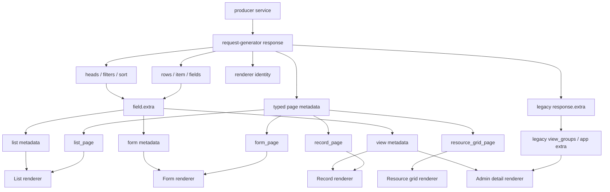

# Контракт универсального рендера

Имя: `UniversalRenderer`

Версия: `1.0.0`

Статус: `draft`

Владелец спецификации: мейнтейнеры request-generator.

Процесс изменения описан отдельно: [specification-process.md](specification-process.md).

Общие цели спецификаций описаны отдельно: [specification-goals.md](specification-goals.md).

Этот документ фиксирует typed frontend-контракт `request-generator producer service -> UniversalRenderer`: producer описывает UI metadata через Go API `renderer.Universal`, request-generator сам добавляет renderer identity/version и page metadata в response, а UniversalRenderer строит форму, список, карточку, detail view или рабочую страницу без module-specific кода.

Проектные названия, конкретные роли, конкретные route names и application-specific ресурсы не являются частью core contract. Их можно использовать только в разделе примеров application profile.

## Визуальная Схема



## Где Лежит Metadata

UniversalRenderer читает canonical metadata только из typed top-level response fields. `response.extra` остается legacy/deprecated escape hatch для старых модулей и application-specific compatibility, но не является частью UniversalRenderer metadata.

Каждый response с typed page metadata должен содержать renderer identity:

```json
{
  "renderer": {
    "name": "UniversalRenderer",
    "version": "1.0.0"
  }
}
```

Producer module не задает `renderer.name/version` вручную. Эти значения добавляет request-generator, когда у `BaseModule.Render` есть metadata для текущего response type.

### Typed Go API

```go
Render: renderer.Universal{
    List: &renderer.ListPage{
        Layout: &renderer.Layout{
            Type:  renderer.LayoutOneColumn,
            Gap:   renderer.SpacingMD,
            Align: renderer.AlignStretch,
        },
        Filters: &renderer.Filters{Enabled: true},
        CardSchema: &renderer.CardSchema{
            Variant: renderer.CardVariantMedia,
            Size:    renderer.SizeSM,
        },
    },
    Form:   &renderer.FormPage{Layout: renderer.LayoutTwoColumn},
    Record: &renderer.RecordPage{Layout: &renderer.Layout{Type: renderer.LayoutThreeColumn}},
}
```

Если metadata зависит от request context, producer module должен использовать typed dynamic hook:

```go
RenderFunc: func(c *gin.Context, base renderer.Universal) (renderer.Universal, error) {
    render := base
    if render.List != nil {
        render.List.Context = map[string]interface{}{
            "can_create_request": canCreateRequest(c),
        }
    }
    return render, nil
}
```

`Render` задает базовую статическую схему. `RenderFunc` является optional typed runtime override/merge и вызывается request-generator через `RenderFor(c)` перед построением `/api/config`, list, defrec и view responses. В `RenderFunc` передается deep clone базового `Render`, поэтому producer module может безопасно менять pointer structs, slices, maps и стандартные JSON-like значения внутри `interface{}` (`map[string]interface{}`, `[]interface{}`, `map[string]string`, `[]string` и т.п.) без протекания state в следующие запросы. Произвольные custom objects внутри `interface{}` не клонируются и остаются ответственностью producer module. Результат `RenderFunc` остается `renderer.Universal` и валидируется через `Validate()` уже после runtime изменений. Legacy `ExtraFunc` не должен использоваться для canonical UniversalRenderer metadata.

Closed enums должны использовать typed constants из package `renderer`. `map[string]interface{}` допустим только в явно typed runtime/transport полях (`Context`, `Payload`, `Query`, route query и т.п.), где содержимое является данными запроса или состоянием выполнения, а не схемой UI. Если producer-у нужен новый UI metadata block, он должен быть добавлен в typed renderer contract, а не передан через ad-hoc map.

### List Response

```json
{
  "count": 120,
  "size": 20,
  "page": 0,
  "renderer": {
    "name": "UniversalRenderer",
    "version": "1.0.0"
  },
  "list_page": {},
  "rows": [],
  "heads": {
    "status": {
      "title": "Status",
      "extra": {
        "display": {"type": "badge"}
      }
    }
  },
  "filters": {
    "status": {
      "title": "Status",
      "type": "string",
      "form_type": "select",
      "options": [],
      "group": "main",
      "order": 10,
      "extra": {
        "filter_group": "main",
        "filter_order": 10
      }
    }
  },
  "sort": [
    {"value": "updated_at:desc", "text": "Updated ↓"}
  ]
}
```

Канонические места:

| Path | Назначение |
|------|------------|
| `rows` | Данные строк. |
| `heads[field].extra` | Metadata отображения колонки. |
| `filters[field].extra` | Metadata UI фильтра. |
| `sort[].value` | Значение сортировки в формате `field:asc` или `field:desc`. |
| `count`, `size`, `page` | Server-side pagination. |
| `renderer` | Renderer identity/version, добавляется request-generator. |
| `list_page` | Typed metadata страницы списка из `BaseModule.Render.List`. |
| `resource_grid_page` | Typed metadata рабочей grid-страницы из `BaseModule.Render.ResourceGrid`. |

### Defrec/Form Response

```json
{
  "renderer": {
    "name": "UniversalRenderer",
    "version": "1.0.0"
  },
  "form_page": {},
  "fields": {
    "status": {
      "title": "entity.fields.status",
      "type": "string",
      "form_type": "select",
      "required": true,
      "options": [],
      "section": "main",
      "extra": {
        "visual_kind": "select",
        "section": "main",
        "group": "general",
        "order": 20
      }
    }
  }
}
```

Канонические места:

| Path | Назначение |
|------|------------|
| `fields[field]` | Описание поля формы. |
| `fields[field].required` | Required marker для UI. |
| `fields[field].options` | Static options. |
| `fields[field].section` | Базовая секция поля. |
| `fields[field].extra` | UI metadata формы. |
| `renderer` | Renderer identity/version, добавляется request-generator. |
| `form_page` | Typed metadata универсальной form/edit страницы из `BaseModule.Render.Form`. |

### View/Record Response

```json
{
  "renderer": {
    "name": "UniversalRenderer",
    "version": "1.0.0"
  },
  "record_page": {},
  "item": {
    "status": {
      "title": "Status",
      "type": "string",
      "form_type": "select",
      "value": "active",
      "edit": true,
      "options": [],
      "extra": {
        "display": {"type": "badge"}
      }
    }
  }
}
```

Канонические места:

| Path | Назначение |
|------|------------|
| `item[field].value` | Значение поля. |
| `item[field].edit` | Можно ли редактировать поле в UI. |
| `item[field].options` | Options для значения. |
| `item[field].extra` | Metadata отображения поля. |
| `renderer` | Renderer identity/version, добавляется request-generator. |
| `record_page` | Typed metadata страницы просмотра из `BaseModule.Render.Record`. |

### Config Response

`config` используется для navigation/routes и роли текущего пользователя, если producer service участвует в построении оболочки приложения.

```json
{
  "left_menu": [
    {
      "blockTitle": "navigation.main",
      "elements": [
        {
          "url": "/entities",
          "title": "entities.menu.list",
          "icon": "list",
          "query": {},
          "data": {}
        }
      ]
    }
  ],
  "routes": {
    "/entities": {
      "title": "entities.routes.list",
      "menuTitle": "entities.menu.list",
      "renderer": {
        "name": "UniversalRenderer",
        "version": "1.0.0"
      },
      "page_type": "list",
      "query": {
        "url": "/entities",
        "method": "get"
      },
      "data": {},
      "children": {}
    }
  },
  "role": "admin"
}
```

Канонические места:

| Path | Назначение |
|------|------------|
| `left_menu[]` | Группы навигации. |
| `left_menu[].elements[]` | Пункты меню. |
| `routes` | Map route config, где ключ это frontend path. |
| `routes[path].renderer` | Renderer identity/version для route discovery, если route использует typed `BaseModule.Render`. |
| `routes[path].page_type` | Тип страницы: `list`, `form`, `record`, `resource_grid`. |
| `routes[path].query` | Endpoint и method для загрузки данных route. |
| `routes[path].children` | Вложенные route configs. |
| `role` | Роль текущего пользователя. |

Renderer discovery происходит через `/api/config`: frontend может проверить compatibility с `UniversalRenderer` до загрузки данных страницы. Data responses (`list`, `defrec`, `view`) повторяют `renderer.name/version`, чтобы каждый response был самодостаточным.

## Field Metadata

Поле может иметь metadata в трех контекстах:

| Контекст | Где задается producer-side | Где приходит frontend |
|----------|-----------------------------|-----------------------|
| Form | `ModuleField.Extra.Defrec` | `defrec.fields[field].extra` |
| List | `ModuleField.Extra.List` | `list.heads[field].extra`, `list.filters[field].extra` |
| View | `ModuleField.Extra.View` | `view.item[field].extra` |

Канонический shape:

```json
{
  "extra": {
    "visual_kind": "select",
    "display": {
      "type": "badge",
      "tone": "cyan"
    },
    "section": "main",
    "group": "general",
    "order": 20,
    "layout": "full",
    "icon": "status",
    "hint": "entity.fields.status_hint",
    "placeholder": "entity.fields.status_placeholder",
    "multiple": false,
    "searchable": true,
    "options_url": "/options/statuses",
    "options_params": {
      "scope": "active"
    }
  }
}
```

### Form Metadata

| Key | Назначение |
|-----|------------|
| `visual_kind` | UI control: `input`, `textarea`, `select`, `location`, `radio`, `switch`, `matrix`, `media`, `collection`. |
| `section` | ID секции формы. |
| `group` | ID группы внутри секции. |
| `order` | Порядок поля. |
| `layout` | `full`, `grid`, `inline`, `compact`, `matrix`. |
| `icon` | Icon registry key. |
| `hint` | Translation key подсказки. |
| `placeholder` | Translation key placeholder. |
| `multiple` | Множественный выбор. |
| `searchable` | Поиск внутри control. |
| `options_url` | Server-driven options endpoint. |
| `options_params` | Параметры для `options_url`. |
| `prefix` / `suffix` | Визуальный prefix/suffix. |
| `min` / `max` / `step` | UI-ограничения числового ввода. |

### Display Metadata

`display` всегда должен быть object.

```json
{
  "display": {
    "type": "badge",
    "tone": "cyan",
    "tones": {
      "active": "success",
      "blocked": "danger"
    }
  }
}
```

Поддерживаемые `display.type`:

| Type | Назначение |
|------|------------|
| `text` | Обычный текст. |
| `badge` | Статус, роль, тип. |
| `boolean` | Boolean indicator. |
| `code` | ID/key/code. |
| `json` | Pretty JSON. |
| `masked` | Token/secret/IP. |
| `chips` | Массивы и tags. |
| `media` | Media preview. |
| `money` | Money value. |
| `date` | Date/time. |
| `location` | Location value. |

## List Contract

`list_page` описывает список целиком. В Go API это `renderer.Universal.List`.

Для одного list route `Render.List` и `Render.ResourceGrid` являются mutually exclusive. Producer module не должен задавать оба блока одновременно; если нужны две разные страницы, их нужно оформить отдельными route/module или дождаться будущего explicit route mapping contract. Request-generator валидирует этот инвариант при `Generator.Run()`.

```json
{
  "list_page": {
    "id": "entities",
    "title": "entities.title",
    "subtitle": "entities.subtitle",
    "show_header": false,
    "layout": {
      "type": "one_column",
      "align": "stretch",
      "max_width": "none",
      "gap": "md"
    },
    "filters": {
      "renderer": "universal.filters",
      "enabled": true,
      "primary_placement": "topbar",
      "primary": ["status", "type"],
      "secondary": ["location"],
      "more": ["created_at"],
      "nested": [],
      "reset": {
        "preserve": ["page", "scope"]
      }
    },
    "summary": {
      "title": "entities.summary",
      "title_fallback": "All records",
      "show_online": true,
      "show_action": false
    },
    "grid": {
      "enabled": true,
      "mode": "cards"
    },
    "pagination": {
      "renderer": "universal.pagination",
      "mode": "server"
    },
    "card_schema": {},
    "context": {}
  }
}
```

`list_page.extra` не используется. Если producer-у не хватает поля для renderer metadata, поле нужно добавить в typed contract генератора и в документацию.

### Design Tokens

Producer-service не должен передавать raw CSS values в layout/style metadata. Для каждого non-color design-token field contract должен задавать закрытый enum допустимых значений. Неизвестное значение token является нарушением contract.

Базовые enum:

| Группа | Значения |
|--------|----------|
| `spacing` | `none`, `xs`, `sm`, `md`, `lg`, `xl` |
| `radius` | `none`, `sm`, `md`, `lg`, `xl`, `full` |
| `size` | `xs`, `sm`, `md`, `lg`, `xl` |
| `weight` | `regular`, `medium`, `semibold`, `bold` |
| `align` | `start`, `center`, `end`, `stretch` |

Color values (`color`, `tone`, `accent` и аналогичные поля) должны ссылаться на shared theme color tokens. Неизвестный color token является нарушением contract. Raw CSS colors (`hex`, `rgb(...)`, `hsl(...)`, `var(...)` и другие CSS expressions) не допускаются в producer metadata.

Shared color registry описывается отдельно в theme/config contract. UniversalRenderer мапит token values на CSS variables текущего UI kit.

### Renderer-Specific Enums

Renderer-specific enum values должны быть описаны в разделе contract, который владеет полем. Если поле является global design-token field, оно использует enum из `Design Tokens`. Если поле является renderer-specific, его допустимые значения перечисляются отдельно. Неизвестное значение renderer-specific enum является нарушением contract.

Минимальные enum для core renderers:

| Path | Значения |
|------|----------|
| `list_page.layout.type`, `record_page.layout.type` | `one_column`, `two_column`, `three_column` |
| `list_page.layout.max_width` | `none`, `sm`, `md`, `lg`, `xl`, `full` |
| `list_page.grid.mode` | `table`, `cards` |
| `pagination.mode` | `server`, `client` |
| `card_schema.variant` | `default`, `media`, `compact` |
| `card_schema.surface_variant` | `default`, `primary`, `secondary` |
| `card_schema.surface_effect` | `none`, `flat`, `elevated` |
| `card_schema.media.ratio` | `square`, `portrait`, `landscape`, `wide` |
| `card_schema.media.size` | `thumb`, `card`, `hero` |
| `form_page.layout` | `one_column`, `two_column`, `three_column` |
| `form_page.sections[].block.type` | `none`, `panel`, `card` |
| `form_page.sections[].block.variant` | `default`, `compact` |
| `action.variant` | `default`, `primary`, `secondary`, `success`, `warning`, `danger` |
| `action.appearance` | `solid`, `outline`, `ghost`, `soft`, `link` |

### Filters

Filters являются server-driven:

- если фильтр есть в `filters[field]`, producer должен применять его server-side;
- `filters[field].group` и `filters[field].order` задают группировку и порядок;
- `filters[field].extra.filter_group` и `filters[field].extra.filter_order` могут переопределять группировку и порядок;
- selected values передаются в query как `filter[field]=value`;
- multi-value filters передаются повторением query value или согласованным serialized array;
- search query передается отдельным search parameter, если list action поддерживает search;
- reset не должен сбрасывать scope страницы, если scope описан в `list_page.filters.reset.preserve`.

Sort format: `field:asc` или `field:desc`.

Pagination: `count`, `size`, `page`.

## Card Schema

`card_schema` описывает карточку строки.

```json
{
  "type": "entity",
  "variant": "media",
  "size": "sm",
  "surface_variant": "secondary",
  "surface_effect": "flat",
  "badge_size": "sm",
  "action_size": "sm",
  "primary_action": "open",
  "media": {"field": "avatar", "ratio": "portrait", "size": "card"},
  "title": {"field": "name"},
  "subtitle": {"template": "@{{nick}}"},
  "description": {"field": "description"},
  "status": {"id": "status", "field": "status", "type": "status"},
  "badges": [],
  "stats": [],
  "actions": []
}
```

## Action Contract

Actions используются в `card_schema.actions`, `record_page.actions`, `form_page.actions`, `resource_grid_page` и других page metadata.

Канонический shape:

```json
{
  "id": "open",
  "type": "route",
  "label_key": "ui.open",
  "icon": "open",
  "variant": "primary",
  "appearance": "outline",
  "visible_if": {"path": "record.status", "equals": "active"},
  "disabled_if": {"path": "record.locked", "equals": true},
  "endpoint": "/entities/:id/action",
  "method": "post",
  "uniqueEndpoint": "/entities/view/slug/:slug",
  "afterRoute": {
    "path": "/entities/:id",
    "queryParam": "record",
    "source": "id"
  },
  "route": {
    "path": "/entities/:id",
    "params": {"id": "record.id"},
    "query": {}
  },
  "api": {
    "method": "post",
    "endpoint": "/entities/:id/action",
    "params": {"id": "record.id"},
    "query": {},
    "payload": {}
  },
  "modal": {
    "renderer": "universal.confirm",
    "title": "ui.confirm"
  },
  "confirm": {
    "title": "ui.confirm",
    "message": "ui.confirm_message",
    "confirm_label": "ui.confirm"
  },
  "after_success": {
    "reload": "list",
    "toast": "ui.saved"
  },
  "after_error": {
    "toast": "ui.error"
  },
  "aria_label_key": "ui.open",
  "title_key": "ui.open",
  "test": "entity-open"
}
```

Supported `action.type`:

| Type | Назначение |
|------|------------|
| `route` | Навигация внутри frontend. |
| `api` | HTTP action. |
| `modal` | Открытие modal renderer. |
| `emit` | Frontend event. |
| `external` | Внешний обработчик текущего приложения. |

`external: true` является legacy shorthand для action, который текущий webapp обрабатывает вне generic action executor. Для новых producer-сервисов предпочтительно использовать `type`.

## Typed Renderer Tokens

Producer code must build UniversalRenderer metadata with typed renderer structs and token types, not by assembling ad-hoc `map[string]interface{}` trees or stringly typed renderer fields.

Core renderer package owns only stable universal values:

- renderer keys: `RendererUniversalDisplay`, `RendererUniversalSection`, `RendererUniversalFilters`, `RendererUniversalPagination`, `RendererMediaGallery`, `RendererCollectionManager`;
- record layout slots: `LayoutSlotLeft`, `LayoutSlotCenter`, `LayoutSlotRight`;
- display component types: `DisplayMediaGallery`, `DisplayActions`, `DisplayIdentity`, `DisplayStatList`, `DisplayDataList`, `DisplayBadgeList`, `DisplayRateGroups`, `DisplayAccordionGroups`;
- generic tokens: spacing, inset, radius, alignment, semantic tones, separator appearance.

Application-specific values, especially visual color names such as `cyan`, `violet`, `magenta`, shell variants, section IDs, business IDs and translation keys, must be declared by the application as typed constants when reused. The renderer package should not try to maintain every project's color or shell catalog.

## Conditions

`visible_if`, `hidden_if`, `disabled_if` и похожие condition fields используют один grammar.

Atomic condition:

```json
{"path": "record.status", "equals": "active"}
```

Supported operators:

| Operator | Shape |
|----------|-------|
| `equals` | `{"path": "record.status", "equals": "active"}` |
| `not_equals` | `{"path": "record.status", "not_equals": "blocked"}` |
| `in` | `{"path": "record.status", "in": ["active", "draft"]}` |
| `not_in` | `{"path": "record.status", "not_in": ["blocked"]}` |
| `empty` | `{"path": "record.owner_id", "empty": true}` |
| `not_empty` | `{"path": "record.owner_id", "not_empty": true}` |
| `truthy` | `{"path": "context.can_edit", "truthy": true}` |
| `falsy` | `{"path": "context.can_edit", "falsy": true}` |
| `all` | `{"all": [condition, condition]}` |
| `any` | `{"any": [condition, condition]}` |
| `not` | `{"not": condition}` |

`not` используется только как отрицание вложенного condition object. Legacy shape `{"path": "...", "not": true}` поддерживается текущим webapp, но не должен использоваться в новых metadata.

Conditions отвечают только за отображение. Любое действие, скрытое или выключенное UI-условием, должно иметь server-side проверку в endpoint/action.

## Resource Grid Page

`resource_grid_page` описывает рабочую страницу управления сущностями. В Go API это `renderer.Universal.ResourceGrid`.

`Render.ResourceGrid` использует тот же list action route, что и обычный list response, поэтому он mutually exclusive с `Render.List` для одного route.

```json
{
  "resource_grid_page": {
    "endpoint": "/entities",
    "list": {
      "size": 100,
      "filters": {"scope": "managed"}
    },
    "create": {
      "type": "api",
      "api": {"method": "put", "endpoint": "/entities"},
      "after_success": {"reload": "list"}
    },
    "delete": {
      "type": "api",
      "api": {"method": "delete", "endpoint": "/entities/delete/id/:id", "params": {"id": "record.id"}},
      "confirm": {"title": "ui.confirm_delete"},
      "after_success": {"reload": "list"}
    },
    "update": {
      "type": "api",
      "api": {"method": "post", "endpoint": "/entities/id/:id", "params": {"id": "record.id"}},
      "after_success": {"reload": "record"}
    },
    "card": {"type": "entity", "size": "md"},
    "status": {"activeField": "status"},
    "actions": {"editRoute": {"path": "/entities/:id"}},
    "text": {"title": "entities.title"},
    "context": {}
  }
}
```

`resource_grid_page.list`, `resource_grid_page.status`, `resource_grid_page.actions` и `resource_grid_page.text` являются typed renderer contract. `resource_grid_page.context` предназначен только для runtime state, который не описывает структуру UI.

## Form Page

`form_page` описывает универсальную form/edit page metadata. В Go API это `renderer.Universal.Form`. Этот блок не привязан к бизнес-сущности settings и может использоваться для profile settings, entity edit, wizard step или admin edit page.

```json
{
  "form_page": {
    "id": "settings",
    "title": "settings.title",
    "subtitle": "settings.subtitle",
    "layout": "two_column",
    "actions": [],
    "sections": [
      {
        "id": "main",
        "title": "settings.nav.main",
        "panel_title": "settings.main.title",
        "subtitle": "settings.main.subtitle",
        "renderer": "universal.section",
        "group": "account",
        "group_title": "settings.nav.account",
        "icon": "user",
        "block": {"type": "panel", "variant": "default"}
      }
    ],
    "fields": []
  }
}
```

## Record Page

`record_page` описывает страницу просмотра записи. В Go API это `renderer.Universal.Record`.

```json
{
  "record_page": {
    "id": "profile",
    "title": "Anna",
    "subtitle": "@anna",
    "show_header": false,
    "badge": "Model",
    "badge_tone": "glass-cyan",
    "badge_teleport": "topbar",
    "navigation": {"type": "none", "enabled": false},
    "layout": {"type": "three_column"},
    "sections": [
      {
        "id": "summary",
        "renderer": "universal.display",
        "layout_slot": "center",
        "order": 10,
        "block": {"type": "panel", "inset": "md"},
        "stack": {"gap": "md"},
        "components": []
      }
    ],
    "display_data": {
      "gallery": {"items": [], "current": 0},
      "hero": {"identity": {}, "stats": []},
      "details": {"items": []}
    },
    "theme": {
      "profile": {
        "panels": {},
        "headings": {},
        "badges": {},
        "buttons": {},
        "avatar": {}
      }
    },
    "actions": [],
    "context": {}
  }
}
```

`record_page.sections[].components` и `record_page.sections[].stack` являются canonical metadata для display renderer. Не кладите layout/display metadata в `section.extra`: такого поля нет в UniversalRenderer contract.

## View Groups

`view_groups` является legacy/application-specific metadata для detail view. Для новых typed modules предпочтительно описывать группировку через `record_page.sections`.

```json
{
  "view_groups": [
    {
      "key": "summary",
      "title": "admin_module.detail_group_summary",
      "fields": ["id", "name", "status"]
    },
    {
      "key": "conditional",
      "title": "admin_module.detail_group_content",
      "fields": ["description"],
      "visible_when": {"field": "type", "in": ["public"]}
    }
  ]
}
```

## Renderer Registry

В текущей схеме renderer задается строкой.

Stable renderer names:

| Renderer | Expected metadata |
|----------|-------------------|
| `universal.section` | Section metadata: `id`, `title`, `panel_title`, `block`, related fields. |
| `universal.display` | Display section metadata: `components`, `display_data`, layout fields. |
| `universal.filters` | `filters`, `levels`, `primary`, `secondary`, `more`, `nested`, `reset`. |
| `universal.pagination` | `mode`, pagination response fields. |
| `universal.preferences` | `preferences` config directly in section. |
| `media.gallery` | Media fields/config in section metadata. |
| `collection.manager` | `collection` config directly in section. |

Unknown renderer names must degrade to a generic block or produce a visible unsupported-renderer state. Producer services should not introduce custom renderer names unless the target frontend registers them.

Renderer behavior changes are versioned through this specification process, not through per-renderer object versions.

## Icon References

Icon values are stable keys resolved through the frontend icon registry or `/api/icons` when the application exposes an icon registry.

```json
{"icon": "chat"}
```

## Media References

Media metadata should reference fields, not hardcoded rendering branches.

```json
{
  "media": {
    "field": "avatar",
    "ratio": "portrait",
    "size": "card",
    "fallback": "/assets/img/placeholder.jpg"
  }
}
```

## Generic Producer Example

```json
{
  "count": 1,
  "size": 20,
  "page": 0,
  "renderer": {
    "name": "UniversalRenderer",
    "version": "1.0.0"
  },
  "rows": [
    {"id": 1, "name": "Example", "status": "active"}
  ],
  "heads": {
    "name": {"title": "Name"},
    "status": {"title": "Status", "extra": {"display": {"type": "badge"}}}
  },
  "filters": {
    "status": {
      "title": "Status",
      "type": "string",
      "form_type": "select",
      "options": [{"value": "active", "label": "Active"}],
      "extra": {"filter_group": "main", "filter_order": 10}
    }
  },
  "sort": [
    {"value": "name:asc", "text": "Name ↑"},
    {"value": "name:desc", "text": "Name ↓"}
  ],
  "list_page": {
    "id": "entities",
    "grid": {"enabled": true, "mode": "cards"},
    "pagination": {"renderer": "universal.pagination", "mode": "server"},
    "card_schema": {
      "type": "entity",
      "title": {"field": "name"},
      "badges": [{"id": "status", "field": "status", "tone": "success"}],
      "actions": [{"id": "open", "type": "route", "route": {"path": "/entities/:id", "params": {"id": "record.id"}}}]
    }
  }
}
```

## Application Profile Example

Этот раздел показывает, как текущий webapp применяет generic contract. Эти значения не являются обязательной частью core contract.

Examples of application-specific values:

- role/entity names: `model`, `agency`, `manager`, `client`;
- routes: `/settings`, `/profiles`;
- resources: `/api/icons`, `/api/media_assets`, `/api/media_links`;
- renderer-specific visual variants: `wash-brand-secondary`, `qo-panel`, `glass-cyan`.

## Compatibility Notes

Текущий webapp поддерживает legacy metadata, но новые producer-сервисы должны использовать canonical shapes выше.

Legacy forms:

- UniversalRenderer metadata внутри `response.extra.*`, например `extra.list_page`, `extra.form_page`, `extra.record_page`, `extra.resource_grid_page`;
- application extension fields внутри top-level page `extra` не допускаются в UniversalRenderer contract;
- `display` как string вместо object, например `"display": "badge"`;
- `{"path": "...", "not": true}` вместо `{"not": {"path": "...", "truthy": true}}`;
- `external: true` action without explicit `type`;

`response.extra` остается deprecated escape hatch для старых модулей и application-specific данных вне UniversalRenderer. Новые producer modules должны описывать UniversalRenderer metadata через typed `BaseModule.Render renderer.Universal`, а request-generator должен отдавать canonical top-level `renderer` + page metadata fields.
