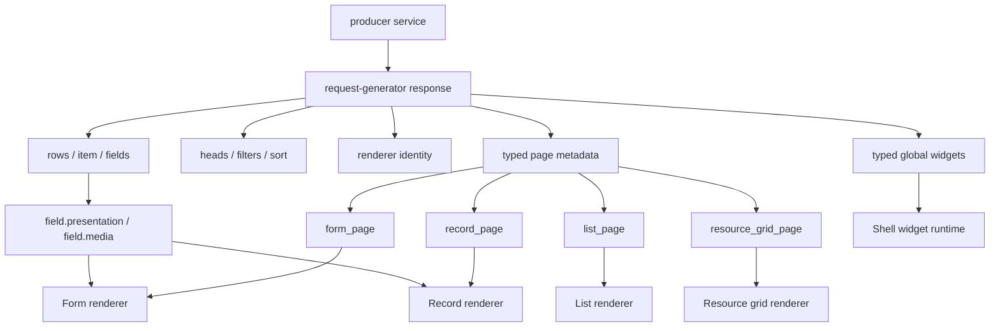

# Контракт универсального рендера

Имя: `UniversalRenderer`

Версия: `2.0.0`

Статус: `draft`

Владелец спецификации: мейнтейнеры request-generator.

Процесс изменения описан отдельно: [specification-process.md](specification-process.md).

Общие цели спецификаций описаны отдельно: [specification-goals.md](specification-goals.md).

Этот документ фиксирует typed frontend-контракт `request-generator producer service -> UniversalRenderer`: producer описывает UI metadata через Go API `renderer.Universal`, request-generator сам добавляет renderer identity/version и page metadata в response, а UniversalRenderer строит форму, список, карточку, detail view или рабочую страницу без module-specific кода.

Проектные названия, конкретные роли, конкретные route names и application-specific ресурсы не являются частью core contract. Их можно использовать только в разделе примеров application profile.

## Визуальная Схема



## Где Лежит Metadata

UniversalRenderer читает metadata только из typed response fields. Новые UI-возможности добавляются в typed contract генератора, а не в ad-hoc maps.

Каждый response с typed page metadata должен содержать renderer identity:

```json
{
  "renderer": {
    "name": "UniversalRenderer",
    "version": "2.0.0"
  }
}
```

Producer module не задает `renderer.name/version` вручную. Эти значения добавляет request-generator, когда у `BaseModule.Render` есть metadata для текущего response type.

### Typed Go API

```go
Render: renderer.Universal{
    List: &renderer.ListPage{
        Layout: &renderer.Layout{
            Type:  renderer.LayoutOneColumn,
            Gap:   renderer.SpacingMD,
            Align: renderer.AlignStretch,
        },
        Filters: &renderer.Filters{Enabled: true},
        CardSchema: &renderer.CardSchema{
            Variant: renderer.CardVariantMedia,
            Size:    renderer.SizeSM,
        },
    },
    Form:   &renderer.FormPage{Layout: renderer.LayoutTwoColumn},
    Record: &renderer.RecordPage{Layout: &renderer.Layout{Type: renderer.LayoutThreeColumn}},
}
```

Если metadata зависит от request context, producer module должен использовать typed dynamic hook:

```go
RenderFunc: func(c *gin.Context, base renderer.Universal) (renderer.Universal, error) {
    render := base
    if render.List != nil {
        render.List.Context = map[string]interface{}{
            "can_create_request": canCreateRequest(c),
        }
    }
    return render, nil
}
```

`Render` задает базовую статическую схему. `RenderFunc` является optional typed runtime override/merge и вызывается request-generator через `RenderFor(c)` перед построением `/api/config`, list, defrec и view responses. В `RenderFunc` передается deep clone базового `Render`, поэтому producer module может безопасно менять pointer structs, slices, maps и стандартные JSON-like значения внутри `interface{}` (`map[string]interface{}`, `[]interface{}`, `map[string]string`, `[]string` и т.п.) без протекания state в следующие запросы. Произвольные custom objects внутри `interface{}` не клонируются и остаются ответственностью producer module. Результат `RenderFunc` остается `renderer.Universal` и валидируется через `Validate()` уже после runtime изменений.

Closed enums должны использовать typed constants из package `renderer`. `map[string]interface{}` допустим только в явно typed runtime/transport полях (`Context`, `Payload`, `Query`, route query и т.п.), где содержимое является данными запроса или состоянием выполнения, а не схемой UI. Если producer-у нужен новый UI metadata block, он должен быть добавлен в typed renderer contract, а не передан через ad-hoc map.

### List Response

```json
{
  "count": 120,
  "size": 20,
  "page": 0,
  "renderer": {
    "name": "UniversalRenderer",
    "version": "2.0.0"
  },
  "list_page": {},
  "rows": [],
  "heads": {
    "status": {
      "title": "Status"
    }
  },
  "filters": {
    "status": {
      "title": "Status",
      "type": "string",
      "form_type": "select",
      "options": []
    }
  },
  "sort": [
    {"value": "updated_at:desc", "text": "Updated ↓"}
  ]
}
```

Канонические места:

| Path | Назначение |
|------|------------|
| `rows` | Данные строк. |
| `heads[field]` | Локализованный заголовок колонки. Визуальное представление поля задается typed `presentation`. |
| `filters[field]` | Тип, form type, options и typed `options_source` фильтра. Расположение задается в `list_page.filters`. |
| `sort[].value` | Значение сортировки в формате `field:asc` или `field:desc`. |
| `count`, `size`, `page` | Server-side pagination. |
| `renderer` | Renderer identity/version, добавляется request-generator. |
| `list_page` | Typed metadata страницы списка из `BaseModule.Render.List`. |
| `resource_grid_page` | Typed metadata рабочей grid-страницы из `BaseModule.Render.ResourceGrid`. |

### Defrec/Form Response

```json
{
  "renderer": {
    "name": "UniversalRenderer",
    "version": "2.0.0"
  },
  "form_page": {},
  "fields": {
    "status": {
      "title": "entity.fields.status",
      "type": "string",
      "form_type": "select",
      "required": true,
      "options": [],
      "section": "main",
      "presentation": {
        "renderer": "universal.section",
        "variant": "default"
      }
    }
  }
}
```

Канонические места:

| Path | Назначение |
|------|------------|
| `fields[field]` | Описание поля формы. |
| `fields[field].required` | Required marker для UI. |
| `fields[field].options` | Static options. |
| `fields[field].section` | Базовая секция поля. |
| `fields[field].presentation` | Typed metadata визуального представления одиночного поля. |
| `fields[field].media` | Typed media metadata одиночного поля, если поле является media value. |
| `renderer` | Renderer identity/version, добавляется request-generator. |
| `form_page` | Typed metadata универсальной form/edit страницы из `BaseModule.Render.Form`. |

### Form Section Columns

`form_page.sections[].columns` задает количество колонок для обычной секции
формы и ее дочерних fields. Это layout секции, а не свойство отдельного поля
или визуальной поверхности `block`.

Допустимы typed значения `1`, `2`, `3`, `4` из
`renderer.FieldMatrixColumnCount`. Значение `0` не сериализуется и означает
renderer default. Generator отклоняет другие значения при `Universal.Validate()`.

```go
renderer.FormSection{
    ID:      "payments",
    Block:   &renderer.Block{Type: renderer.BlockPanel},
    Fields:  []string{"accepted_payment", "commission_rate"},
    Columns: renderer.FieldMatrixColumnsOne,
}
```

### Field Matrix

`field.matrix` задает раскладку уже описанных typed полей формы. Matrix не
дублирует значение, `type`, `form_type`, options, checks или presentation:
renderer получает их из стандартных `fields` либо `item` response.

```go
renderer.FormSection{
    ID:       "rates",
    Renderer: renderer.RendererFieldMatrix,
    Matrix: &renderer.FieldMatrix{
        Type:      renderer.FieldMatrixTypeTable,
        Underline: "rates",
        Table: &renderer.FieldMatrixTable{
            Heads: []string{
                "settings.rates.duration",
                "settings.rates.incall",
                "settings.rates.outcall",
            },
            Rows: []renderer.FieldMatrixRow{
                {
                    Label: "settings.rates.1h",
                    Cells: []renderer.FieldMatrixCell{
                        {Field: "incall_1h_price"},
                        {Field: "outcall_1h_price"},
                    },
                },
            },
        },
    },
}
```

`table` содержит `heads` и `rows`. У каждой ячейки должен быть ровно один
источник: `field` (ссылка на поле модуля) или `text` (статический текст).
Непустой `row.label` занимает первую ячейку строки, поэтому в этом случае
количество `cells` на единицу меньше числа заголовков. Без `row.label` оно
должно совпадать с числом заголовков.

`list` содержит только упорядоченные `fields` и typed `columns` от одного до
четырех. Каждый field выводится как самостоятельный item без описания строк,
ячеек или колонок в producer metadata.

```go
renderer.FormSection{
    ID:       "preferences",
    Renderer: renderer.RendererFieldMatrix,
    Matrix: &renderer.FieldMatrix{
        Type:      renderer.FieldMatrixTypeList,
        Underline: "settings",
        List: &renderer.FieldMatrixList{
            Fields:  []string{"email_enabled", "push_enabled", "quiet_hours"},
            Columns: renderer.FieldMatrixColumnsTwo,
        },
    },
}
```

`heads[]`, `rows[].label` и `cells[].text` producer задает translation
keys. Перед ответом request-generator локализует их для выбранного `lang`; UI
kit не получает ключи и не выполняет перевод. `underline` является opaque
application-defined visual identifier: generator не знает его палитру и не
валидирует как CSS value.

Generator проверяет closed `type`, применимость `list`/`table`, допустимое
число колонок list, структуру table и существование каждого referenced field
в модуле.

### View/Record Response

```json
{
  "renderer": {
    "name": "UniversalRenderer",
    "version": "2.0.0"
  },
  "record_page": {},
  "item": {
    "status": {
      "title": "Status",
      "type": "string",
      "form_type": "select",
      "value": "active",
      "edit": true,
      "options": [],
      "presentation": {
        "renderer": "universal.display",
        "variant": "badge"
      }
    }
  }
}
```

Канонические места:

| Path | Назначение |
|------|------------|
| `item[field].value` | Значение поля. |
| `item[field].edit` | Можно ли редактировать поле в UI. |
| `item[field].options` | Options для значения. |
| `item[field].presentation` | Typed metadata визуального представления одиночного поля. |
| `item[field].media` | Typed media metadata одиночного поля, если поле является media value. |
| `renderer` | Renderer identity/version, добавляется request-generator. |
| `record_page` | Typed metadata страницы просмотра из `BaseModule.Render.Record`. |

### Config Response

`config` используется для навигации, глобальных виджетов и роли текущего пользователя, если producer service участвует в построении оболочки приложения.

```json
{
  "navigation": [
    {
      "id": "entities.list",
      "path": "/entities",
      "target": {
        "type": "page",
        "renderer": {
          "name": "UniversalRenderer",
          "version": "2.0.0"
        },
        "page_type": "list",
        "query": {
          "url": "/api/entities",
          "method": "GET"
        },
        "data": {},
        "children": {}
      },
      "title": "entities.menu.list",
      "icon": "list",
      "order": 10,
      "group": "navigation.main",
      "query": {},
      "data": {}
    },
    {
      "id": "chat.open",
      "target": {
        "type": "client_action",
        "name": "chat.open"
      }
    }
  ],
  "widgets": [
    {
      "id": "profile-menu",
      "order": 10,
      "renderer": {
        "name": "UniversalRenderer",
        "version": "2.0.0"
      },
      "widget": {
        "surface": {
          "kind": "popup",
          "placement": "shell_end",
          "load_policy": "on_open"
        }
      },
      "load": {
        "resource": {
          "request": {
            "method": "GET",
            "endpoint": "/api/profile-menu/view/:bykey/:value"
          },
          "bindings": [
            {"target": "path_by_key", "source": {"literal": {"type": "string", "string": "id"}}},
            {"target": "path_value", "source": {"runtime": {"scope": "current_user", "field": "id"}}}
          ]
        }
      }
    }
  ],
  "role": "admin"
}
```

Канонические места:

| Path | Назначение |
|------|------------|
| `navigation` | Плоский список пунктов навигации. Это источник истины для frontend routes. |
| `navigation[].path` | Frontend path для `target.type=page`. Для popup/client_action может отсутствовать. |
| `navigation[].target` | Поведение пункта навигации. |
| `navigation[].target.type` | Тип поведения: `page`, `modal`, `client_action`, `external`. |
| `navigation[].target.name` | Имя modal/client_action/external target. |
| `navigation[].target.renderer` | Renderer identity/version для page discovery, если route использует typed `BaseModule.Render`. |
| `navigation[].target.page_type` | Тип страницы: `list`, `form`, `record`, `resource_grid`. |
| `navigation[].target.query` | Endpoint и method для загрузки данных page route. |
| `navigation[].target.children` | Вложенные route configs. |
| `widgets` | Глобальные виджеты, построенные из действий модулей с `WidgetConfig`. |
| `widgets[].renderer` | Renderer identity/version глобального typed widget contract. |
| `widgets[].widget` | Typed surface и optional workspace composition. |
| `widgets[].load` | Generated typed requests для resource либо master/detail. |
| `role` | Роль текущего пользователя. |

Renderer discovery происходит через `/api/config`: frontend может проверить compatibility с `UniversalRenderer` до загрузки данных страницы. Data responses (`list`, `defrec`, `view`) повторяют `renderer.name/version`, чтобы каждый response был самодостаточным.

## Field Metadata

Поле может иметь typed metadata, которая приходит вместе с самим field object в `defrec.fields[field]` и `view.item[field]`.

Typed field metadata нужна для одиночных полей, где базовых `type/form_type/options/checks` недостаточно, но вводить module-specific frontend код нельзя. Пример: поле с одним media value. Frontend не должен проверять `field.id == "avatar"` или другой application-specific ключ. API должен явно сказать, что значение поля является media item и каким renderer presentation его показывать.

### Field Presentation

`presentation` описывает только визуальное представление поля. Оно не описывает данные и не содержит бизнес-смысл.

```json
{
  "presentation": {
    "renderer": "avatar",
    "variant": "avatar",
    "style": "avatar",
    "size": "thumb",
    "ratio": "square"
  }
}
```

Поля:

| Path | Назначение |
|------|------------|
| `presentation.renderer` | Renderer/component key, например `avatar`, `universal.display`, `universal.section`. |
| `presentation.variant` | Вариант компонента внутри renderer. |
| `presentation.style` | Optional style token, если renderer поддерживает несколько визуальных стилей. |
| `presentation.icon` | Стабильный ключ иконки из icon registry. Не локализуется. |
| `presentation.size` | Media size token: `thumb`, `card`, `hero`. |
| `presentation.ratio` | Media ratio token: `square`, `portrait`, `landscape`, `wide`. |
| `presentation.prefix`, `presentation.suffix` | Локализуемый текст до или после значения. |
| `presentation.hint`, `presentation.description` | Локализуемые подсказка и описание поля. |
| `presentation.rows` | Высота многострочного control. |
| `presentation.visible_if` | Typed условие видимости через `renderer.Condition`. |
| `presentation.tone_by_value` | Маппинг стабильного значения enum на theme tone. |

### Option Controls

Для вариантов выбора в `defrec` и `view` producer использует базовые
`form_type`, `options` и `presentation.renderer`. UI kit выбирает control
поля только по renderer key:

| Renderer key | Назначение |
|---|---|
| `chip_select` | Множественный выбор через chips. Используется с `form_type: multiselect`. |
| `primary_radio` | Выбор одного основного варианта. Используется со scalar `form_type`, например `select`. |
| `badge` | Статус или enum с tone, в том числе `presentation.tone_by_value`. |

Каждый option может содержать `icon`. Значение и label остаются стандартными:

```json
{
  "form_type": "multiselect",
  "presentation": { "renderer": "chip_select" },
  "options": [
    { "value": "example", "label": "Example", "icon": "tag" }
  ]
}
```

`label` задается producer-ом как translation key и локализуется
request-generator до выдачи JSON. `icon` является стабильным именем иконки и
не локализуется.

В list filters generator передает `form_type`, стандартные options
(`value`, локализованный `label`, `icon`) и `options_source`, если варианты
подгружаются асинхронно. Расположение и порядок фильтров описываются только в
`list_page.filters` (`primary`, `secondary`, `more`, `nested`), а не в metadata
самого поля.

```go
{
    Column:   table.Items.Categories,
    Title:    "items.fields.categories",
    Type:     fields.ModuleFieldTypeArray,
    FormType: fields.ModuleFieldFormTypeMultiselect,
    Presentation: &renderer.FieldPresentation{
        Renderer: renderer.RendererChipSelect,
    },
    Options: []fields.ModuleFieldOptions{
        {Value: "example", Label: "items.options.example", Icon: "tag"},
    },
},
{
    Column:   table.Items.Status,
    Title:    "items.fields.status",
    Type:     fields.ModuleFieldTypeString,
    FormType: fields.ModuleFieldFormTypeSelect,
    Presentation: &renderer.FieldPresentation{
        Renderer: renderer.RendererPrimaryRadio,
    },
    Options: []fields.ModuleFieldOptions{
        {Value: "active", Label: "items.options.active", Icon: "check"},
    },
},
```

### Field Options Source

`options_source` задает typed источник вариантов для `select` и
`multiselect`. Он одинаково сериализуется в `list.filters`, `defrec.fields` и
`view.item`.

```json
{
  "options_source": {
    "endpoint": "/api/locations",
    "query": [{"key": "active", "value": "true"}],
    "search_param": "search",
    "mode": "tree"
  }
}
```

`endpoint` обязателен. `mode` допускает `list` или `tree`; при отсутствии поля
frontend использует обычный список. `query` содержит статические параметры
запроса, `search_param` задает имя параметра поиска.

### Field Media

`media` описывает одиночное media-поле через существующие универсальные media-структуры. Это не gallery section и не application-specific avatar contract. Это один media item, optional upload config, labels и actions.

```json
{
  "media": {
    "item": {
      "kind": "photo",
      "usage": "avatar",
      "visibility": "public",
      "src": "ipfs://..."
    },
    "upload": {
      "title": "Ваш аватар",
      "subtitle": "Загрузите фото. Мы поможем вам правильно обрезать его по кругу.",
      "loading_title": "Загрузка…",
      "accept": "image/jpeg,image/png,image/webp",
      "multiple": false
    },
    "labels": {
      "empty": "Аватар не загружен",
      "remove": "Удалить"
    },
    "actions": {
      "upload": {
        "id": "upload",
        "type": "emit",
        "label": "Загрузить",
        "icon": "upload"
      },
      "recenter": {
        "id": "recenter",
        "type": "emit",
        "label": "Центрировать",
        "icon": "crosshair"
      },
      "crop": {
        "id": "crop",
        "type": "emit",
        "label": "Обрезать",
        "icon": "crop"
      },
      "remove": {
        "id": "remove",
        "type": "emit",
        "label": "Удалить",
        "icon": "trash",
        "variant": "danger"
      }
    }
  }
}
```

Поля:

| Path | Назначение |
|------|------------|
| `media.item` | `MediaGalleryItem` для одиночного значения. |
| `media.item.kind` | Тип media: `photo`, `video`, `file`. |
| `media.item.poster` | Постер видео для основного просмотра. |
| `media.item.thumbnail` | Компактная миниатюра для лент и списков. |
| `display_component.media_items` | Упорядоченные элементы для `media_gallery`; не требует дублировать их в module fields. |
| `media.item.usage` | Назначение media: `gallery`, `avatar`, `poster`. |
| `media.item.src` | URI значения. В `view` request-generator может подставить сюда `item[field].value`, если producer не указал `src` явно. |
| `media.upload` | `MediaUploadConfig`: ограничения upload UI и localized labels. |
| `media.labels` | `MediaGalleryLabels`, переиспользуется для одиночного media field. |
| `media.actions` | `MediaGalleryActions`: стандартные действия `upload`, `link`, `reorder`, `recenter`, `crop`, `remove`. |
| `media.cropper` | Optional typed config универсального image cropper. |

Producer задает labels как translation keys. Request-generator возвращает во внешнем JSON уже локализованные labels согласно `lang`/`Accept-Language`.

### Media Cropper

`media.cropper` опционально описывает обрезку любого image field. Generator не
знает назначение изображения: `circle` является только маской viewport, а не
признаком avatar.

```json
{
  "cropper": {
    "title": "Adjust image",
    "subtitle": "Move and scale the image",
    "hint": "Drag or pinch to zoom",
    "choose_label": "Choose image",
    "cancel_label": "Cancel",
    "confirm_label": "Use image",
    "close_label": "Close",
    "accept": "image/jpeg,image/png,image/webp",
    "viewport": {
      "shape": "circle",
      "aspect_ratio": 1
    },
    "output": {
      "width": 512,
      "height": 512,
      "mime_type": "image/jpeg",
      "quality": 0.92
    }
  }
}
```

Producer задает `title`, `hint`, `choose_label`, `cancel_label`,
`confirm_label` и `close_label` как обязательные translation keys; в response
они уже локализованы. `subtitle` optional. `viewport.shape` принимает только
`circle`, `rounded` или `rectangle`; `viewport.aspect_ratio` должен быть
положительным. Output требует положительные `width` и `height`, один из typed
`mime_type` (`image/jpeg`, `image/png`, `image/webp`) и `quality` от `0` до
`1`. Некорректный cropper generator отклоняет при запуске.

```go
Media: &renderer.FieldMediaConfig{
    Cropper: &renderer.MediaCropperConfig{
        Title:        "items.cropper.title",
        Subtitle:     "items.cropper.subtitle",
        Hint:         "items.cropper.hint",
        ChooseLabel:  "items.cropper.choose",
        CancelLabel:  "ui.cancel",
        ConfirmLabel: "items.cropper.confirm",
        CloseLabel:   "ui.close",
        Accept:       "image/jpeg,image/png,image/webp",
        Viewport: renderer.MediaCropperViewportConfig{
            Shape:       renderer.MediaCropperViewportCircle,
            AspectRatio: 1,
        },
        Output: renderer.MediaCropperOutputConfig{
            Width:    512,
            Height:   512,
			MIMEType: renderer.MediaCropperOutputMIMETypeJPEG,
            Quality:  0.92,
        },
    },
},
```

### Go API

```go
{
    Column:   table.Profiles.Avatar,
    Title:    "profiles.fields.avatar",
    Type:     fields.ModuleFieldTypeString,
    FormType: fields.ModuleFieldFormTypeText,
    Presentation: &renderer.FieldPresentation{
        Renderer: renderer.RendererAvatar,
        Variant:  "avatar",
        Style:    "avatar",
        Size:     renderer.MediaSizeThumb,
        Ratio:    renderer.MediaRatioSquare,
    },
    Media: &renderer.FieldMediaConfig{
        Item: &renderer.MediaGalleryItem{
            Kind:       renderer.MediaKindPhoto,
            Visibility: renderer.MediaVisibilityPublic,
            Usage:      renderer.MediaUsageAvatar,
        },
        Upload: &renderer.MediaUploadConfig{
            Title:        "settings.profile.avatar_title",
            Subtitle:     "settings.profile.avatar_desc",
            LoadingTitle: "settings.profile.uploading",
            Accept:       "image/jpeg,image/png,image/webp",
            Multiple:     false,
        },
        Labels: &renderer.MediaGalleryLabels{
            Empty:  "settings.profile.avatar_empty",
            Remove: "settings.profile.remove_avatar",
        },
        Actions: &renderer.MediaGalleryActions{
            Upload:   &renderer.Action{ID: "upload", Label: "settings.profile.upload_new", Type: renderer.ActionEmit},
            Recenter: &renderer.Action{ID: "recenter", Label: "settings.profile.recenter", Type: renderer.ActionEmit},
            Crop:     &renderer.Action{ID: "crop", Label: "settings.profile.crop", Type: renderer.ActionEmit},
            Remove:   &renderer.Action{ID: "remove", Label: "settings.profile.remove_avatar", Type: renderer.ActionEmit, Variant: renderer.ActionVariantDanger},
        },
    },
}
```

## List Contract

`list_page` описывает список целиком. В Go API это `renderer.Universal.List`.

Для одного list route `Render.List` и `Render.ResourceGrid` являются mutually exclusive. Producer module не должен задавать оба блока одновременно; если нужны две разные страницы, их нужно оформить отдельными route/module или дождаться будущего explicit route mapping contract. Request-generator валидирует этот инвариант при `Generator.Run()`.

```json
{
  "list_page": {
    "id": "entities",
    "title": "entities.title",
    "subtitle": "entities.subtitle",
    "show_header": false,
    "layout": {
      "type": "one_column",
      "align": "stretch",
      "max_width": "none",
      "gap": "md"
    },
    "filters": {
      "renderer": "universal.filters",
      "enabled": true,
      "primary_placement": "topbar",
      "primary": ["status", "type"],
      "secondary": ["location"],
      "more": ["created_at"],
      "nested": [],
      "reset": {
        "preserve": ["page", "scope"]
      }
    },
    "summary": {
      "title": "entities.summary",
      "title_fallback": "All records",
      "show_online": true,
      "show_action": false
    },
    "grid": {
      "enabled": true,
      "mode": "cards"
    },
    "pagination": {
      "renderer": "universal.pagination",
      "mode": "server"
    },
    "card_schema": {},
    "context": {}
  }
}
```

Если producer-у не хватает поля для renderer metadata, поле нужно добавить в typed contract генератора и в документацию.

## Контракт Глобального Виджета

`/api/config.widgets` описывает глобальные элементы оболочки. Виджет не
создаёт route и не передаёт UI shape через `map[string]interface{}`. Его
серверное описание состоит из renderer identity, `widget` и `load`.

```json
{
  "id": "work-area",
  "order": 10,
  "renderer": {"name": "UniversalRenderer", "version": "2.0.0"},
  "widget": {
    "surface": {
      "kind": "drawer",
      "placement": "shell_end",
      "load_policy": "on_open"
    },
    "workspace": {
      "selection": {"field": "id"},
      "master": {"module": "master_records", "action": "list"},
      "detail": {
        "module": "detail_records",
        "action": "list",
        "bindings": [
          {
            "target": "filter",
            "field": "parent_id",
            "source": {"runtime": {"scope": "selection", "field": "id"}}
          }
        ]
      },
      "subscriptions": [
        {
          "module": "detail_records",
          "actions": ["add", "update"],
          "correlation": {"event_field": "parent_id"},
          "refresh": ["master", "detail"]
        }
      ]
    }
  },
  "load": {
    "master": {"request": {"method": "GET", "endpoint": "/api/workspace/master_records"}},
    "detail": {
      "request": {"method": "GET", "endpoint": "/api/workspace/detail_records"},
      "bindings": [
        {
          "target": "filter",
          "field": "parent_id",
          "source": {"runtime": {"scope": "selection", "field": "id"}}
        }
      ]
    }
  }
}
```

### Объявление В Producer

`actions.WidgetConfig` содержит только типизированное renderer-описание и
bindings для action, зарегистрировавшего простой widget. `Type`, строковый
`Renderer`, `Placement`, `Config` и `Params` в этом контракте отсутствуют.

```go
Widget: &actions.WidgetConfig{
    ID: "work-area",
    Renderer: renderer.GlobalWidget{
        Surface: renderer.WidgetSurface{
            Kind:       renderer.WidgetSurfaceDrawer,
            Placement:  renderer.WidgetPlacementShellEnd,
            LoadPolicy: renderer.WidgetLoadOnOpen,
        },
        Workspace: &renderer.WorkspaceWidget{
            Selection: renderer.WorkspaceSelection{Field: "id"},
            Master: renderer.WorkspaceResource{
                Module: "master_records",
                Action: "list",
            },
            Detail: renderer.WorkspaceResource{
                Module: "detail_records",
                Action: "list",
                Bindings: []renderer.WidgetRequestBinding{{
                    Target: renderer.WidgetRequestBindingFilter,
                    Field:  "parent_id",
                    Source: renderer.WidgetValueSource{Runtime: &renderer.WidgetRuntimeValue{
                        Scope: renderer.WidgetRuntimeValueSourceSelection,
                        Field: "id",
                    }},
                }},
            },
        },
    },
}
```

`WorkspaceResource` ссылается на существующий module action. Generator сам
выдаёт его URL и HTTP method в `load`; response этого action уже содержит
существующие `list_page`, `record_page` или `form_page`. Widget не повторяет
pagination, sort, field schema или presentation.

`selection` объявляется один раз на workspace и определяет **целевое** поле
master resource. Binding не содержит произвольные `name`/`value` строки. Его
`source` - закрытый union: `literal` с `TypedValue` либо `runtime`. Сейчас
runtime scope содержит только `current_user.id` и поле `selection`, объявленное
workspace. Generator проверяет scope, поле и тип значения.

`target` также закрыт. `path_by_key` и `path_value` заполняют два обязательных
placeholder view action; `path_by_key` принимает только строковый literal из
`ViewModuleAction.By`. `filter` выводит query name как `filter[field]`.
Доступность каждого filter binding generator определяет при построении config
через `effectiveListFilters`, поэтому учитываются `Filter`, `FilterFunc`,
`FilterCondition` и virtual filters. Если хотя бы один binding недоступен в
текущем контексте, widget не попадает в config; статическая проверка не ведёт
собственный дублирующий реестр фильтров.

`surface.kind`: `drawer` или `popup`. `surface.placement`: `shell_start`,
`shell_end` или `center`; drawer нельзя разместить в `center`.
`surface.load_policy`: `on_open` или `eager`. Все перечисления закрыты и
валидируются генератором.

Обычный widget без `workspace` загружает action, на котором он объявлен. Его
`load.resource` содержит generated request и optional typed bindings. Это
позволяет использовать тот же контракт для shell-level record/form/list без
отдельного frontend renderer.

### Цель Действия И Realtime

Стандартный `renderer.Action` открывает или закрывает зарегистрированный
widget через `after_success.widget` или `after_error.widget`. Selection
разрешён только в `after_success`:

```json
{
  "after_success": {
    "widget": {
      "id": "work-area",
      "state": "open",
      "selection": {
        "source": {
          "resource": {"module": "workspace_entry", "action": "add"},
          "field": "value"
        }
      },
      "refresh": ["detail"]
    }
  }
}
```

`selection.source.resource` описывает standard action, чей успешный HTTP
response является источником значения. `renderer.Action` обязан быть `api`
action и его `method`/`endpoint` должны точно совпадать с generated request
этого resource. Generator проверяет `selection.source.field` по типизированной
схеме ответа resource и сопоставляет его тип с `workspace.selection.field`.
Сейчас scalar source поддерживает стандартный `add`: `value` (number) и
`primary_key` (string). Target никогда не повторяется в action result.
Возможные refresh targets: `master`, `detail`.

Producer объявляет correlation у write action, который её публикует:

```go
actions.AddModuleAction{
    Realtime: &actions.RealtimeEventConfig{CorrelationField: "parent_id"},
}
```

Такая декларация доступна только для `add`, `update` и `delete`. Generator
проверяет поле и его typed value type при запуске, а перед публикацией сверяет
runtime event с той же декларацией.

Realtime event может нести typed correlation отдельно от `record_id`:

```json
{
  "module": "detail_records",
  "action": "add",
  "correlation": {
    "field": "parent_id",
    "value": {"type": "number", "number": 42}
  }
}
```

`WorkspaceSubscription.correlation.event_field` должен совпадать с declared
producer field, а его type - с selection workspace. Runtime сравнивает этот
field с typed correlation, а не с `payload`. Данные event payload остаются
транспортными данными и не являются UI contract-ом. Socket, auth, reconnect,
replay и UI lifecycle не входят в request-generator: их реализует
integration/runtime.

### Design Tokens

Producer-service не должен передавать raw CSS values в layout/style metadata. Для каждого non-color design-token field contract должен задавать закрытый enum допустимых значений. Неизвестное значение token является нарушением contract.

Базовые enum:

| Группа | Значения |
|--------|----------|
| `spacing` | `none`, `xs`, `sm`, `md`, `lg`, `xl` |
| `radius` | `none`, `sm`, `md`, `lg`, `xl`, `full` |
| `size` | `xs`, `sm`, `md`, `lg`, `xl` |
| `weight` | `regular`, `medium`, `semibold`, `bold` |
| `align` | `start`, `center`, `end`, `stretch` |

Color values (`color`, `tone`, `accent` и аналогичные поля) должны ссылаться на shared theme color tokens. Неизвестный color token является нарушением contract. Raw CSS colors (`hex`, `rgb(...)`, `hsl(...)`, `var(...)` и другие CSS expressions) не допускаются в producer metadata.

Shared color registry описывается отдельно в theme/config contract. UniversalRenderer мапит token values на CSS variables текущего UI kit.

### Renderer-Specific Enums And Open Tokens

Renderer-specific enum values должны быть описаны в разделе contract, который владеет полем. Если поле является global design-token field, оно использует enum из `Design Tokens`. Если поле является renderer-specific, его допустимые значения перечисляются отдельно. Неизвестное значение renderer-specific enum является нарушением contract.

Исключение составляют поля, явно обозначенные как **open token**. Их значение
является непустой строкой: generator сохраняет его без whitelist-валидации, а
integration отвечает за визуальную реализацию application-defined token. Open
token не является причиной добавлять project-specific constant или условие в
request-generator.

Минимальные enum для core renderers:

| Path | Значения |
|------|----------|
| `list_page.layout.type`, `record_page.layout.type` | `one_column`, `two_column`, `three_column` |
| `list_page.layout.max_width` | `none`, `sm`, `md`, `lg`, `xl`, `full` |
| `list_page.grid.mode` | `table`, `cards` |
| `pagination.mode` | `server`, `client` |
| `card_schema.variant` | `default`, `media`, `compact` |
| `card_schema.surface_variant` | `default`, `primary`, `secondary` |
| `card_schema.surface_effect` | `none`, `flat`, `elevated` |
| `card_schema.action_layout` | `inline`, `edge_fill` |
| `card_schema.media.ratio` | `square`, `portrait`, `landscape`, `wide` |
| `card_schema.media.size` | `thumb`, `card`, `hero` |
| `form_page.layout` | `one_column`, `two_column`, `three_column` |
| `form_page.sections[].block.type` | `none`, `panel`, `card` |
| `form_page.sections[].block.variant` | `default`, `compact` |
| `action.variant` | `default`, `primary`, `secondary`, `success`, `warning`, `danger` |
| `action.appearance`, `action.active_appearance` | open token. Гарантированные UI kit варианты: `solid`, `outline`, `outline-fill`, `ghost`, `soft`, `link`; integration может передать свой string token. |

### Filters

Filters являются server-driven:

- если фильтр есть в `filters[field]`, producer должен применять его server-side;
- расположение и порядок фильтров определяет `list_page.filters` через `primary`, `secondary`, `more` и `nested`;
- именованный control, объединяющий несколько полей, задаётся через `list_page.filters.groups`: `id`, локализуемый `label`/`label_key`, `placement` и `fields`; это позволяет renderer отобразить, например, единый `Options`, не выводя дочерние поля отдельными dropdown;
- для control со сложным layout задаются typed `presentation` и `sections`. Например, `presentation: "tabs"` описывает порядок вкладок через section `id`, локализуемый заголовок и `fields`. В этом варианте поля задаются только внутри sections, а не в `group.fields`;
- для ordered nested composition generic group использует `items`. Каждый item содержит ровно один `field` или вложенную typed `group`; вложенная группа наследует placement родителя и поэтому не задаёт собственный `placement`;
- виртуальные фильтры, не связанные с `ModuleField`, задаются typed `ListModuleAction.VirtualFilters`;
- range presets задаются в `list_page.filters.range_presets` и содержат `field`, локализуемый `label`, `min`, `max`;
- numeric range controls используют локализованные `list_page.filters.text.range_min_label` и `range_max_label`;
- selected values передаются в query как `filter[field]=value`;
- multi-value filters передаются повторением query value или согласованным serialized array;
- search query передается отдельным search parameter, если list action поддерживает search;
- reset не должен сбрасывать scope страницы, если scope описан в `list_page.filters.reset.preserve`.

Sort format: `field:asc` или `field:desc`.

Pagination: `count`, `size`, `page`.

Пример named controls:

```json
{
  "groups": [
    {
      "id": "others",
      "label": "Others",
      "placement": "nested",
      "items": [
        {"field": "language"},
        {"group": {
          "id": "breast",
          "label": "Breast",
          "presentation": "tabs",
          "sections": [
            {"id": "size", "label": "Size", "fields": ["breast_size"]},
            {"id": "type", "label": "Type", "fields": ["breast_type"]}
          ]
        }},
        {"field": "height"}
      ]
    },
    {
      "id": "price",
      "label": "Price",
      "placement": "primary",
      "presentation": "tabs",
      "sections": [
        {"id": "incall", "label": "Incall", "fields": ["incall_1h_price"]},
        {"id": "outcall", "label": "Outcall", "fields": ["outcall_1h_price"]}
      ]
    },
    {
      "id": "options",
      "label": "Options",
      "placement": "primary",
      "fields": ["smoker", "piercing", "tattoo"]
    }
  ]
}
```

Все поля группы, включая section fields и nested items, обязаны присутствовать в top-level `filters` при `addFilters=true`; generator проверяет это до сериализации ответа. Поле принадлежит ровно одному flat placement либо одной группе: `group.fields` для generic group, item `field`, или одной section для group с presentation.

Для list action generator строит effective typed filter registry из разрешённых module fields и `VirtualFilters`. Virtual definition с тем же logical key имеет приоритет для нормализации query, metadata ответа и SQL predicate; так action может изменить filter semantics, не меняя form semantics записи.

## Card Schema

`card_schema` описывает карточку строки.

```json
{
  "type": "entity",
  "variant": "media",
  "size": "sm",
  "surface_variant": "secondary",
  "surface_effect": "flat",
  "badge_size": "sm",
  "action_size": "sm",
  "action_layout": "edge_fill",
  "primary_action": "open",
  "media": {"field": "avatar", "ratio": "portrait", "size": "card"},
  "title": {"field": "name"},
  "subtitle": {"template": "@{{nick}}"},
  "description": {"field": "description"},
  "status": {"id": "status", "field": "status", "type": "status"},
  "badges": [],
  "stats": [],
  "actions": []
}
```

`action_layout` определяет раскладку `actions`: пустое значение и `inline` используют обычный ряд. При `edge_fill` действия сохраняют объявленный порядок, а свободное место заполняет только действие без `icon_only`. `block` не меняет поведение этого поля.

## Action Contract

Actions используются в `card_schema.actions`, `record_page.actions`, `form_page.actions`, `resource_grid_page` и других page metadata.

Канонический shape:

```json
{
  "id": "open",
  "type": "api",
	"behavior": "submit",
	"label": "Open",
  "icon": "open",
  "variant": "primary",
  "appearance": "outline",
  "visible_if": {"path": "record.status", "equals": "active"},
  "disabled_if": {"path": "record.locked", "equals": true},
  "endpoint": "/entities/:id/action",
  "method": "post",
  "uniqueEndpoint": "/entities/view/slug/:slug",
  "afterRoute": {
    "path": "/entities/:id",
    "queryParam": "record",
    "source": "id"
  },
  "api": {
    "method": "post",
    "endpoint": "/entities/:id/action",
    "params": {"id": "record.id"},
    "query": {},
    "payload": {}
  },
  "modal": {
    "renderer": "universal.confirm",
    "title": "ui.confirm"
  },
  "confirm": {
    "title": "ui.confirm",
    "message": "ui.confirm_message",
    "cancel_label": "ui.cancel",
    "confirm_label": "ui.confirm"
  },
  "after_success": {
    "reload": "list",
    "toast": "ui.saved"
  },
  "after_error": {
    "toast": "ui.error"
  },
  "aria_label_key": "ui.open",
  "title_key": "ui.open",
  "test": "entity-open"
}
```

`behavior` описывает lifecycle формы и независим от `type` транспорта:

| Behavior | Поведение UI kit |
|---|---|
| отсутствует | Обычное typed action без form lifecycle. |
| `submit` | Передать только измененные поля формы через описанный API action, показать `saving_label`/`saved_label` и принять сохраненный record как исходное состояние. |
| `reset` | Восстановить исходное состояние формы локально, без обязательного HTTP-запроса. |

Например, `type: "api"` + `behavior: "submit"` сохраняет diff полей. Отдельный reset action выглядит как `{"type":"emit","behavior":"reset"}` и сбрасывает форму. UI kit не должен определять lifecycle по `id` action. Неизвестное значение `behavior` отклоняется validation renderer.

Supported `action.type`:

| Type | Назначение |
|------|------------|
| `route` | Навигация внутри frontend. |
| `api` | HTTP action. |
| `modal` | Открытие modal renderer. |
| `emit` | Frontend event. |
| `external` | Внешний обработчик текущего приложения. |

`external: true` является legacy shorthand для action, который текущий webapp обрабатывает вне generic action executor. Для новых producer-сервисов предпочтительно использовать `type`.

## Typed Renderer Tokens

Producer code must build UniversalRenderer metadata with typed renderer structs and token types, not by assembling ad-hoc `map[string]interface{}` trees or stringly typed renderer fields.

Core renderer package owns only stable universal values:

- renderer keys: `RendererUniversalDisplay`, `RendererUniversalSection`, `RendererUniversalFilters`, `RendererUniversalPagination`, `RendererMediaGallery`, `RendererCollectionManager`;
- record layout slots: `LayoutSlotLeft`, `LayoutSlotCenter`, `LayoutSlotRight`;
- display component types: `DisplayMediaGallery`, `DisplayActions`, `DisplayIdentity`, `DisplayDataList`, `DisplayBadgeList`, `DisplayAccordionGroups`;
- generic tokens: spacing, inset, radius, alignment, semantic tones, separator appearance.

Application-specific values, especially visual color names such as `cyan`, `violet`, `magenta`, shell variants, section IDs, business IDs and translation keys, must be declared by the application as typed constants when reused. The renderer package should not try to maintain every project's color or shell catalog.

## Conditions

`visible_if`, `hidden_if`, `disabled_if` и похожие condition fields используют один grammar.

Atomic condition:

```json
{"path": "record.status", "equals": "active"}
```

Supported operators:

| Operator | Shape |
|----------|-------|
| `equals` | `{"path": "record.status", "equals": "active"}` |
| `not_equals` | `{"path": "record.status", "not_equals": "blocked"}` |
| `in` | `{"path": "record.status", "in": ["active", "draft"]}` |
| `not_in` | `{"path": "record.status", "not_in": ["blocked"]}` |
| `empty` | `{"path": "record.owner_id", "empty": true}` |
| `not_empty` | `{"path": "record.owner_id", "not_empty": true}` |
| `truthy` | `{"path": "context.can_edit", "truthy": true}` |
| `falsy` | `{"path": "context.can_edit", "falsy": true}` |
| `all` | `{"all": [condition, condition]}` |
| `any` | `{"any": [condition, condition]}` |
| `not` | `{"not": condition}` |

`not` используется только как отрицание вложенного condition object. Legacy shape `{"path": "...", "not": true}` поддерживается текущим webapp, но не должен использоваться в новых metadata.

Conditions отвечают только за отображение. Любое действие, скрытое или выключенное UI-условием, должно иметь server-side проверку в endpoint/action.

## Collection Manager

`collection.manager` описывает универсальную коллекцию записей одного самостоятельного модуля. Контракт не содержит business-specific полей владельца, target module/id, цены или специальных endpoint-ов.

Разделение ответственности:

- `actor` определяется только auth token текущего запроса;
- `module relation` задается в producer module через `BaseModule.Relations`, а не в renderer metadata;
- если коллекция scoped, renderer передает только stable relation name через `collection.relation`;
- client передает `scope[relation]` и `scope[id]` в query, но не передает owner foreign key в body create/update/delete actions;
- server-side permission, `ScopeCheck` и relation filtering остаются ответственностью backend/generator integration.

Минимальная коллекция без relation scope:

```json
{
  "renderer": "collection.manager",
  "collection": {
    "module": "tags",
    "item": {
      "label_field": "title"
    },
    "buckets": [
      {
        "id": "all",
        "title": "All",
        "block_id": "collection.default"
      }
    ]
  }
}
```

Коллекция с relation scope, несколькими редактируемыми полями и bucket predicate/defaults:

```json
{
  "renderer": "collection.manager",
  "collection": {
    "module": "related_records",
    "relation": "owner",
    "edit_fields": ["amount", "note", "enabled"],
    "item": {
      "label_field": "kind",
      "meta_fields": ["amount", "note"]
    },
    "buckets": [
      {
        "id": "included",
        "title": "Included",
        "block_id": "collection.included",
        "edit_fields": ["note"],
        "predicate": {
          "field": "amount",
          "operator": "eq",
          "value": {"type": "number", "number": 0}
        },
        "defaults": [
          {"field": "amount", "value": {"type": "number", "number": 0}},
          {"field": "enabled", "value": {"type": "bool", "bool": true}}
        ]
      }
    ]
  }
}
```

Канонические поля:

| Path | Назначение |
|------|------------|
| `collection.module` | Имя модуля request-generator. Client строит стандартные list/defrec/action endpoints из имени модуля. |
| `collection.relation` | Optional stable technical name relation из `BaseModule.Relations`. Если задан, client передает `scope[relation]` и `scope[id]` в query стандартных actions. |
| `collection.item.label_field` | Поле модуля коллекции для основного текста элемента. |
| `collection.item.meta_fields` | Дополнительные поля элемента. |
| `collection.edit_fields` | Идентификаторы редактируемых полей. Типы, labels, options, validation и permissions берутся из `defrec` модуля коллекции. |
| `collection.buckets[].block_id` | Stable id универсального блока/варианта оформления bucket. |
| `collection.buckets[].predicate` | Typed predicate по произвольному полю. |
| `collection.buckets[].defaults` | Typed default values для bucket. |
| `collection.buckets[].edit_fields` | Optional override списка редактируемых полей внутри конкретного bucket. |

`collection` не должен содержать `target`, `list_endpoint`, `defrec_endpoint`, `profile_field`, `price_field`, `price_prefix`, `price_enabled`, `default_price`, `tone` или другие business-specific поля.

Go relation declaration:

```go
Relations: []module.ModuleRelation{
    {
        Name:         "owner",
        TargetModule: "records",
        SourceField:  table.RelatedRecords.RecordID,
        TargetField:  table.Records.ID,
        ScopeCheck: func(c *gin.Context, scope module.RelationScope) error {
            return checkActorCanUseRecord(c, scope.ID)
        },
    },
}
```

Scoped transport:

```http
GET /api/related_records?scope[relation]=owner&scope[id]=123&size=200
PUT /api/related_records?scope[relation]=owner&scope[id]=123
POST /api/related_records/id/88?scope[relation]=owner&scope[id]=123
DELETE /api/related_records/delete/id/88?scope[relation]=owner&scope[id]=123
```

Generator behavior:

- без `scope[...]` стандартные actions работают как раньше;
- с `scope[...]` generator находит relation по имени, вызывает `ScopeCheck`, добавляет relation filter в `list`;
- при `add` generator сам подставляет `SourceField = scope[id]`;
- при `add/update` body с relation source field отклоняется;
- при `update/delete` generator добавляет relation constraint к `WHERE`, поэтому запись из другого scope не изменяется и не удаляется.

## Resource Grid Page

`resource_grid_page` описывает рабочую страницу управления сущностями. В Go API это `renderer.Universal.ResourceGrid`.

`Render.ResourceGrid` использует тот же list action route, что и обычный list response, поэтому он mutually exclusive с `Render.List` для одного route.

```json
{
  "resource_grid_page": {
    "endpoint": "/entities",
    "list": {
      "size": 100,
      "filters": {"scope": "managed"}
    },
    "create": {
      "type": "api",
      "api": {"method": "put", "endpoint": "/entities"},
      "after_success": {"reload": "list"}
    },
    "delete": {
      "type": "api",
      "api": {"method": "delete", "endpoint": "/entities/delete/id/:id", "params": {"id": "record.id"}},
      "confirm": {"title": "ui.confirm_delete"},
      "after_success": {"reload": "list"}
    },
    "update": {
      "type": "api",
      "api": {"method": "post", "endpoint": "/entities/id/:id", "params": {"id": "record.id"}},
      "after_success": {"reload": "record"}
    },
    "card": {"type": "entity", "size": "md"},
    "status": {"activeField": "status"},
    "actions": {"editRoute": {"path": "/entities/:id"}},
    "text": {"title": "entities.title"},
    "context": {}
  }
}
```

`resource_grid_page.list`, `resource_grid_page.status`, `resource_grid_page.actions` и `resource_grid_page.text` являются typed renderer contract. `resource_grid_page.context` предназначен только для runtime state, который не описывает структуру UI.

## Form Page

`form_page` описывает универсальную form/edit page metadata. В Go API это `renderer.Universal.Form`. Этот блок не привязан к бизнес-сущности settings и может использоваться для profile settings, entity edit, wizard step или admin edit page.

```json
{
  "form_page": {
    "id": "settings",
    "title": "settings.title",
    "subtitle": "settings.subtitle",
    "layout": "two_column",
    "actions": [],
    "sections": [
      {
        "id": "main",
        "title": "settings.nav.main",
        "panel_title": "settings.main.title",
        "subtitle": "settings.main.subtitle",
        "renderer": "universal.section",
        "group": "account",
        "group_title": "settings.nav.account",
        "icon": "user",
        "block": {"type": "panel", "variant": "default"}
      }
    ],
    "fields": []
  }
}
```

## Record Page

`record_page` описывает страницу просмотра записи. В Go API это `renderer.Universal.Record`.

```json
{
  "record_page": {
    "id": "profile",
    "title": "Anna",
    "subtitle": "@anna",
    "show_header": false,
    "badge": "Model",
    "badge_tone": "glass-cyan",
    "badge_teleport": "topbar",
    "navigation": {"type": "none", "enabled": false},
    "layout": {"type": "three_column"},
    "sections": [
      {
        "id": "summary",
        "renderer": "universal.display",
        "layout_slot": "center",
        "order": 10,
        "block": {"type": "panel", "inset": "md"},
        "stack": {"gap": "md"},
        "components": [
          {
            "id": "identity",
            "type": "identity",
            "fields": ["avatar", "name", "status"]
          },
          {
            "id": "facts",
            "type": "data_list",
            "fields": ["created_at", "updated_at"],
            "display_type": "key_value_grid",
            "items": [
              {"field": "created_at", "label": "Created", "label_fallback": "Created"},
              {"field": "updated_at", "label": "Updated", "label_fallback": "Updated"}
            ]
          },
          {
            "id": "offers",
            "type": "accordion_groups",
            "collection_groups": {
              "source_field": "offers",
              "groups": [
                {
                  "id": "available",
                  "label": "Available",
                  "label_fallback": "Available",
                  "item_condition": {"path": "status", "equals": "available"}
                }
              ]
            }
          }
        ]
      }
    ],
    "theme": {
      "surfaces": {},
      "headings": {},
      "badges": {},
      "buttons": {},
      "media": {},
      "components": {}
    },
    "actions": []
  }
}
```

`record_page.sections[].components` и `record_page.sections[].stack` являются canonical metadata для display renderer.

Для `data_list` поле `items` задает типизированные ссылки на поля и их короткие локализованные подписи. Если `items` отсутствует, renderer использует `fields`, сохраняя совместимость с существующим описанием. `display_type` принимает `key_value_grid` или `tile_grid`; `tile_grid` предназначен для универсальных пар key/value.

`accordion_groups` использует `collection_groups`: `source_field` указывает поле-коллекцию записи, а каждая группа задает уникальный `id`, локализуемую подпись, необязательный renderer-token `tone` для элементов группы и `item_condition`. `tone` является строкой: библиотека не ограничивает палитру конкретного приложения. Условие вычисляется относительно каждого элемента этой коллекции, а не относительно корневой записи.

`block.overlays` задает поверхностный слой для любого визуального блока. Каждый overlay имеет одну из фиксированных позиций `top-left`, `top-right`, `bottom-left`, `bottom-right` и типизированный список `badges`. Используется существующая структура `Badge`, поэтому доступны привязка к полю, `tone`, `tone_map`, `marker` и условные `if_field` / `then` / `else`. Значения бейджей renderer получает из текущей записи; библиотека не задает визуальные токены приложения.

```json
{
  "type": "GlassesPanel",
  "overlays": [
    {
      "id": "availability",
      "position": "top-left",
      "size": "sm",
      "badges": [
        {"id": "state", "field": "state", "tone_map": {"active": "glass-success"}}
      ]
    },
    {
      "id": "ownership",
      "position": "top-right",
      "badges": [
        {
          "id": "ownership",
          "if_field": "owner_id",
          "then": {"label": "Assigned", "tone": "glass-cyan", "marker": false},
          "else": {"label": "Independent", "tone": "glass-cyan", "marker": false}
        }
      ]
    }
  ]
}
```

## Renderer Registry

В текущей схеме renderer задается строкой.

Stable renderer names:

| Renderer | Expected metadata |
|----------|-------------------|
| `universal.section` | Section metadata: `id`, `title`, `panel_title`, `block`, related fields. |
| `universal.display` | Display section metadata: `components`, `components[].fields`, layout fields. |
| `universal.filters` | `filters`, `levels`, `primary`, `secondary`, `more`, `nested`, `reset`. |
| `universal.pagination` | `mode`, pagination response fields. |
| `media.gallery` | Media fields/config in section metadata. |
| `collection.manager` | `collection` config directly in section. |

Unknown renderer names must degrade to a generic block or produce a visible unsupported-renderer state. Producer services should not introduce custom renderer names unless the target frontend registers them.

Renderer registry должен описывать универсальные UI primitives. Business-specific renderer names не допускаются в core contract. Например, настройки уведомлений не должны оформляться как `universal.preferences` с полями `global_channels`, `type_prefs`, `quiet_hours` и `connections`; такие экраны должны раскладываться на обычные sections, fields, matrices/lists и typed actions.

Renderer behavior changes are versioned through this specification process, not through per-renderer object versions.

## Icon References

Icon values are stable keys resolved through the frontend icon registry or `/api/icons` when the application exposes an icon registry.

```json
{"icon": "chat"}
```

## Media References

Media metadata should reference fields, not hardcoded rendering branches.

```json
{
  "media": {
    "field": "avatar",
    "ratio": "portrait",
    "size": "card",
    "fallback": "/assets/img/placeholder.jpg"
  }
}
```

## Generic Producer Example

```json
{
  "count": 1,
  "size": 20,
  "page": 0,
  "renderer": {
    "name": "UniversalRenderer",
    "version": "2.0.0"
  },
  "rows": [
    {"id": 1, "name": "Example", "status": "active"}
  ],
  "heads": {
    "name": {"title": "Name"},
    "status": {"title": "Status"}
  },
  "filters": {
    "status": {
      "title": "Status",
      "type": "string",
      "form_type": "select",
      "options": [{"value": "active", "label": "Active"}]
    }
  },
  "sort": [
    {"value": "name:asc", "text": "Name ↑"},
    {"value": "name:desc", "text": "Name ↓"}
  ],
  "list_page": {
    "id": "entities",
    "grid": {"enabled": true, "mode": "cards"},
    "pagination": {"renderer": "universal.pagination", "mode": "server"},
    "card_schema": {
      "type": "entity",
      "title": {"field": "name"},
      "badges": [{"id": "status", "field": "status", "tone": "success"}],
      "actions": [{"id": "open", "type": "route", "route": {"path": "/entities/:id", "params": {"id": "record.id"}}}]
    }
  }
}
```

## Application Profile Example

Этот раздел показывает, как текущий webapp применяет generic contract. Эти значения не являются обязательной частью core contract.

Examples of application-specific values:

- role/entity names: `model`, `agency`, `manager`, `client`;
- routes: `/settings`, `/profiles`;
- resources: `/api/icons`, `/api/media_assets`, `/api/media_links`;
- renderer-specific visual variants: `wash-brand-secondary`, `qo-panel`, `glass-cyan`.

## Совместимость

UniversalRenderer использует только canonical typed shapes этого документа. Модуль,
которому не хватает metadata для отображения, должен расширить typed contract,
обновить документацию и добавить response-contract тест.
