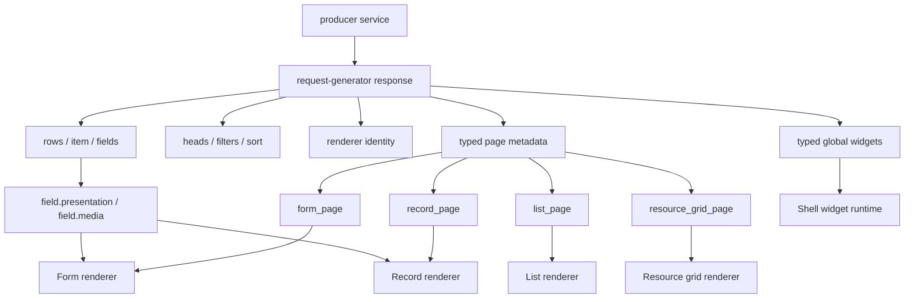

# Контракт универсального рендера

Имя: `UniversalRenderer`

Версия: `2.7.0`

Статус: `draft`

Владелец спецификации: мейнтейнеры request-generator.

Процесс изменения описан отдельно: [specification-process.md](specification-process.md).

Общие цели спецификаций описаны отдельно: [specification-goals.md](specification-goals.md).

Этот документ фиксирует typed frontend-контракт `request-generator producer service -> UniversalRenderer`: producer описывает UI metadata через Go API `renderer.Universal`, request-generator сам добавляет renderer identity/version и page metadata в response, а UniversalRenderer строит форму, список, карточку, detail view или рабочую страницу без module-specific кода.

Проектные названия, конкретные роли, конкретные route names и application-specific ресурсы не являются частью core contract. Их можно использовать только в разделе примеров application profile.

## Изменения В 2.7.0

`2.7.0` — minor-версия. Все изменения wire-формата аддитивны, и producer
включает их сам; ответы без новых полей не меняются. Required keys, CRUD route
mapping и error shape не менялись.

- Новые optional поля page, field и action metadata.
- Новые значения закрытых enum: `placement: half|head|menu`, pill
  `presentation: menu`, `display_type: action_rows|flow_steps|card_rail`,
  `block.decoration.variant`, `ratio: natural`, `size: original`,
  `main_ratio`/`thumb_ratio: tall`, `usage: cover` и типы компонентов
  `record_carousel` и `prompts`.
- Atomic `add`/`update` публикуют в result contract свои скалярные
  `ResultFields`, а `selection.source` сверяет endpoint с параметрами пути
  standard request (см. «Action result selection»).
- Новые optional ключи ответов: `sort_active` в list response,
  `fields[field].min`/`max` в defrec response, `home`, `locked` и
  `lock_reason` в `/api/config`.
- `display_type` проверяется по типу компонента-владельца. Для уже
  существующих значений `key_value_grid` и `tile_grid` правило прежнее
  (`data_list`).
- Версия также покрывает аддитивные поля, добавленные после `2.6.0` без смены
  версии: `navigation[].mobile_order`, `mobile_title`,
  `navigation_more_label`, `layout.mobile_slots`, `sections[].mobile_order`,
  `form_page.navigation` (tabs), `RecordSection.Resource` и
  `date_range.min_days`.

Новый метод `Delete` интерфейса `actions.AtomicExecutor` меняет Go API
реализаций executor-а, а не renderer wire contract, и описан в changelog.
Порядок выкатки новых значений закрытых enum описан в разделе «Совместимость».

Там же — ещё два дополнения Go API, не меняющие wire contract:

- `SerializeOn(ctx, key)` берёт транзакционный advisory lock с этим именем.
  Операция, которая сначала считает, а потом пишет, иначе читает счёт
  одновременно со второй такой же, и обе проходят. Postgres отпускает
  блокировку в конце транзакции, чем бы она ни кончилась, поэтому вызывающий
  не может оставить её висеть.
- `AtomicValueKindNullableTime` читает timestamp-колонку, которой позволено
  быть пустой, как пустую, а не как ошибку — так же, как уже читаются
  nullable-строка и nullable-число.

- `AtomicInput.Float(name)` читает число, у которого может быть дробная часть
  — сумму денег, курс — и целое, присланное вместо него, читает как то же
  число. Раньше такое поле приходилось доставать через `Field` руками.

Обе добавки интерфейса обязательны для сторонних реализаций
`AtomicExecutor`; `Float` — метод входа, реализовывать его не нужно.

**Ячейка баланса.** `DisplayFieldRef` получил два аддитивных поля рядом с
`tone` и `unit`:

- `art` — картинка того, что считает ячейка (монета, токен). Стоит там, где
  была бы иконка, без собственной подложки; клиент разрешает адрес тем же
  резолвером, что и остальные изображения. Ячейка с `art` не рисует
  `presentation.icon`.
- `badge_field` — имя другого поля, значение которого едет рядом с цифрой
  маленьким словом: сумма, которая уже в пути, говорит об этом возле себя, а
  не отдельной строкой под балансом. Пустое значение не рисует ничего.
- `badge_below` — это слово стоит строкой под цифрой, а не рядом: у длинного
  названия плана состояние рядом не читается, поэтому ячейка может попросить
  поставить его под ним, по ширине самого названия.

Оба поля читает вариант списка `metric_row`; остальные варианты их
игнорируют.

**Локализация конфигурации виджета.** `LocalizeGlobalWidget` записывает
разрешённый текст в `LabelMap` бейджей, поэтому клонирует конфигурацию перед
этим. Бейджи над полем ввода (`WorkspaceWidget.ComposerBadges`) клонирование
пропускало, и карты оставались общими с модулем: первый запрос после рестарта
заменял в них ключи одним языком, а все следующие запросы, на любом языке,
получали этот первый язык.

## Визуальная Схема



## Где Лежит Metadata

UniversalRenderer читает metadata только из typed response fields. Новые UI-возможности добавляются в typed contract генератора, а не в ad-hoc maps.

Каждый response с typed page metadata должен содержать renderer identity:

```json
{
  "renderer": {
    "name": "UniversalRenderer",
    "version": "2.3.0"
  }
}
```

Producer module не задает `renderer.name/version` вручную. Эти значения добавляет request-generator, когда у `BaseModule.Render` есть metadata для текущего response type.

### Typed Go API

```go
Render: renderer.Universal{
    List: &renderer.ListPage{
        Layout: &renderer.Layout{
            Type:  renderer.LayoutOneColumn,
            Gap:   renderer.SpacingMD,
            Align: renderer.AlignStretch,
        },
        Filters: &renderer.Filters{Enabled: true},
        CardSchema: &renderer.CardSchema{
            Variant: renderer.CardVariantMedia,
            Size:    renderer.SizeSM,
        },
    },
    Form:   &renderer.FormPage{Layout: renderer.LayoutTwoColumn},
    Record: &renderer.RecordPage{Layout: &renderer.Layout{Type: renderer.LayoutThreeColumn}},
}
```

Если metadata зависит от request context, producer module должен использовать typed dynamic hook:

```go
RenderFunc: func(c *gin.Context, base renderer.Universal) (renderer.Universal, error) {
    render := base
    if render.List != nil {
        render.List.Context = map[string]interface{}{
            "can_create_request": canCreateRequest(c),
        }
    }
    return render, nil
}
```

`Render` задает базовую статическую схему. `RenderFunc` является optional typed runtime override/merge и вызывается request-generator через `RenderFor(c)` перед построением `/api/config`, list, defrec и view responses. В `RenderFunc` передается deep clone базового `Render`, поэтому producer module может безопасно менять pointer structs, slices, maps и стандартные JSON-like значения внутри `interface{}` (`map[string]interface{}`, `[]interface{}`, `map[string]string`, `[]string` и т.п.) без протекания state в следующие запросы. Произвольные custom objects внутри `interface{}` не клонируются и остаются ответственностью producer module. Результат `RenderFunc` остается `renderer.Universal` и валидируется через `Validate()` уже после runtime изменений.

Возвращаемое `RenderFunc` дерево принадлежит запросу: callback не должен
подключать изменяемые глобальные структуры или сохранять результат для других
запросов. Разрешение ресурсов и локализация выполняются на этом экземпляре.
Общие внутри одного результата текстовые объекты локализуются один раз.
Публичный `renderer.Localize` сохраняет поведение с копированием;
`renderer.LocalizeOwned` предназначен только для уже изолированного результата.
Custom objects внутри `interface{}` по-прежнему требуют явного владения producer-а.

### Сборка только запрошенной страницы

Полный `RenderFunc(c, Universal)` строит все ветки, даже когда response
использует только одну. Для модуля с независимо собираемыми list/form/record
страницами это приводит к лишним копиям и загрузке runtime metadata.
Опциональный `PageRenderFunc(c, *renderer.Draft) error` выбирает нужную ветку:

```go
PageRenderFunc: func(c *gin.Context, draft *renderer.Draft) error {
    if draft.PageType() == renderer.PageTypeList {
        // Fresh request-owned page: базовая ветка не копируется.
        return draft.Replace(renderer.Universal{List: buildListPage(c)})
    }
    page, err := draft.Edit() // lazy deep clone только выбранной ветки
    if err != nil { return err }
    if page.Form != nil { page.Form.Title = "edit.title" }
    return nil
},
```

При `Generator.Run` базовый `Render` валидируется и копируется в закрытый
`renderer.Template`. После запуска declaration и hooks изменять нельзя.
Template не содержит user/role/language state и не отдаёт свои pointers.
`Template.Draft` создаёт request-local объект: `Edit()` копирует выбранную
ветку максимум один раз, `Replace(Universal)` передаёт владение свежей веткой
без копирования. Изменение корневого pointer после `Edit` требует `Replace`.
`Build()` завершает draft и валидирует результат; повторное использование
возвращает ошибку. Нельзя сохранять draft или его pointers после callback,
передавать их другому запросу или подключать изменяемые shared objects.
Custom values внутри `interface{}` имеют те же ограничения, что `Clone`.

List endpoint запрашивает `PageTypeList` (результат содержит `List` **или**
`ResourceGrid`), defrec — `PageTypeForm`, view — результат `PageTypeFunc`
либо объявленный `PageType`. Unrelated ветки в `Replace` отклоняются;
`Universal{}` явно удаляет страницу. Dynamic metadata и ссылки field matrix
валидируются; resource resolution, access gates и localization выбранной
страницы выполняются в обычном response pipeline. Неиспользуемые ветки
не строятся и не разрешают свои ресурсы. Producer должен сохранять все
зависимости и проверки, необходимые именно запрошенной странице.

Без `PageRenderFunc` используется прежний полный `RenderFor`, включая
cross-page зависимости callbacks. Сам `RenderFor`, discovery и внутренние
проверки связанных ресурсов сохраняют прежнюю семантику: для мигрирующего
модуля нужно оставить полный callback и согласованный `DiscoveryFunc`.
Прямой `RenderPageFor` до `Run` компилирует временный template, не изменяя
shared state. Go API расширен аддитивно; JSON shape, identity/version и
frontend protocol не меняются. Это copy-on-write на уровне страницы,
а не автоматическое копирование отдельных узлов при записи.

`DiscoveryFunc` описывает доступные типы страниц без полного renderer:

```go
DiscoveryFunc: func(c *gin.Context, base renderer.Discovery) (renderer.Discovery, error) {
    base.Form = true // форма строится runtime callback-ом
    return base, nil
},
```

`renderer.Discovery` содержит только значения: `List` (`""`, `PageTypeList`
или `PageTypeResourceGrid`), `Form` и `Record` (bool). Базовое значение берётся
из `BaseModule.Render`, валидируемого при запуске. Hook может менять наличие
страниц для текущего запроса; результат всегда проверяется через `Validate()`.
В этом типе нет page contents, идентичность и версия renderer задаются библиотекой.
Описания страниц не являются проверками доступа: `AccessGate`, permissions и
`NavigationHidden` продолжают выполняться для текущего пользователя.

В `/api/config` приоритет: `DiscoveryFunc`, затем `ConfigRenderFunc`, затем
`RenderFunc`. Если hooks нет, достаточно возможностей статического `Render`.
Компактное описание сохраняется только на время одного config-запроса.
List/view/defrec используют `PageRenderFunc`, если он задан; иначе сохраняют
полный runtime render и его validation. Проверки связанных ресурсов сохраняют
полный runtime render. Переход на `DiscoveryFunc` явно выполняет
producer; автоматически считать динамический renderer статическим нельзя.
Go API расширен аддитивно, JSON и renderer version не меняются.

`ConfigRenderFunc` — optional отдельный hook для `/api/config`. Он использует ту же
сигнатуру и validation, что и `RenderFunc`, но описывает только наличие и типы
страниц для discovery. Producer не должен загружать в нём содержимое страниц.
Например, модуль, у которого динамически наполняется существующий `Record`,
может вернуть переданный `base` без чтения записей. Если `List` или `Form`
создаются динамически, discovery hook должен объявить их для соответствующего
request context. Права действий, `AccessGate`, `NavigationHidden`, widget bindings
и локализация по-прежнему применяются generator-ом отдельно.

При отсутствии обоих discovery hooks явно сохраняется обычная семантика `RenderFunc`,
включая динамические типы страниц и ошибки validation. При сборке одного конфига
каждый модуль вычисляется один раз; результат не разделяется между HTTP-запросами,
пользователями или языками. List, view и defrec без `PageRenderFunc`, а также проверки связанных ресурсов
продолжают использовать полный `RenderFunc`. JSON-контракт и renderer
version не меняются; новый hook относится только к producer Go API.

Closed enums должны использовать typed constants из package `renderer`. `map[string]interface{}` допустим только в явно typed runtime/transport полях (`Context`, `Payload`, `Query`, route query и т.п.), где содержимое является данными запроса или состоянием выполнения, а не схемой UI. Если producer-у нужен новый UI metadata block, он должен быть добавлен в typed renderer contract, а не передан через ad-hoc map.

### List Response

```json
{
  "count": 120,
  "size": 20,
  "page": 0,
  "renderer": {
    "name": "UniversalRenderer",
    "version": "2.3.0"
  },
  "list_page": {},
  "rows": [],
  "heads": {
    "status": {
      "title": "Status"
    }
  },
  "filters": {
    "status": {
      "title": "Status",
      "type": "string",
      "form_type": "select",
      "options": []
    }
  },
  "sort": [
    {"value": "updated_at:desc", "text": "Updated ↓"}
  ],
  "sort_active": {"field": "updated_at", "direction": "desc"}
}
```

Канонические места:

| Path | Назначение |
|------|------------|
| `rows` | Данные строк. |
| `heads[field]` | Локализованный заголовок колонки. Визуальное представление поля задается typed `presentation`. |
| `filters[field]` | Тип, form type, options и typed `options_source` фильтра. Расположение задается в `list_page.filters`. |
| `sort[].value` | Значение сортировки в формате `field:asc` или `field:desc`. |
| `sort_active` | Фактическая сортировка ответа: `field` и `direction` (`asc`/`desc`). Отсутствует, если list action не сортирует. |
| `count`, `size`, `page` | Server-side pagination. |
| `renderer` | Renderer identity/version, добавляется request-generator. |
| `list_page` | Typed metadata страницы списка из `BaseModule.Render.List`. |
| `resource_grid_page` | Typed metadata рабочей grid-страницы из `BaseModule.Render.ResourceGrid`. |

`sort_active` (`actions.SortActiveResponse`) называет сортировку, в которой
строки реально отданы: `field` — имя колонки, `direction` — `asc` или `desc`.
Consumer, добавляющий строку в уже загруженную страницу, ставит её туда, куда
её поставил бы сам список, а не в начало. Значение формирует generator: это
запрошенная сортировка из `action.Sort`, иначе `SortDefaultFunc(c)`, иначе
`SortDefault` вместе с `SortDefaultDirection` (по умолчанию `asc`). Если
сортировки нет, ключ отсутствует. Это относится и к запросу с колонкой, которой
нет в `action.Sort`: default в этом случае не применяется.

### Defrec/Form Response

```json
{
  "renderer": {
    "name": "UniversalRenderer",
    "version": "2.3.0"
  },
  "form_page": {},
  "fields": {
    "status": {
      "title": "entity.fields.status",
      "type": "string",
      "form_type": "select",
      "required": true,
      "options": [],
      "section": "main",
      "presentation": {
        "renderer": "universal.section",
        "variant": "default"
      }
    }
  }
}
```

Канонические места:

| Path | Назначение |
|------|------------|
| `fields[field]` | Описание поля формы. |
| `fields[field].required` | Required marker для UI. |
| `fields[field].min`, `fields[field].max` | Принимаемый числовой диапазон из check rule с `RuleInfo().Type == "range"` (сценарий `add`). |
| `fields[field].options` | Static options. |
| `fields[field].section` | Базовая секция поля. |
| `fields[field].presentation` | Typed metadata визуального представления одиночного поля. |
| `fields[field].media` | Typed media metadata одиночного поля, если поле является media value. |
| `renderer` | Renderer identity/version, добавляется request-generator. |
| `form_page` | Typed metadata универсальной form/edit страницы из `BaseModule.Render.Form`. |

#### Диапазон числового поля

`response.NewDefrecResponse` публикует `min` и `max`, если у поля есть check
rule, реализующий `fields.CheckRuleIntrospectable`, у которого
`RuleInfo().Type == "range"` в сценарии `add`. Значения берутся из
`RuleInfo.Min` и `RuleInfo.Max` (`int`). Control удерживает значение внутри
диапазона, а не отклоняет его после ввода.

- Встроенного `range` rule в библиотеке нет: ключи появляются только для
  application-defined rule с таким `RuleInfo`.
- Ключи есть только в `defrec.fields`; в `view.item` их нет.
- Это UI-подсказка: серверная проверка остаётся за самим rule.

```json
{
  "fields": {
    "quantity": {
      "title": "Quantity",
      "type": "number",
      "form_type": "number",
      "min": 1,
      "max": 99
    }
  }
}
```

#### Заголовок поля для запроса

`fields.ModuleField.TitleFunc` (`func(c *gin.Context) string`, в JSON не
сериализуется) задаёт заголовок поля для текущего запроса. Функция возвращает
translation key; пустой результат оставляет `Title`. Generator применяет её
только в `defrec`, до перевода `Title`. На `view.item[field].title` и list
`heads` она не влияет.

```go
{
    Column: table.Records.Name,
    Title:  "records.fields.name",
    TitleFunc: func(c *gin.Context) string {
        if recordIsOrganization(c) {
            return "records.fields.organization_title"
        }
        return ""
    },
}
```

### Form Section Columns

`form_page.sections[].columns` задает количество колонок для обычной секции
формы и ее дочерних fields. Это layout секции, а не свойство отдельного поля
или визуальной поверхности `block`.

Допустимы typed значения `1`, `2`, `3`, `4` из
`renderer.FieldMatrixColumnCount`. Значение `0` не сериализуется и означает
renderer default. Generator отклоняет другие значения при `Universal.Validate()`.

```go
notConnected := true

renderer.FormSection{
    ID:      "payments",
    Block:   &renderer.Block{Type: renderer.BlockPanel},
    Fields:  []string{"accepted_payment", "commission_rate"},
    Columns: renderer.FieldMatrixColumnsOne,
}
```

### Date Range Form Section

`RendererDateRange` объединяет два уже объявленных поля формы в один контрол
диапазона дат. Это только presentation: стандартный add/update body остаётся
плоским и содержит исходные `start_field` и `end_field`.

```go
renderer.FormSection{
    ID:       "period",
    Renderer: renderer.RendererDateRange,
    Fields:   []string{"starts_on", "ends_on"},
    DateRange: &renderer.DateRangeConfig{
        StartField: "starts_on",
        EndField:   "ends_on",
        Min:        "2026-01-01",
        ApplyLabel: "ui.apply",
        CancelLabel: "ui.cancel",
        Months: []string{
            "calendar.january", "calendar.february", "calendar.march",
            "calendar.april", "calendar.may", "calendar.june",
            "calendar.july", "calendar.august", "calendar.september",
            "calendar.october", "calendar.november", "calendar.december",
        },
        FormatMonths: []string{
            "calendar.format_january", "calendar.format_february", "calendar.format_march",
            "calendar.format_april", "calendar.format_may", "calendar.format_june",
            "calendar.format_july", "calendar.format_august", "calendar.format_september",
            "calendar.format_october", "calendar.format_november", "calendar.format_december",
        },
        Weekdays: []string{
            "calendar.monday", "calendar.tuesday", "calendar.wednesday",
            "calendar.thursday", "calendar.friday", "calendar.saturday",
            "calendar.sunday",
        },
    },
}
```

Оба field id должны входить и в `form_page.fields`, и в `section.fields`.
`min`, `max` и `disabled_dates` используют ISO `YYYY-MM-DD`. `months` содержит
формы для заголовка календаря, а необязательный `format_months` — формы для
полной выбранной даты. Например, русская локаль передаёт `Август` и `августа`,
чтобы renderer вывел заголовок `Август 2026` и значение `1 августа 2026` без
языковой логики на клиенте. Месяцы и дни недели передаются producer-ом и
локализуются обычным renderer localizer.

`min_days` (`DateRangeConfig.MinDays`, int) задаёт минимальную длину
диапазона в днях, считая обе границы: picker не даёт собрать диапазон, который
сервер потом отклонит. `0` не сериализуется и означает «без ограничения».
`min_days_label` (`DateRangeConfig.MinDaysLabel`) — translation key пояснения
этого правила; он локализуется вместе с остальными подписями picker-а.
Ограничение presentation-only: add/update action обязан проверять диапазон сам.

```json
{
  "date_range": {
    "start_field": "starts_on",
    "end_field": "ends_on",
    "min_days": 3,
    "min_days_label": "Minimum stay is 3 days"
  }
}
```

### Prompt List Внутри Формы

`form_page.sections[].prompts` описывает короткие статусные строки, которые
относятся именно к своей секции формы. Это подходит для возможностей среды,
подключения канала доставки или другого действия, которое не является полем
записи. Prompt не хранит локальное состояние и не заменяет field validation.

```go
renderer.FormSection{
    ID:       "delivery_channels",
    Renderer: renderer.RendererFieldMatrix,
    Matrix:   deliveryMatrix(),
    Prompts: &renderer.PromptList{
        Variant: "compact",
        Items: []renderer.Prompt{{
            ID:   "browser_delivery",
            Kind: "browser",
            Tone: "info",
            Icon: "bell",
            Text: "delivery.prompts.browser.text",
            VisibleIf: &renderer.Condition{
                Path:  "record.browser_connected",
                Falsy: &notConnected,
            },
            Action: &renderer.Action{
                ID:    "connect_browser",
                Type:  renderer.ActionEmit,
                Label: "delivery.prompts.browser.action",
                API:   &renderer.APIAction{Method: "PUT", Endpoint: "/api/browser_subscriptions"},
                Client: &renderer.ClientAction{
                    Name: "browser.delivery.subscribe",
                    Arguments: []renderer.ClientActionArgument{{
                        Name:  "application_server_key",
                        Value: renderer.TypedValue{Type: renderer.TypedValueString, String: "public-key"},
                    }},
                },
                AfterSuccess: &renderer.ActionResult{Reload: "record"},
            },
        }},
    },
}
```

На wire это выглядит так:

```json
{
  "id": "delivery_channels",
  "renderer": "field.matrix",
  "prompts": {
    "variant": "compact",
    "items": [{
      "id": "browser_delivery",
      "kind": "browser",
      "tone": "info",
      "icon": "bell",
      "text": "Browser delivery is not connected.",
      "visible_if": {"path": "record.browser_connected", "falsy": true},
      "action": {
        "id": "connect_browser",
        "type": "emit",
        "label": "Connect browser",
        "api": {"method": "PUT", "endpoint": "/api/browser_subscriptions"},
        "client": {
          "name": "browser.delivery.subscribe",
          "arguments": [{
            "name": "application_server_key",
            "value": {"type": "string", "string": "public-key"}
          }]
        },
        "after_success": {"reload": "record"}
      }
    }]
  }
}
```

`PromptList.variant` определяет только общую визуальную плотность списка.
`Prompt.visible_if` использует общий condition grammar. Producer обязан
проверять доступ и входные данные в endpoint из `action.api`; скрытый prompt
не является механизмом авторизации.

`action.client` описывает capability текущего приложения. Generic renderer
делегирует его зарегистрированному application handler и не знает бизнес-имя
capability. `arguments` имеют `TypedValue`, поэтому обработчик не угадывает
строковые типы. Для browser-only capability API может одновременно передать
`action.api`: application handler получает endpoint и method из typed action,
но сам выполняет только доступную ему browser operation.

`Prompt.close_label` (`CloseLabel`) — optional translation key второго ответа
на prompt («позже»), когда prompt просит действовать сейчас. Он локализуется
вместе с `title` и `text`. Если `close_label` задан, consumer показывает его
как текстовое закрытие prompt-а рядом с `action`.

```json
{
  "id": "browser_delivery",
  "text": "Browser delivery is not connected.",
  "close_label": "Later",
  "action": {"id": "connect_browser", "type": "emit", "label": "Connect browser"}
}
```

### Внешняя форма в секции

`RecordSection.Resource` использует тот же `Resource`/`ResourceLoad`, что и
`FormSection.Resource`. Это композиция существующих страниц, не новый renderer:
`renderer: "universal.section"`. Источник — стандартный `list`, `view` (с
`form_page`) или `defrec`. `Components` одновременно с `Resource` запрещены.
Generator разрешает bindings и проверяет permissions целевого action; при
отсутствии доступа секция исключается. Source module остаётся server-only.
`loading_label` и `retry_label` — локализуемые подписи состояний секции.
Для списка используется его `list_page`, карточки, `count`, `size` и server
pagination. Форма использует свой обычный контракт полей/actions; успешная
запись обновляет соседние встроенные списки, не отправляя повторную мутацию.
Никаких module-specific callbacks или схем в `context` не требуется.
Изменение аддитивное: существующие секции без `Resource` не меняются. Producer
подключает новую композицию только после обновления consumer renderer.

`FormSection.Resource` позволяет встроить форму другого стандартного модуля в
навигацию текущей form page. Это не отдельный frontend route и не новый
проектный transport: producer указывает только существующий `view` action и
typed bindings. Generator проверяет доступ текущей роли, сохраняет описание
`resource` только на сервере и выдаёт consumer-у уже собранный `load`.

```go
renderer.FormSection{
    ID:           "delivery",
    Title:        "settings.delivery",
    Renderer:     renderer.RendererUniversalSection,
    Columns:      renderer.FieldMatrixColumnsOne,
    LoadingLabel: "ui.loading",
    Resource: &renderer.Resource{
        ActionResource: renderer.ActionResource{
            Module: "delivery_preferences",
            Action: "view",
        },
        Bindings: []renderer.RequestBinding{
            {
                Target: renderer.RequestBindingPathByKey,
                Source: renderer.ValueSource{Literal: &renderer.TypedValue{
                    Type: renderer.TypedValueString,
                    String: "user_id",
                }},
            },
            {
                Target: renderer.RequestBindingPathValue,
                Source: renderer.ValueSource{Runtime: &renderer.RuntimeValue{
                    Scope: renderer.RuntimeValueSourceCurrentUser,
                    Field: "id",
                }},
            },
        },
    },
}
```

В response section получает только исполняемый descriptor. `resource` и имя
целевого module/action в JSON не попадают:

```json
{
  "id": "delivery",
  "renderer": "universal.section",
  "load": {
    "request": {
      "method": "GET",
      "endpoint": "/api/delivery_preferences/view/:bykey/:value"
    },
    "bindings": [
      {
        "target": "path_by_key",
        "source": {"literal": {"type": "string", "string": "user_id"}}
      },
      {
        "target": "path_value",
        "source": {"runtime": {"scope": "current_user", "field": "id"}}
      }
    ]
  }
}
```

Consumer выполняет `load.request` с bindings, использует полученные
`form_page`, `fields`, `item` и `form_page.actions` без domain-specific
веток. Секция с недоступным target action не попадает в response.

### Поле времени

`form_type: "time"` представляет значение времени суток в формате `HH:MM`.
Для PostgreSQL `TIME` module использует `fields.TimeOfDayConverter` на записи
и `fields.TimeOfDayResultValue` на чтении: UI не получает техническую дату,
которую драйвер использует при сканировании значения `TIME`.

### Field Matrix

`field.matrix` задает раскладку уже описанных typed полей формы. Matrix не
дублирует значение, `type`, `form_type`, options, checks или presentation:
renderer получает их из стандартных `fields` либо `item` response.

```go
renderer.FormSection{
    ID:       "rates",
    Renderer: renderer.RendererFieldMatrix,
    Matrix: &renderer.FieldMatrix{
        Type:      renderer.FieldMatrixTypeTable,
        Underline: "rates",
        Table: &renderer.FieldMatrixTable{
            Heads: []string{
                "settings.rates.duration",
                "settings.rates.incall",
                "settings.rates.outcall",
            },
            Rows: []renderer.FieldMatrixRow{
                {
                    Label: "settings.rates.1h",
                    Cells: []renderer.FieldMatrixCell{
                        {Field: "incall_1h_price"},
                        {Field: "outcall_1h_price"},
                    },
                },
            },
        },
    },
}
```

`table` содержит `heads` и `rows`. У каждой ячейки должен быть ровно один
источник: `field` (ссылка на поле модуля) или `text` (статический текст).
Непустой `row.label` занимает первую ячейку строки, поэтому в этом случае
количество `cells` на единицу меньше числа заголовков. Без `row.label` оно
должно совпадать с числом заголовков.

`table.presentation` задает arrangement тех же typed rows: пустое значение
или `grid` рисует таблицу, `chips` — компактные переключатели одной строки,
`accordion` — раскрывающиеся строки. `rows[].icon`, `rows[].tone` и
`cells[].icon` являются presentation tokens: consumer сопоставляет их со
своим icon catalog и palette, generator не знает их реализации.

`list` содержит только упорядоченные `fields` и typed `columns` от одного до
четырех. Каждый field выводится как самостоятельный item без описания строк,
ячеек или колонок в producer metadata.

```go
renderer.FormSection{
    ID:       "preferences",
    Renderer: renderer.RendererFieldMatrix,
    Matrix: &renderer.FieldMatrix{
        Type:      renderer.FieldMatrixTypeList,
        Underline: "settings",
        List: &renderer.FieldMatrixList{
            Fields:  []string{"email_enabled", "push_enabled", "quiet_hours"},
            Columns: renderer.FieldMatrixColumnsTwo,
        },
    },
}
```

`heads[]`, `rows[].label`, `rows[].description`, `cells[].label` и
`cells[].text` producer задает translation
keys. Перед ответом request-generator локализует их для выбранного `lang`; UI
kit не получает ключи и не выполняет перевод. `underline` является opaque
application-defined visual identifier: generator не знает его палитру и не
валидирует как CSS value.

Generator проверяет closed `type`, применимость `list`/`table`, допустимое
число колонок list, структуру table и существование каждого referenced field
в модуле.

### Матрица с самостоятельными строками

Когда строки матрицы хранятся в другом стандартном module, `table.source`
связывает presentation с его обычными `list` и `update` actions. Producer не
передает endpoint в JSON: request-generator проверяет actions, permissions,
selector и editable boolean fields, а затем публикует `source.load` для
текущего principal. `id_field` является selector update action, `key_field`
связывает response list с `rows[].id`, а `available_field` отключает channel,
который недоступен для данной строки.

```go
renderer.FormSection{
    ID:       "delivery-rules",
    Renderer: renderer.RendererFieldMatrix,
    Matrix: &renderer.FieldMatrix{
        Type: renderer.FieldMatrixTypeTable,
        Table: &renderer.FieldMatrixTable{
            Heads: []string{"preferences.type", "preferences.email", "preferences.push"},
            Rows: []renderer.FieldMatrixRow{{
                ID:          "chat_messages",
                Label:       "preferences.chat_messages",
                Description: "preferences.chat_messages_hint",
                Icon:        "chat",
                Tone:        "cyan",
                Cells: []renderer.FieldMatrixCell{
                    {Field: "email_enabled", Label: "preferences.email", Icon: "mail", AvailableField: "email_available"},
                    {Field: "push_enabled", Label: "preferences.push", Icon: "push", AvailableField: "push_available"},
                },
            }},
            Source: &renderer.FieldMatrixDataSource{
                IDField:  "id",
                KeyField: "group_code",
                List:     renderer.ActionResource{Module: "delivery_preferences", Action: "list"},
                Update:   renderer.ActionResource{Module: "delivery_preferences", Action: "update"},
            },
        },
    },
}
```

После разрешения contract consumer получает только executable metadata:

```json
{
  "source": {
    "id_field": "id",
    "key_field": "group_code",
    "load": {
      "list": {"request": {"method": "GET", "endpoint": "/api/delivery_preferences"}},
      "update": {"request": {"method": "POST", "endpoint": "/api/delivery_preferences/:bykey/:value"}}
    }
  }
}
```

### Матрица с динамическими строками

Если набор строк определяет сам list resource, вместо статического `Rows`
задаётся `source.row`. Consumer строит одну строку на каждую запись list;
`label_field` и `description_field` могут содержать ключи локализации.

```go
Source: &renderer.FieldMatrixDataSource{
    IDField:  "id",
    KeyField: "group_code",
    Row: &renderer.FieldMatrixDataRow{
        LabelField:       "label_key",
        DescriptionField: "description_key",
        IconField:        "icon",
        ToneField:        "tone",
        Cells: []renderer.FieldMatrixCell{
            {Field: "email_enabled", Label: "preferences.email", AvailableField: "email_available"},
            {Field: "push_enabled", Label: "preferences.push", AvailableField: "push_available"},
        },
    },
    List:   renderer.ActionResource{Module: "delivery_preferences", Action: "list"},
    Update: renderer.ActionResource{Module: "delivery_preferences", Action: "update"},
},
```

### Иконка из данных

Для карточек, чьи иконка и тон приходят из каталога, `IconBinding` использует
`icon_field` и `tone_field`. Они имеют приоритет над `icon_map` и `tone_map`,
которые предназначены для закрытых enum-наборов.

```go
Icon: &renderer.IconBinding{
    IconField: "event_icon",
    ToneField: "event_tone",
    Fallback:  "bell",
},
```

`rows[].icon`, `rows[].tone` и `rows[].description` относятся только к
presentation. Значения переключателей, availability и update selector всегда
остаются в ответе исходного standard module action.

### View/Record Response

```json
{
  "renderer": {
    "name": "UniversalRenderer",
    "version": "2.3.0"
  },
  "record_page": {},
  "item": {
    "status": {
      "title": "Status",
      "type": "string",
      "form_type": "select",
      "value": "active",
      "edit": true,
      "options": [],
      "presentation": {
        "renderer": "universal.display",
        "variant": "badge"
      }
    }
  }
}
```

Канонические места:

| Path | Назначение |
|------|------------|
| `item[field].value` | Значение поля. |
| `item[field].edit` | Можно ли редактировать поле в UI. |
| `item[field].options` | Options для значения. |
| `item[field].presentation` | Typed metadata визуального представления одиночного поля. |
| `item[field].media` | Typed media metadata одиночного поля, если поле является media value. |
| `renderer` | Renderer identity/version, добавляется request-generator. |
| `record_page` | Typed metadata страницы просмотра из `BaseModule.Render.Record`. |

### Config Response

`config` используется для навигации, глобальных виджетов и роли текущего пользователя, если producer service участвует в построении оболочки приложения.

```json
{
  "navigation": [
    {
      "id": "entities.list",
      "path": "/entities",
      "target": {
        "type": "page",
        "renderer": {
          "name": "UniversalRenderer",
          "version": "2.3.0"
        },
        "page_type": "list",
        "query": {
          "url": "/api/entities",
          "method": "GET"
        },
        "data": {},
        "children": {}
      },
      "title": "entities.menu.list",
      "icon": "list",
      "order": 10,
      "mobile_order": 2,
      "mobile_title": "Catalog",
      "group": "navigation.main",
      "query": {},
      "data": {}
    },
    {
      "id": "chat.open",
      "target": {
        "type": "client_action",
        "name": "chat.open"
      }
    }
  ],
  "navigation_more_label": "More",
  "widgets": [
    {
      "id": "profile-menu",
      "order": 10,
      "renderer": {
        "name": "UniversalRenderer",
        "version": "2.3.0"
      },
      "widget": {
        "surface": {
          "kind": "popup",
          "placement": "shell_end",
          "load_policy": "on_open"
        }
      },
      "load": {
        "resource": {
          "request": {
            "method": "GET",
            "endpoint": "/api/profile-menu/view/:bykey/:value"
          },
          "bindings": [
            {"target": "path_by_key", "source": {"literal": {"type": "string", "string": "id"}}},
            {"target": "path_value", "source": {"runtime": {"scope": "current_user", "field": "id"}}}
          ]
        }
      }
    }
  ],
  "role": "admin"
}
```

Канонические места:

| Path | Назначение |
|------|------------|
| `navigation` | Плоский список пунктов навигации. Это источник истины для frontend routes. |
| `navigation[].path` | Frontend path для `target.type=page`. Для popup/client_action может отсутствовать. |
| `navigation[].target` | Поведение пункта навигации. |
| `navigation[].target.type` | Тип поведения: `page`, `modal`, `client_action`, `external`. |
| `navigation[].target.name` | Имя modal/client_action/external target. |
| `navigation[].target.renderer` | Renderer identity/version для page discovery, если route использует typed `BaseModule.Render`. |
| `navigation[].target.page_type` | Тип страницы: `list`, `form`, `record`, `resource_grid`. |
| `navigation[].target.query` | Endpoint и method для загрузки данных page route. |
| `navigation[].target.children` | Вложенные route configs. |
| `navigation[].mobile_order` | Порядок в нижней mobile navigation. Положительные значения получают приоритет над пунктами без mobile order. |
| `navigation[].mobile_title` | Уже локализованная короткая подпись для mobile navigation. Если поле пусто, frontend использует `title`. |
| `navigation[].home` | Optional. Пункт, на который для этого актора ведёт бренд/логотип. Consumer следует первому пункту с `home: true`. |
| `navigation[].locked` | Optional. Пункт существует для актора, но сейчас закрыт: он остаётся в меню и сообщает об этом, а не исчезает. |
| `navigation[].lock_reason` | Optional причина закрытия. Generator её не переводит: `AccessGate` возвращает готовый текст. |
| `navigation_more_label` | Уже локализованная подпись overflow-кнопки mobile navigation. |
| `routes` | Реестр page routes текущего актора: пункты `navigation` с `target.type=page` и страницы из `BaseModule.Routes`. Каждый элемент содержит уникальный `path` и `target` того же shape, что `navigation[].target`. |
| `routes[].locked`, `routes[].lock_reason` | Optional. Страница, открытая по адресу (reload, закладка, ссылка), закрыта тем же правилом, что и пункт меню. |
| `widgets` | Глобальные виджеты, построенные из действий модулей с `WidgetConfig`. |
| `widgets[].renderer` | Renderer identity/version глобального typed widget contract. |
| `widgets[].widget` | Typed surface и optional workspace composition. |
| `widgets[].load` | Generated typed requests для resource либо master/detail. |
| `widgets[].locked`, `widgets[].lock_reason` | Optional. То же, что у `navigation[]`, для глобального виджета. |
| `role` | Роль текущего пользователя. |

Renderer discovery происходит через `/api/config`: frontend может проверить compatibility с `UniversalRenderer` до загрузки данных страницы. Data responses (`list`, `defrec`, `view`) повторяют `renderer.name/version`, чтобы каждый response был самодостаточным.

#### Закрытые и скрытые пункты

| Go | Назначение |
|---|---|
| `module.NavigationEntry.Home` | Пометка home-пункта; переносится в `navigation[].home`. |
| `module.Generator.AccessGate` (тип `module.AccessGate`) | `func(c *gin.Context, target AccessTarget) (locked bool, reason string)`. Вызывается для каждого пункта navigation, каждого widget и каждого route. Принадлежит приложению; generator только спрашивает. |
| `module.Generator.NavigationHidden` (тип `module.NavigationHidden`) | `func(c *gin.Context, target AccessTarget) bool`. `true` убирает пункт navigation из ответа целиком. Спрашивается до `AccessGate`. На `routes` и `widgets` не действует. |
| `module.AccessTarget` | `Kind`, `ID`, `Path`. `Kind` — строка без typed constants: `"navigation"` (заданы `ID` и `Path`), `"widget"` (`ID`), `"route"` (`Path`). |

Lock означает «пока нет»: пункт виден и закрыт. Hidden означает «не для тебя»:
пункта в ответе нет. Ни одно из них не заменяет permission-проверку action:
закрытая страница всё равно должна отказывать на сервере.

```go
generator.AccessGate = func(c *gin.Context, target module.AccessTarget) (bool, string) {
    if target.Kind == "route" && !accountIsVerified(c) {
        return true, "Available after verification"
    }
    return false, ""
}
generator.NavigationHidden = func(c *gin.Context, target module.AccessTarget) bool {
    return target.ID == "records.billing" && !actorHasBilling(c)
}
```

```json
{
  "navigation": [
    {"id": "records.list", "path": "/records", "title": "Records", "home": true, "target": {"type": "page"}},
    {"id": "reports.list", "path": "/reports", "title": "Reports", "locked": true, "lock_reason": "Available after verification", "target": {"type": "page"}}
  ],
  "routes": [
    {"path": "/reports", "target": {"type": "page", "page_type": "list"}, "locked": true, "lock_reason": "Available after verification"}
  ],
  "widgets": [
    {"id": "work-area", "renderer": {"name": "UniversalRenderer", "version": "2.7.0"}, "widget": {"surface": {"kind": "drawer", "placement": "shell_end", "load_policy": "on_open"}}, "load": {}, "locked": true, "lock_reason": "Available after verification"}
  ]
}
```

## Field Metadata

Поле может иметь typed metadata, которая приходит вместе с самим field object в `defrec.fields[field]` и `view.item[field]`.

Typed field metadata нужна для одиночных полей, где базовых `type/form_type/options/checks` недостаточно, но вводить module-specific frontend код нельзя. Пример: поле с одним media value. Frontend не должен проверять `field.id == "avatar"` или другой application-specific ключ. API должен явно сказать, что значение поля является media item и каким renderer presentation его показывать.

### Field Presentation

`presentation` описывает только визуальное представление поля. Оно не описывает данные и не содержит бизнес-смысл.

```json
{
  "presentation": {
    "renderer": "avatar",
    "variant": "avatar",
    "style": "avatar",
    "size": "thumb",
    "ratio": "square"
  }
}
```

Поля:

| Path | Назначение |
|------|------------|
| `presentation.renderer` | Renderer/component key, например `avatar`, `universal.display`, `universal.section`. |
| `presentation.variant` | Вариант компонента внутри renderer. |
| `presentation.style` | Optional style token, если renderer поддерживает несколько визуальных стилей. |
| `presentation.icon` | Стабильный ключ иконки из icon registry. Не локализуется. |
| `presentation.size` | Media size token: `thumb`, `card`, `hero`, `original`. `original` запрашивает файл в том виде, в каком его загрузили: все sized renditions обрезаны под свой бокс, поэтому картинка, которая должна остаться целой, запрашивает `original`. |
| `presentation.ratio` | Media ratio token: `square`, `portrait`, `landscape`, `wide`, `natural`. `natural` сохраняет исходную форму снимка без обрезки под рамку. |
| `presentation.prefix`, `presentation.suffix` | Локализуемый текст до или после значения. |
| `presentation.hint`, `presentation.description` | Локализуемые подсказка и описание поля. |
| `presentation.placeholder` | Локализуемый текст внутри пустого control. Сюда относится правило, которое control уже соблюдает (диапазон, формат), вместо отдельной строки под полем. |
| `presentation.rows` | Высота многострочного control. |
| `presentation.visible_if` | Typed условие видимости через `renderer.Condition`. |
| `presentation.required_if` | `renderer.Condition`: поле обязательно только в этом состоянии (например, при отправке на проверку, но не в черновике). Дополняет `required` и не заменяет серверную проверку. |
| `presentation.disabled_if` | `renderer.Condition`: в этом состоянии поле остаётся на экране, показывает значение и недоступно для изменения («ответ не за читателем»). Не заменяет `item[field].edit` и серверные права. |
| `presentation.tone_by_value` | Маппинг стабильного значения enum на theme tone. |
| `presentation.notice_by_value[]` | Уведомление в момент выбора значения: что этот выбор влечёт. |
| `presentation.notice_by_value[].value` | `TypedValue` значения, при выборе которого показывается уведомление. |
| `presentation.notice_by_value[].title` | Optional локализуемый заголовок. |
| `presentation.notice_by_value[].message` | Локализуемый текст уведомления. Обязателен: сериализуется всегда. |
| `presentation.notice_by_value[].confirm_label` | Optional локализуемая подпись кнопки, закрывающей уведомление. |

`placeholder` локализуется вместе с `prefix`, `suffix`, `hint` и
`description`. Тексты `notice_by_value[]` (`title`, `message`,
`confirm_label`) локализуются в `defrec` и `view`.

```json
{
  "presentation": {
    "renderer": "primary_radio",
    "placeholder": "From 1 to 99",
    "required_if": {"path": "record.state", "equals": "review"},
    "disabled_if": {"path": "record.owner_managed", "truthy": true},
    "notice_by_value": [
      {
        "value": {"type": "string", "string": "cash"},
        "title": "Cash payment",
        "message": "The order is confirmed only after the payment is received.",
        "confirm_label": "Got it"
      }
    ]
  }
}
```

### Option Controls

Для вариантов выбора в `defrec` и `view` producer использует базовые
`form_type`, `options` и `presentation.renderer`. UI kit выбирает control
поля только по renderer key:

| Renderer key | Назначение |
|---|---|
| `chip_select` | Множественный выбор через chips. Используется с `form_type: multiselect`. |
| `primary_radio` | Выбор одного основного варианта. Используется со scalar `form_type`, например `select`. |
| `badge` | Статус или enum с tone, в том числе `presentation.tone_by_value`. |

Каждый option может содержать `icon`. Значение и label остаются стандартными:

```json
{
  "form_type": "multiselect",
  "presentation": { "renderer": "chip_select" },
  "options": [
    { "value": "example", "label": "Example", "icon": "tag" }
  ]
}
```

`label` задается producer-ом как translation key и локализуется
request-generator до выдачи JSON. `icon` является стабильным именем иконки и
не локализуется.

В list filters generator передает `form_type`, стандартные options
(`value`, локализованный `label`, `icon`) и `options_source`, если варианты
подгружаются асинхронно. Расположение и порядок фильтров описываются только в
`list_page.filters` (`primary`, `secondary`, `more`, `nested`), а не в metadata
самого поля.

```go
{
    Column:   table.Items.Categories,
    Title:    "items.fields.categories",
    Type:     fields.ModuleFieldTypeArray,
    FormType: fields.ModuleFieldFormTypeMultiselect,
    Presentation: &renderer.FieldPresentation{
        Renderer: renderer.RendererChipSelect,
    },
    Options: []fields.ModuleFieldOptions{
        {Value: "example", Label: "items.options.example", Icon: "tag"},
    },
},
{
    Column:   table.Items.Status,
    Title:    "items.fields.status",
    Type:     fields.ModuleFieldTypeString,
    FormType: fields.ModuleFieldFormTypeSelect,
    Presentation: &renderer.FieldPresentation{
        Renderer: renderer.RendererPrimaryRadio,
    },
    Options: []fields.ModuleFieldOptions{
        {Value: "active", Label: "items.options.active", Icon: "check"},
    },
},
```

Вариант, показанный карточкой, может нести дополнительные поля
`fields.ModuleFieldOptions`. Они сериализуются в `options[]` в
`defrec.fields`, `view.item` и `list.filters`:

| Go | JSON | Назначение |
|---|---|---|
| `Media` | `media` | Вариант — картинка (обложка, фон) вместо имени. Адрес разрешается приложением так же, как любой media URI. |
| `Badge` | `badge` | Короткая метка в углу варианта-карточки. Translation key. |
| `BadgeTone` | `badge_tone` | Тон метки; open token. |
| `Trailing` | `trailing` | Значение с trailing-стороны варианта. Producer передаёт его уже отформатированным. |
| `TrailingNote` | `trailing_note` | Подпись под `trailing`. Translation key. |
| `Note` | `note` | Строка акцента под `description`. Translation key. |

`badge`, `note` и `trailing_note` generator переводит в `defrec`, `view` и
обычных list filters; в `ListModuleAction.VirtualFilters` по-прежнему
переводится только `label`. `media`, `badge_tone` и `trailing` не
переводятся. Вариант без этих полей сериализуется как раньше
(`{"value": …, "label": …}`).

```json
{
  "form_type": "select",
  "presentation": {"renderer": "primary_radio"},
  "options": [
    {
      "value": "annual",
      "label": "Annual",
      "description": "Billed once a year",
      "badge": "Best value",
      "badge_tone": "amber",
      "trailing": "$99",
      "trailing_note": "per year",
      "note": "Two months free"
    },
    {"value": "cover_1", "label": "Cover 1", "media": "ipfs://..."}
  ]
}
```

### Field Options Source

`options_source` задает typed источник вариантов для `select` и
`multiselect`. Он одинаково сериализуется в `list.filters`, `defrec.fields` и
`view.item`.

```json
{
  "options_source": {
    "endpoint": "/api/locations",
    "query": [{"key": "active", "value": "true"}],
    "search_param": "search",
    "mode": "tree"
  }
}
```

Тип `array` не меняется, когда данные хранятся в `JSON`/`JSONB`. Это является producer-only настройкой storage, не частью renderer contract-а:

```go
{
    Column:       table.Messages.Media,
    Title:        "messages.fields.media",
    Type:         fields.ModuleFieldTypeArray,
    ArrayStorage: fields.ModuleFieldArrayStorageJSON,
}
```

Для PostgreSQL array `ArrayStorage` не указывается. JSON array storage нельзя использовать в стандартном list filter: фильтрация JSON-массивов требует отдельной явно описанной семантики.

`endpoint` обязателен. `mode` допускает `list` или `tree`; при отсутствии поля
frontend использует обычный список. `query` содержит статические параметры
запроса, `search_param` задает имя параметра поиска.

### Field Media

`media` описывает одиночное media-поле через существующие универсальные media-структуры. Это не gallery section и не application-specific avatar contract. Это один media item, optional upload config, labels и actions.

```json
{
  "media": {
    "item": {
      "kind": "photo",
      "usage": "avatar",
      "visibility": "public",
      "src": "ipfs://..."
    },
    "upload": {
      "title": "Ваш аватар",
      "subtitle": "Загрузите фото. Мы поможем вам правильно обрезать его по кругу.",
      "loading_title": "Загрузка…",
      "accept": "image/jpeg,image/png,image/webp",
      "multiple": false
    },
    "labels": {
      "empty": "Аватар не загружен",
      "remove": "Удалить"
    },
    "actions": {
      "upload": {
        "id": "upload",
        "type": "emit",
        "label": "Загрузить",
        "icon": "upload"
      },
      "recenter": {
        "id": "recenter",
        "type": "emit",
        "label": "Центрировать",
        "icon": "crosshair"
      },
      "crop": {
        "id": "crop",
        "type": "emit",
        "label": "Обрезать",
        "icon": "crop"
      },
      "remove": {
        "id": "remove",
        "type": "emit",
        "label": "Удалить",
        "icon": "trash",
        "variant": "danger"
      }
    }
  }
}
```

Поля:

| Path | Назначение |
|------|------------|
| `media.item` | `MediaGalleryItem` для одиночного значения. |
| `media.item.kind` | Тип media: `photo`, `video`, `file`. |
| `media.item.poster` | Постер видео для основного просмотра. |
| `media.item.thumbnail` | Компактная миниатюра для лент и списков. |
| `media.item.hide_face` | Владелец запрашивает face-blur для отображения media. Это свойство media link, а не физического файла. |
| `media.item.access_granted` | Явный результат server-side проверки доступа к private media. При `false` UI не пытается запускать закрытое video; image URL всё равно обязан проверять storage service. |
| `media.item.badges` | Server-owned annotations конкретного tile. Использует общий `Badge` contract и подходит для сохранённого state вроде публикации или active срока, без client-only marker. |
| `media.item.actions` | Действия, доступные именно для этого элемента media. Producer выдаёт их только после проверки прав; UI не выводит и не угадывает доступность по `visibility`, роли или URL. Каждое действие имеет обычный typed `Action` contract и получает текущий `MediaGalleryItem` как scope. |
| `media.item.open_action` | Typed `Action`: что открывает тап по элементу, если это больше, чем картинка (публикация, запись). Без него элемент открывается как картинка. Обязан иметь `type` и проходит обычную проверку `Action`. |
| `media.item.cover` | bool. Картинка — «лицо» всего набора (обложка профиля): показывается как обложка и не считается одним из элементов. |
| `media.item.post_count` | int. В скольких публикациях участвует картинка. Опубликованная картинка занимает место своей публикации и не переставляется вручную. |
| `display_component.media_items` | Упорядоченные элементы для `media_gallery`; не требует дублировать их в module fields. |
| `media.item.usage` | Назначение media: `gallery`, `avatar`, `poster`, `cover` (картинка, которую несёт карточка). |
| `media.item.src` | URI значения. В `view` request-generator может подставить сюда `item[field].value`, если producer не указал `src` явно. |
| `media.upload` | `MediaUploadConfig`: ограничения upload UI и localized labels. |
| `media.upload.min_duration_seconds` | Optional int. Видео короче этого значения отклоняется до загрузки. |
| `media.upload.min_duration_error` | Локализуемый текст для такого отказа. |
| `media.labels` | `MediaGalleryLabels`, переиспользуется для одиночного media field. |
| `media.labels.filter_all`, `filter_public`, `filter_private`, `filter_hidden`, `filter_video`, `filter_unpublished` | Подписи частей, на которые consumer делит большую галерею. Без них галерея показывается целиком; счётчики остаются фактическими. `filter_unpublished` — картинки, которых пока нет ни в одной публикации. |
| `media.labels.hidden`, `media.labels.hidden_hint` | Подпись и пояснение состояния «скрыто». |
| `media.labels.more`, `media.labels.view_all`, `media.labels.close` | Подписи галереи с ограниченной полосой миниатюр (`thumb_limit`, см. «Record Page»): «ещё», «смотреть все», «закрыть». |
| `media.actions` | `MediaGalleryActions`: стандартные действия `upload`, `link`, `update`, `reorder`, `recenter`, `crop`, `remove`, `set_avatar`, `set_cover`. `update` получает текущий `MediaGalleryItem` как scope и подходит, в том числе, для изменения `visibility` и `hide_face`. `set_avatar` и `set_cover` тоже получают текущий `MediaGalleryItem` как scope. |
| `media.actions.set_avatar`, `media.actions.set_cover` | Typed `Action`: сделать существующую картинку аватаром или обложкой. Что из двух предлагать, решает producer. |
| `media.cropper` | Optional typed config универсального image cropper. |

Producer задает labels как translation keys. Request-generator возвращает во внешнем JSON уже локализованные labels согласно `lang`/`Accept-Language`.

`MediaGalleryItem`, `MediaGalleryLabels`, `MediaGalleryActions` и
`MediaUploadConfig` общие для `field.media`, form-секции галереи
(`media_items`, `media_labels`, `media_actions`, `media_upload`) и display
component (`media_items`, `media_labels`), поэтому поля выше действуют во всех
этих местах. Правило для `open_action` (обязательный `type` и проверка
`Action`) generator применяет к `field.media.item`, к form-секциям и к display
components.

```json
{
  "media": {
    "upload": {
      "title": "Upload video",
      "accept": "video/mp4",
      "multiple": false,
      "min_duration_seconds": 5,
      "min_duration_error": "The video must be at least 5 seconds long"
    },
    "item": {
      "id": "42",
      "kind": "photo",
      "usage": "cover",
      "src": "ipfs://...",
      "sort_order": 0,
      "cover": true,
      "post_count": 2,
      "open_action": {"id": "open_post", "type": "route", "route": {"path": "/posts/42"}}
    },
    "actions": {
      "set_avatar": {"id": "set_avatar", "type": "api", "label": "Use as avatar"},
      "set_cover": {"id": "set_cover", "type": "api", "label": "Use as cover"}
    }
  }
}
```

### Media Cropper

`media.cropper` опционально описывает обрезку любого image field. Generator не
знает назначение изображения: `circle` является только маской viewport, а не
признаком avatar.

```json
{
  "cropper": {
    "title": "Adjust image",
    "subtitle": "Move and scale the image",
    "hint": "Drag or pinch to zoom",
    "choose_label": "Choose image",
    "cancel_label": "Cancel",
    "confirm_label": "Use image",
    "close_label": "Close",
    "accept": "image/jpeg,image/png,image/webp",
    "viewport": {
      "shape": "circle",
      "aspect_ratio": 1
    },
    "output": {
      "width": 512,
      "height": 512,
      "mime_type": "image/jpeg",
      "quality": 0.92
    }
  }
}
```

Producer задает `title`, `hint`, `choose_label`, `cancel_label`,
`confirm_label` и `close_label` как обязательные translation keys; в response
они уже локализованы. `subtitle` optional. `viewport.shape` принимает только
`circle`, `rounded` или `rectangle`; `viewport.aspect_ratio` должен быть
положительным. Output требует положительные `width` и `height`, один из typed
`mime_type` (`image/jpeg`, `image/png`, `image/webp`) и `quality` от `0` до
`1`. Некорректный cropper generator отклоняет при запуске.

```go
Media: &renderer.FieldMediaConfig{
    Cropper: &renderer.MediaCropperConfig{
        Title:        "items.cropper.title",
        Subtitle:     "items.cropper.subtitle",
        Hint:         "items.cropper.hint",
        ChooseLabel:  "items.cropper.choose",
        CancelLabel:  "ui.cancel",
        ConfirmLabel: "items.cropper.confirm",
        CloseLabel:   "ui.close",
        Accept:       "image/jpeg,image/png,image/webp",
        Viewport: renderer.MediaCropperViewportConfig{
            Shape:       renderer.MediaCropperViewportCircle,
            AspectRatio: 1,
        },
        Output: renderer.MediaCropperOutputConfig{
            Width:    512,
            Height:   512,
			MIMEType: renderer.MediaCropperOutputMIMETypeJPEG,
            Quality:  0.92,
        },
    },
},
```

### Go API

```go
{
    Column:   table.Profiles.Avatar,
    Title:    "profiles.fields.avatar",
    Type:     fields.ModuleFieldTypeString,
    FormType: fields.ModuleFieldFormTypeText,
    Presentation: &renderer.FieldPresentation{
        Renderer: renderer.RendererAvatar,
        Variant:  "avatar",
        Style:    "avatar",
        Size:     renderer.MediaSizeThumb,
        Ratio:    renderer.MediaRatioSquare,
    },
    Media: &renderer.FieldMediaConfig{
        Item: &renderer.MediaGalleryItem{
            Kind:       renderer.MediaKindPhoto,
            Visibility: renderer.MediaVisibilityPublic,
            Usage:      renderer.MediaUsageAvatar,
        },
        Upload: &renderer.MediaUploadConfig{
            Title:        "settings.profile.avatar_title",
            Subtitle:     "settings.profile.avatar_desc",
            LoadingTitle: "settings.profile.uploading",
            Accept:       "image/jpeg,image/png,image/webp",
            Multiple:     false,
        },
        Labels: &renderer.MediaGalleryLabels{
            Empty:  "settings.profile.avatar_empty",
            Remove: "settings.profile.remove_avatar",
        },
        Actions: &renderer.MediaGalleryActions{
            Upload:   &renderer.Action{ID: "upload", Label: "settings.profile.upload_new", Type: renderer.ActionEmit},
            Recenter: &renderer.Action{ID: "recenter", Label: "settings.profile.recenter", Type: renderer.ActionEmit},
            Crop:     &renderer.Action{ID: "crop", Label: "settings.profile.crop", Type: renderer.ActionEmit},
            Remove:   &renderer.Action{ID: "remove", Label: "settings.profile.remove_avatar", Type: renderer.ActionEmit, Variant: renderer.ActionVariantDanger},
        },
    },
}
```

## List Contract

`list_page` описывает список целиком. В Go API это `renderer.Universal.List`.

Для одного list route `Render.List` и `Render.ResourceGrid` являются mutually exclusive. Producer module не должен задавать оба блока одновременно; если нужны две разные страницы, их нужно оформить отдельными route/module или дождаться будущего explicit route mapping contract. Request-generator валидирует этот инвариант при `Generator.Run()`.

```json
{
  "list_page": {
    "id": "entities",
    "title": "entities.title",
    "subtitle": "entities.subtitle",
    "show_header": false,
    "layout": {
      "type": "one_column",
      "align": "stretch",
      "max_width": "none",
      "gap": "md"
    },
    "filters": {
      "renderer": "universal.filters",
      "enabled": true,
      "primary_placement": "topbar",
      "primary": ["status", "type"],
      "secondary": ["location"],
      "more": ["created_at"],
      "nested": [],
      "reset": {
        "preserve": ["page", "scope"]
      }
    },
    "summary": {
      "title": "entities.summary",
      "title_fallback": "All records",
      "show_online": true,
      "show_action": false
    },
    "grid": {
      "enabled": true,
      "mode": "cards",
      "columns": {
        "desktop": 2,
        "tablet": 2,
        "mobile": 1
      }
    },
    "pagination": {
      "renderer": "universal.pagination",
      "mode": "server"
    },
    "card_schema": {},
    "context": {}
  }
}
```

Если producer-у не хватает поля для renderer metadata, поле нужно добавить в typed contract генератора и в документацию.

## Контракт Глобального Виджета

`/api/config.widgets` описывает глобальные элементы оболочки. Виджет не
создаёт route и не передаёт UI shape через `map[string]interface{}`. Его
серверное описание состоит из renderer identity, `widget` и `load`.

```json
{
  "id": "work-area",
  "order": 10,
  "renderer": {"name": "UniversalRenderer", "version": "2.7.0"},
  "widget": {
    "surface": {
      "kind": "drawer",
      "placement": "shell_end",
      "load_policy": "on_open"
    },
    "workspace": {
      "selection": {"field": "id"},
      "summary": {"module": "summary_records", "action": "list"},
      "master": {"module": "master_records", "action": "list"},
      "detail": {
        "module": "detail_records",
        "action": "list",
        "bindings": [
          {
            "target": "filter",
            "field": "parent_id",
            "source": {"runtime": {"scope": "selection", "field": "id"}}
          }
        ]
      },
      "commands": [
        {
          "id": "set_status",
          "label": "Set status",
          "presentation": {
            "icon": "ref-check",
            "icon_only": true,
            "variant": "success",
            "appearance": "outline",
            "visible_if": {"path": "enabled", "equals": false}
          },
          "module": "state_records",
          "action": "update",
          "bindings": [
            {
              "target": "path_by_key",
              "source": {"literal": {"type": "string", "string": "id"}}
            },
            {
              "target": "path_value",
              "source": {"runtime": {"scope": "selection", "field": "participant_id"}}
            },
            {
              "target": "body",
              "field": "status",
              "source": {"literal": {"type": "string", "string": "active"}}
            }
          ],
          "refresh": ["master", "detail"]
        }
      ],
      "footer_actions": [
        {
          "id": "open-all",
          "type": "route",
          "label": "Open all",
          "variant": "primary",
          "appearance": "solid",
          "route": {"path": "/records"}
        }
      ],
      "subscriptions": [
        {
          "module": "detail_records",
          "actions": ["add", "update"],
          "correlation": {"event_field": "parent_id"},
          "refresh": ["master", "detail"]
        }
      ]
    }
  },
  "load": {
    "summary": {"request": {"method": "GET", "endpoint": "/api/workspace/summary_records"}},
    "master": {"request": {"method": "GET", "endpoint": "/api/workspace/master_records"}},
    "detail": {
      "request": {"method": "GET", "endpoint": "/api/workspace/detail_records"},
      "bindings": [
        {
          "target": "filter",
          "field": "parent_id",
          "source": {"runtime": {"scope": "selection", "field": "id"}}
        }
      ]
    },
    "commands": [
      {
        "id": "set_status",
        "request": {"method": "POST", "endpoint": "/api/workspace/state_records/:bykey/:value"},
        "bindings": [
          {
            "target": "path_by_key",
            "source": {"literal": {"type": "string", "string": "id"}}
          },
          {
            "target": "path_value",
            "source": {"runtime": {"scope": "selection", "field": "participant_id"}}
          },
          {
            "target": "body",
            "field": "status",
            "source": {"literal": {"type": "string", "string": "active"}}
          }
        ]
      }
    ]
  }
}
```

`workspace.footer_actions` задаёт обычные typed `Action`, которые renderer
размещает под master-списком. Это подходит для компактного popup-виджета,
когда нужен переход на полную страницу или открытие modal. Каждое действие
обязано иметь `id` и `type`; endpoint и client-side callback в этом поле не
допускаются.

`workspace.composer_badges` (`WorkspaceWidget.ComposerBadges`, `[]Badge`) —
полоса typed бейджей над полем ввода composer: о чём разговор сейчас
(состояние связанной работы, кого он касается). Используется общий `Badge`
contract и его локализация. У каждого бейджа обязателен `id`, значения `id` не
повторяются; generator проверяет это при `WorkspaceWidget.Validate()`.

`workspace.retry_label` (`WorkspaceWidget.RetryLabel`) — локализуемая подпись
повтора после неудачного запроса из composer: у shell нет своих слов.

```json
{
  "workspace": {
    "selection": {"field": "id"},
    "composer_badges": [
      {"id": "state", "field": "state", "label_map": {"open": "Open", "done": "Done"}, "tone_map": {"open": "cyan"}},
      {"id": "participant", "field": "participant_name", "icon": "user"}
    ],
    "retry_label": "Try again"
  }
}
```

### Объявление В Producer

`actions.WidgetConfig` содержит только типизированное renderer-описание и
bindings для action, зарегистрировавшего простой widget. `Type`, строковый
`Renderer`, `Placement`, `Config` и `Params` в этом контракте отсутствуют.

```go
Widget: &actions.WidgetConfig{
    ID: "work-area",
    Renderer: renderer.GlobalWidget{
        Surface: renderer.WidgetSurface{
            Kind:       renderer.WidgetSurfaceDrawer,
            Placement:  renderer.WidgetPlacementShellEnd,
            LoadPolicy: renderer.WidgetLoadOnOpen,
            Size:       renderer.SizeMD,
        },
        Workspace: &renderer.WorkspaceWidget{
            Selection: renderer.WorkspaceSelection{Field: "id"},
            Summary: &renderer.Resource{
                ActionResource: renderer.ActionResource{
                    Module: "summary_records",
                    Action: "list",
                },
            },
            Master: renderer.Resource{
                ActionResource: renderer.ActionResource{
                    Module: "master_records",
                    Action: "list",
                },
            },
            Detail: renderer.Resource{
                ActionResource: renderer.ActionResource{
                    Module: "detail_records",
                    Action: "list",
                },
                Bindings: []renderer.RequestBinding{{
                    Target: renderer.RequestBindingFilter,
                    Field:  "parent_id",
                    Source: renderer.ValueSource{Runtime: &renderer.RuntimeValue{
                        Scope: renderer.RuntimeValueSourceSelection,
                        Field: "id",
                    }},
                }},
            },
            Commands: []renderer.WorkspaceCommand{{
                ID:    "set_status",
                Label: "workspace.command.set_status",
                Presentation: &renderer.ActionPresentation{
                    Icon:       "ref-check",
                    Variant:    renderer.ActionVariantSuccess,
                    Appearance: renderer.ActionAppearanceOutline,
                    VisibleIf:  &renderer.Condition{Path: "enabled", Equals: false},
                },
                Resource: renderer.Resource{
                    ActionResource: renderer.ActionResource{
                        Module: "state_records",
                        Action: "update",
                    },
                    Bindings: []renderer.RequestBinding{
                        {
                            Target: renderer.RequestBindingPathByKey,
                            Source: renderer.ValueSource{Literal: &renderer.TypedValue{
                                Type: renderer.TypedValueString, String: "id",
                            }},
                        },
                        {
                            Target: renderer.RequestBindingPathValue,
                            Source: renderer.ValueSource{Runtime: &renderer.RuntimeValue{
                                Scope: renderer.RuntimeValueSourceSelection,
                                Field: "participant_id",
                            }},
                        },
                        {
                            Target: renderer.RequestBindingBody,
                            Field:  "status",
                            Source: renderer.ValueSource{Literal: &renderer.TypedValue{
                                Type: renderer.TypedValueString, String: "active",
                            }},
                        },
                    },
                },
                Refresh: []renderer.WorkspaceRefreshTarget{
                    renderer.WorkspaceRefreshMaster,
                    renderer.WorkspaceRefreshDetail,
                },
            }},
            FooterActions: []renderer.Action{{
                ID:    "open-all",
                Type:  renderer.ActionRoute,
                Label: "workspace.open_all",
                ActionPresentation: renderer.ActionPresentation{
                    Variant: renderer.ActionVariantPrimary,
                    Appearance: renderer.ActionAppearanceSolid,
                },
                Route: renderer.RouteAction{Path: "/records"},
            }},
        },
    },
}
```

`ActionResource` является единственной ссылкой на существующий module action.
`Resource` добавляет к ней только request bindings. Generator сам
выдаёт URL и HTTP method в `load`; response action уже содержит существующие
`list_page`, `record_page` или `form_page`. Widget не повторяет pagination,
sort, field schema или presentation.

`summary` необязателен и ссылается на обычный `list` или `view` action. Он
используется для server-side агрегатов и состояний (например, счётчиков), не
имеет проектной схемы и не заменяет response action. Если summary отсутствует,
`load.summary` также отсутствует.

`selection` объявляется один раз на workspace и определяет **целевое** поле
master resource. Binding не содержит произвольные `name`/`value` строки. Его
`source` - закрытый union: `literal` с `TypedValue` либо `runtime`. Сейчас
runtime scope содержит только `current_user.id` и поле `selection`, объявленное
workspace. `selection` указывает поле, идентифицирующее выбранную строку;
runtime source может читать любой скалярный field этой строки, возвращаемый
master action. Generator проверяет scope, поле и тип значения.

`target` также закрыт. `path_by_key` и `path_value` заполняют два обязательных
placeholder view/update/delete action; `path_by_key` принимает только строковый
literal из `By`. `filter` выводит query name как `filter[field]`. `body`
заполняет поле JSON body и требует явно объявленного field целевого модуля.
Доступность каждого filter binding generator определяет при построении config
через `effectiveListFilters`, поэтому учитываются `Filter`, `FilterFunc`,
`FilterCondition` и virtual filters. Если хотя бы один binding недоступен в
текущем контексте, widget не попадает в config; статическая проверка не ведёт
собственный дублирующий реестр фильтров.

`surface.kind`: `drawer` или `popup`. `surface.placement`: `shell_start`,
`shell_end` или `center`; drawer нельзя разместить в `center`.
`surface.load_policy`: `on_open` или `eager`. Все перечисления закрыты и
валидируются генератором.

Обычный widget без `workspace` загружает action, на котором он объявлен. Его
`load.resource` содержит generated request и optional typed bindings. Это
позволяет использовать тот же контракт для shell-level record/form/list без
отдельного frontend renderer.

`workspace.commands` описывает операции над текущим выбором. Каждая команда
имеет стабильный `id`, локализуемый `label`, optional `presentation`, ссылку
на стандартный `add`, `update` или `delete` action, typed bindings и
обязательный список `refresh`. URL и method не задаются producer-ом:
generator выводит их в `load.commands[]`. У `add` разрешены только `body`
bindings, у `update` - `path_by_key`, `path_value` и один или несколько `body`,
у `delete` - только два path bindings. Команда, недоступная текущей роли или
текущему набору write-fields, удаляется одновременно из `workspace.commands` и
`load.commands`; сам workspace продолжает работать.

### Presentation Команды

`renderer.ActionPresentation` является общим typed presentation-контрактом
для обычного `renderer.Action` и `WorkspaceCommand`:

```go
type ActionPresentation struct {
    Icon             string
    Description      string
    DescriptionKey   string
    IconOnly         *bool
    Variant          ActionVariant
    Appearance       ActionAppearance
    Placement        ActionPlacement
    ActiveAppearance ActionAppearance
    Active           string
    ActiveIf         *Condition
    ValueField       string
    ValueIcon        string
    Block            *bool
    VisibleIf        *Condition
    HiddenIf         *Condition
    DisabledIf       *Condition
    AttentionKey     string
}
```

`placement` is optional. `full` stretches a card action across its action row;
`half` takes half of an action row: two such actions share one line, and a
single one leaves the other half empty. `filter_footer` places a list action
immediately after the filter controls.
`badge` makes an existing card badge with the same `id` the action surface and
keeps the action out of the ordinary action row. The badge remains ordinary
`card_schema.badges[]` metadata; route, API execution, conditions and
localization continue to come from the matching typed action. `head` places
the action beside the record identity line (card head). `menu` moves the action
into a labelled group that opens the choices a record can be put into; the
group label is `card_schema.action_menu_label`. An omitted
placement keeps the renderer's normal action position. The value is
presentation-only and does not change action execution. The closed set is
`full`, `half`, `filter_footer`, `badge`, `head` and `menu`; an unknown value is
rejected for every action, including `resource_grid_page.head_actions` and
workspace commands.

Modal actions may set `modal.show_header=false` when the rendered modal body
already owns its heading. This hides only the popup heading; the shared popup
still owns its close control and accessible dialog surface.

Он описывает только вид и интерактивное состояние. В нём нельзя передавать
`endpoint`, `method`, payload, `APIAction`, route, modal или result: request
команды всегда строится из стандартного action contract. Обычный `Action`
встраивает `ActionPresentation`, поэтому его JSON остаётся плоским.
`WorkspaceCommand` передаёт presentation вложенным полем, так как его request
в `load.commands` разрешается отдельно.

Для producer Go API это механическая source-level миграция: поля presentation
обычного `Action` задаются через `ActionPresentation: renderer.ActionPresentation{...}`.
Wire shape обычного action и все существующие frontend-consumers не меняются.

`label` остаётся единственным названием действия; `description` только
поясняет его. При `icon_only` integration использует `label` для tooltip и
aria-label. `active`, `visible_if`, `hidden_if` и
`disabled_if` используют существующий condition grammar; в workspace они могут
ссылаться только на скалярные поля выбранной master-строки. Generator
проверяет пути и исключает команду из config, когда поле недоступно текущей
роли. Presentation не заменяет permission или server-side проверку action.

| JSON | Тип | Назначение |
|---|---|---|
| `description` / `description_key` | string | Строка пояснения, принадлежащая самому action. Presentation, у которой для неё есть место (например, `display_type: action_rows`), показывает её под label; обычная кнопка её игнорирует. Локализуется как `label`/`label_key`: при заданном ключе `description` служит fallback. |
| `active_if` | `Condition` | Action — текущий выбор. `active` называет truthy-поле и не может выразить «этот вариант равен значению записи»; набор взаимоисключающих действий описывает совпадение условием, и меню помечает текущий вариант, а не прячет его. |
| `value_field` | string | Поле записи, значение которого action показывает рядом с label (например, баланс рядом с пунктом меню, ведущим в кошелёк). Значение читает consumer. |
| `value_icon` | string | Иконка перед этим значением. |
| `attention_key` | string | Action выделяется, пока его не использовали один раз. Renderer запоминает под этим ключом, что action уже использован; тот же ключ гасит выделение и у других action. |

`active_if`, если задан, должен быть непустым условием: generator проверяет это
в `ActionPresentation.Validate()`.

```json
{
  "id": "set_active",
  "type": "api",
  "label": "Active",
  "description": "Visible in the catalogue",
  "placement": "menu",
  "active_if": {"path": "record.state", "equals": "active"},
  "value_field": "balance_display",
  "value_icon": "wallet",
  "attention_key": "records.set_active.seen"
}
```

### Ввод Команды

`WorkspaceCommand.Input` позволяет workspace собрать значения для
**стандартного `add` action** без второго field schema:

```go
renderer.WorkspaceCommand{
    ID:    "create-entry",
    Label: "workspace.command.create_entry",
    Input: &renderer.WorkspaceCommandInput{Fields: []string{"text"}},
    Resource: renderer.Resource{
        ActionResource: renderer.ActionResource{Module: "entries", Action: "add"},
        Bindings: []renderer.RequestBinding{
            {
                Target: renderer.RequestBindingBody,
                Field:  "parent_id",
                Source: renderer.ValueSource{Runtime: &renderer.RuntimeValue{
                    Scope: renderer.RuntimeValueSourceSelection,
                    Field: "id",
                }},
            },
            {
                Target: renderer.RequestBindingBody,
                Field:  "text",
                Source: renderer.ValueSource{Runtime: &renderer.RuntimeValue{
                    Scope: renderer.RuntimeValueSourceInput,
                    Field: "text",
                }},
            },
        },
    },
    Refresh: []renderer.WorkspaceRefreshTarget{renderer.WorkspaceRefreshDetail},
}
```

`Input.Fields` - allowlist, а не повтор `ModuleField`. В config остаются два
связанных фрагмента: `workspace.commands[].input.fields` и
`load.commands[].input.definition.request`. Второй является generated request
обычного target-module `defrec`. Integration получает definition через этот
request, оставляет только allowlist и выводит поля уже существующим form-field
renderer. Title, type, form_type, options, checks и field presentation всегда
приходят из `defrec`.

`runtime.scope: "input"` допустим только в `body` binding соответствующей
команды. Его field обязан быть в allowlist, существовать среди доступных
write-fields `add` action, не быть hidden/onlyview и совпадать с target body
field. Каждый allowlisted field обязан иметь ровно один такой binding.

Начальная граница намеренно ограничена `add`: стандартный `defrec` endpoint
generator публикует вместе с `AddModuleAction`. Изменение существующей записи
остается обычной `form_page`; добавлять специальный update endpoint или
проектный workspace-form запрещено. Расширение возможно только отдельным
нейтральным action-metadata contract.

### Цель Действия И Realtime

Стандартный `renderer.Action` открывает или закрывает зарегистрированный
widget через `after_success.widget` или `after_error.widget`. Selection
разрешён только в `after_success`:

```json
{
  "after_success": {
    "widget": {
      "id": "work-area",
      "state": "open",
      "selection": {
        "source": {
          "resource": {"module": "workspace_entry", "action": "add"},
          "field": "value"
        }
      },
      "refresh": ["detail"]
    }
  }
}
```

`selection.source.resource` использует тот же `ActionResource`, что master и
detail. `renderer.Action` обязан быть `api` action, а его `method`/`endpoint`
должны совпадать с request, определённым standard action contract. Параметр
пути этого request (`:bykey`, `:value`) совпадает с любым одним непустым
сегментом, поэтому `POST /api/items/id/{id}` — это request `update` модуля
`items` (`/api/items/:bykey/:value`). Этот же contract является источником
route config и typed result fields.
`selection.source.field` использует закрытый `renderer.ActionResultField`; его
доступность и тип определяет result contract исходного action. У atomic
`add` и `update` в этот contract, кроме `value` и `primary_key`, входят
скалярные поля `ResultFields` их atomic config: `int` и `float` как `number`,
`string` как `string`, `bool` как `bool`. Runtime отклоняет результат без
объявленного поля, поэтому action может открыть workspace на записи, которую
operation вернула рядом со своей (`chat_id` у ответа на приглашение). Generator
сопоставляет этот тип с `workspace.selection.field`. Target никогда не
повторяется в action result. Возможные refresh targets: `summary`, `master`, `detail`.

Producer объявляет correlation у write action, который её публикует:

```go
actions.AddModuleAction{
    Realtime: &actions.RealtimeEventConfig{CorrelationField: "parent_id"},
}
```

Такая декларация доступна только для `add`, `update` и `delete`. Generator
проверяет поле и его typed value type при запуске, а перед публикацией сверяет
runtime event с той же декларацией.

Realtime event может нести typed correlation отдельно от `record_id`:

```json
{
  "module": "detail_records",
  "action": "add",
  "correlation": {
    "field": "parent_id",
    "value": {"type": "number", "number": 42}
  }
}
```

`WorkspaceSubscription.correlation.event_field` должен совпадать с declared
producer field, а его type - с selection workspace. Runtime сравнивает этот
field с typed correlation, а не с `payload`.

Для effects, которые не должны угадываться consumer-ом, atomic write может
явно спроецировать проверенные result fields в `event.payload`. Каждое поле
`AtomicRealtimePayloadField` обязано ссылаться на declared `result` field:
значения из HTTP input в payload не допускаются. `WorkspaceSubscription`
может ограничить реакцию через `event_condition`, который вычисляется над
`{ event }`. Это позволяет одному standard action отправить, например,
отдельный refresh и отдельный toast без module-specific ветки в UI:

```go
Publish: []actions.AtomicRealtimePublishConfig{
    {
        Recipients: []actions.AtomicRealtimeRecipient{{
            UserID: actions.AtomicValueSource{Scope: actions.AtomicValueSourceResult, Field: "recipient_ids"},
        }},
        Correlation: &actions.AtomicRealtimeCorrelation{
            Field: "parent_id",
            Source: actions.AtomicValueSource{Scope: actions.AtomicValueSourceResult, Field: "parent_id"},
        },
        Payload: []actions.AtomicRealtimePayloadField{{
            Key: "refresh",
            Source: actions.AtomicValueSource{Scope: actions.AtomicValueSourceResult, Field: "refresh"},
        }},
    },
}

truthy := true
Subscriptions: []renderer.WorkspaceSubscription{{
    Module: "detail_records",
    Actions: []string{"add"},
    EventCondition: &renderer.Condition{
        Path: "event.payload.refresh",
        Truthy: &truthy,
    },
    Refresh: []renderer.WorkspaceRefreshTarget{renderer.WorkspaceRefreshMaster},
}},
```

Подписка с `toast` может не иметь `refresh`: integration отрисовывает
локализованные `TextBinding` из event payload. `skip_empty_recipients` у
atomic publish допускает отсутствие второго, optional effect для всех
получателей, но не маскирует отсутствие получателей у обязательной публикации.

Когда один и тот же refresh допустим для всех online-пользователей заданных
ролей, producer использует `AtomicRealtimePublishConfig.Roles`, а не
выгружает список user id. Generator публикует `role:{role}` и transport
автоматически добавляет connection только его authenticated role и `role:all`.
Событие такого topic не является источником данных: его payload должен быть
безопасным для всей роли, а renderer перечитывает permission-filtered record
или list через API.

`WidgetSurface.size` использует общий `SizeToken`. Это семантический размер
surface (`xs` ... `xl`), а не CSS-значение: consumer сам выбирает адаптивную
геометрию popup или drawer.

Socket, auth, reconnect, replay и UI lifecycle не входят в
request-generator: их реализует integration/runtime.

### Design Tokens

Producer-service не должен передавать raw CSS values в layout/style metadata. Для каждого non-color design-token field contract должен задавать закрытый enum допустимых значений. Неизвестное значение token является нарушением contract.

Базовые enum:

| Группа | Значения |
|--------|----------|
| `spacing` | `none`, `xs`, `sm`, `md`, `lg`, `xl` |
| `radius` | `none`, `sm`, `md`, `lg`, `xl`, `full` |
| `size` | `xs`, `sm`, `md`, `lg`, `xl` |
| `weight` | `regular`, `medium`, `semibold`, `bold` |
| `align` | `start`, `center`, `end`, `stretch` |

Color values (`color`, `tone`, `accent` и аналогичные поля) должны ссылаться на shared theme color tokens. Неизвестный color token является нарушением contract. Raw CSS colors (`hex`, `rgb(...)`, `hsl(...)`, `var(...)` и другие CSS expressions) не допускаются в producer metadata.

Shared color registry описывается отдельно в theme/config contract. UniversalRenderer мапит token values на CSS variables текущего UI kit.

### Renderer-Specific Enums And Open Tokens

Renderer-specific enum values должны быть описаны в разделе contract, который владеет полем. Если поле является global design-token field, оно использует enum из `Design Tokens`. Если поле является renderer-specific, его допустимые значения перечисляются отдельно. Неизвестное значение renderer-specific enum является нарушением contract.

Исключение составляют поля, явно обозначенные как **open token**. Их значение
является непустой строкой: generator сохраняет его без whitelist-валидации, а
integration отвечает за визуальную реализацию application-defined token. Open
token не является причиной добавлять project-specific constant или условие в
request-generator.

Минимальные enum для core renderers:

| Path | Значения |
|------|----------|
| `list_page.layout.type`, `record_page.layout.type` | `one_column`, `two_column`, `three_column` |
| `list_page.layout.max_width` | `none`, `sm`, `md`, `lg`, `xl`, `full` |
| `list_page.grid.mode` | `table`, `cards`, `list` |
| `list_page.grid.columns.desktop`, `.tablet`, `.mobile` | Целое число от `1` до `6`; если `columns` задан, обязательны все три значения и `mobile <= tablet <= desktop` |
| `pagination.mode` | `server`, `client` |
| `card_schema.variant` | `default`, `media`, `compact`, `activity` |
| `card_schema.surface_variant` | `default`, `primary`, `secondary` |
| `card_schema.surface_effect` | `none`, `flat`, `elevated` |
| `card_schema.action_layout` | `inline`, `edge_fill` |
| `card_schema.media.ratio` | `square`, `portrait`, `landscape`, `wide`, `natural` |
| `card_schema.media.size` | `thumb`, `card`, `hero`, `original` |
| `card_schema.meta.format` | `relative_time` |
| `list_page.filters.pill_rows[][].presentation` | `tabs`, `toggle`, `summary`, `menu` |
| `form_page.layout` | `one_column`, `two_column`, `three_column` |
| `form_page.sections[].block.type` | `none`, `panel`, `card` |
| `form_page.sections[].block.variant` | `default`, `compact` |
| `*.block.decoration.variant` | `corner-wide`, `corner-square`, `corner-floating`, `leading-banner`, `background`, `inline`, `corner-hero` |
| `*.block.disclosure` | `open`, `closed` |
| `form_page.sections[].media_visibility_states[].value` | `public`, `private`, `paid`, `internal` |
| `media.item.usage` | `gallery`, `avatar`, `poster`, `cover` |
| `record_page.sections[].components[].type` | `media_gallery`, `actions`, `identity`, `data_list`, `badge_group_block`, `text`, `badge_list`, `accordion_groups`, `status_timeline`, `record_carousel`, `prompts` |
| `record_page.sections[].components[].display_type` | `key_value_grid`, `tile_grid` (только `data_list`); `action_rows` (только `actions`); `flow_steps` (только `status_timeline`); `card_rail` (только `record_carousel`) |
| `record_page.sections[].components[].main_ratio`, `.thumb_ratio` | `square`, `portrait`, `tall` |
| `action.variant` | `default`, `primary`, `secondary`, `success`, `warning`, `danger` |
| `action.placement` | `full`, `half`, `filter_footer`, `badge`, `head`, `menu`; пустое значение — позиция по умолчанию |
| `action.appearance`, `action.active_appearance` | open token. Гарантированные UI kit варианты: `solid`, `outline`, `outline-fill`, `ghost`, `soft`, `link`; integration может передать свой string token. |

Generator отклоняет неизвестные значения `action.placement`, pill
`presentation`, `display_type` и `media_visibility_states[].value` при
`Universal.Validate()`. Для остальных полей таблицы неизвестное значение
остаётся нарушением contract, даже если generator его не отклоняет.

`grid.mode` выбирает вид коллекции, а `grid.columns` независимо задаёт её
responsive-геометрию. `CardSchema.Variant` описывает только саму карточку и не
должен менять число колонок. Отсутствие всего объекта `columns` сохраняет
дефолтное поведение consumer-а для обратной совместимости.

Пример плотной сетки карточек:

```json
{
  "grid": {
    "enabled": true,
    "mode": "cards",
    "columns": {
      "desktop": 6,
      "tablet": 3,
      "mobile": 2
    }
  }
}
```

### Filters

Filters являются server-driven:

- если фильтр есть в `filters[field]`, producer должен применять его server-side;
- расположение и порядок фильтров определяет `list_page.filters` через `primary`, `secondary`, `more` и `nested`;
- именованный control, объединяющий несколько полей, задаётся через `list_page.filters.groups`: `id`, локализуемый `label`/`label_key`, `placement` и `fields`; это позволяет renderer отобразить, например, единый `Options`, не выводя дочерние поля отдельными dropdown;
- для control со сложным layout задаются typed `presentation` и `sections`. Например, `presentation: "tabs"` описывает порядок вкладок через section `id`, локализуемый заголовок и `fields`. В этом варианте поля задаются только внутри sections, а не в `group.fields`;
- для ordered nested composition generic group использует `items`. Каждый item содержит ровно один `field` или вложенную typed `group`; вложенная группа наследует placement родителя и поэтому не задаёт собственный `placement`;
- виртуальные фильтры, не связанные с `ModuleField`, задаются typed `ListModuleAction.VirtualFilters`;
- range presets задаются в `list_page.filters.range_presets` и содержат `field`, локализуемый `label`, `min`, `max`;
- numeric range controls используют локализованные `list_page.filters.text.range_min_label` и `range_max_label`;
- selected values передаются в query как `filter[field]=value`;
- multi-value filters передаются повторением query value или согласованным serialized array;
- search query передается отдельным search parameter, если list action поддерживает search;
- reset не должен сбрасывать scope страницы, если scope описан в `list_page.filters.reset.preserve`.

Sort format: `field:asc` или `field:desc`.

Pagination: `count`, `size`, `page`.

`list_page.filters.presentation` выбирает только общий layout уже описанных
контролов. Например, `toolbar` использует те же `pill_rows`, search и list
actions, что и обычная filter bar; producer не передаёт для него отдельную
схему и не меняет формат query.

У `pill_rows` каждый элемент при необходимости может задать typed
`presentation`:

- `tabs` — эксклюзивная вкладка в toolbar;
- `toggle` — переключатель одного filter value;
- `summary` — интерактивная компактная разбивка для layout, который её
  поддерживает;
- `menu` — pills одного ряда показываются одним меню, которое называет
  выбранный вариант; в ряду выбран один вариант, а pill без `key` означает
  «любой».

Все варианты продолжают использовать `key` и `val` как единственный источник
server-side filter query. `count_field` ссылается на поле record, загруженного
из `list_page.summary.load`.

В Go значения задаются константами `renderer.FilterPillPresentation`
(`FilterPillPresentationMenu` для `menu`). Это закрытый enum: неизвестное
значение generator отклоняет.

```json
{
  "presentation": "toolbar",
  "pill_rows": [
    [
      {"label": "All roles", "presentation": "menu"},
      {"label": "Organizations", "key": "profile_type", "val": "organization", "presentation": "menu"}
    ]
  ]
}
```

### Summary

`list_page.summary` описывает заголовок и счётчики страницы. Это не часть
`filters`: `summary.items` только связывает локализованную подпись с полем
данных summary resource и не создаёт query parameter.

```json
{
  "summary": {
    "title": "Inbox",
    "title_fallback": "This inbox",
    "items": [
      {"id": "all", "label": "All", "value_field": "all_count"},
      {"id": "unread", "label": "Unread", "value_field": "unread_count"}
    ],
    "load": {
      "request": {"method": "GET", "endpoint": "/api/state/view/:bykey/:value"},
      "bindings": []
    }
  }
}
```

`value_field` читается только из результата `summary.load`. Клиент не
подсчитывает строки текущей страницы как fallback, поэтому server-side
pagination и фильтры не искажают значение счётчиков.

Для расширенной сводки item может также ссылаться на `change_field` и
`direction_field`, а `icon` и `tone` задают только presentation. Готовая серия
описывается через `summary.trend` и читается из той же summary record:

```json
{
  "summary": {
    "presentation": "dashboard",
    "items": [{
      "id": "volume",
      "label": "Volume",
      "value_field": "volume_display",
      "change_field": "volume_change",
      "direction_field": "volume_direction",
      "icon": "chart",
      "tone": "cyan"
    }],
    "trend": {
      "points_field": "trend_points",
      "period_field": "period_label",
      "aria_label": "Volume dynamics",
      "empty_label": "No data",
      "loading_label": "Loading",
      "tone": "pink"
    }
  }
}
```

Producer отдаёт уже рассчитанные и отформатированные значения. Generator и
клиент не агрегируют list rows и не выводят валюту из числа.
`presentation: "compact"` сохраняет обычную строку счётчиков, а `dashboard`
включает плитки и trend-композицию. Пустое значение эквивалентно `compact`.

### Status Timeline

`DisplayStatusTimeline` размещает общий timeline внутри обычного
`RecordSection`. Первое и единственное поле содержит готовый упорядоченный
массив элементов с `state`, `tone`, `icon`, `label`, `date` и `description`.
Renderer не выводит lifecycle из статуса и не меняет порядок элементов.

```go
renderer.DisplayComponent{
    ID:     "history",
    Type:   renderer.DisplayStatusTimeline,
    Fields: []string{"status_history"},
}
```

`display_type: flow_steps` (`renderer.ComponentDisplayFlowSteps`) показывает
элементы timeline нумерованными шагами со стрелками: так описывается порядок
действий, а не прошедшая история.

```go
renderer.DisplayComponent{
    ID:          "how_it_works",
    Type:        renderer.DisplayStatusTimeline,
    DisplayType: renderer.ComponentDisplayFlowSteps,
    Fields:      []string{"steps"},
}
```

Пример named controls:

```json
{
  "groups": [
    {
      "id": "others",
      "label": "Others",
      "placement": "nested",
      "items": [
        {"field": "language"},
        {"group": {
          "id": "breast",
          "label": "Breast",
          "presentation": "tabs",
          "sections": [
            {"id": "size", "label": "Size", "fields": ["breast_size"]},
            {"id": "type", "label": "Type", "fields": ["breast_type"]}
          ]
        }},
        {"field": "height"}
      ]
    },
    {
      "id": "price",
      "label": "Price",
      "placement": "primary",
      "presentation": "tabs",
      "sections": [
        {"id": "incall", "label": "Incall", "fields": ["incall_1h_price"]},
        {"id": "outcall", "label": "Outcall", "fields": ["outcall_1h_price"]}
      ]
    },
    {
      "id": "options",
      "label": "Options",
      "placement": "primary",
      "fields": ["smoker", "piercing", "tattoo"]
    }
  ]
}
```

Все поля группы, включая section fields и nested items, обязаны присутствовать в top-level `filters` при `addFilters=true`; generator проверяет это до сериализации ответа. Поле принадлежит ровно одному flat placement либо одной группе: `group.fields` для generic group, item `field`, или одной section для group с presentation.

Для list action generator строит effective typed filter registry из разрешённых module fields и `VirtualFilters`. Virtual definition с тем же logical key имеет приоритет для нормализации query, metadata ответа и SQL predicate; так action может изменить filter semantics, не меняя form semantics записи.

## Card Schema

`card_schema` описывает карточку строки.

```json
{
  "type": "entity",
  "variant": "media",
  "size": "sm",
  "surface_variant": "secondary",
  "surface_effect": "flat",
  "leading_accent": {"tone": "pink"},
  "badge_size": "sm",
  "action_size": "sm",
  "action_layout": "edge_fill",
  "primary_action": "open",
  "icon": {
    "field": "kind",
    "icon_map": {"message": "chat"},
    "tone_map": {"message": "success"},
    "fallback": "info",
    "marker": {
      "visible_if": {"path": "record.unread", "truthy": true},
      "tone": "cyan"
    }
  },
  "media": {"field": "avatar", "ratio": "portrait", "size": "card"},
  "title": {"field": "name"},
  "subtitle": {"template": "@{{nick}}"},
  "meta": {"field": "created_at", "format": "relative_time"},
  "description": {"field": "description"},
  "status": {"id": "status", "field": "status", "type": "status"},
  "badges": [],
  "stats": [],
  "actions": []
}
```

`variant: "activity"` предназначен для вертикальных журналов событий и истории
без привязки к доменному модулю. `icon` выбирает registry icon и tone по значению
поля строки. `icon.marker` задаёт нетекстовый индикатор и его условие видимости
относительно текущей строки. `meta` является дополнительным коротким текстом; `relative_time`
разрешён для date-like значения и форматируется UI kit согласно locale браузера.

`leading_accent` опционально добавляет линию по ведущему краю карточки. `tone`
передаёт расширяемый presentation token; без `leading_accent` линия не рисуется.

`badges[].visible_if` использует тот же `Condition` и позволяет producer-у
показывать badge только для записей, где он несёт полезный визуальный сигнал.
`badges[].variant` передаёт нейтральный renderer-token конкретного варианта
отображения; его интерпретацию определяет UI kit.

Карточка может сделать badge интерактивным без отдельной кнопки, объявив в
`actions[]` обычное typed действие с тем же `id` и `placement: "badge"`:

```json
{
  "badges": [{"id": "owner", "field": "owner_name", "tone": "glass-slate"}],
  "actions": [{
    "id": "owner",
    "type": "route",
    "placement": "badge",
    "route": {"path": "/records/{id}", "params": {"id": "record.owner_id"}}
  }]
}
```

Действие с `placement: "badge"` не создаёт новый badge и не отображается в
обычном ряду действий. Если badge с совпадающим `id` отсутствует или скрыт
своим `visible_if`, renderer не должен создавать запасную кнопку или иной
неявный surface.

Если вкладка list должна показывать серверный счётчик, она объявляет
`count_field`. Значение берётся из одной summary-записи, описанной producer-ом
в `list_page.summary.resource`. Generator скрывает исходную ссылку на модуль и
отдаёт только стандартный `summary.load`; UI выполняет этот ресурс один раз и
читает `item[count_field].value`. Нельзя считать такие значения по текущей
странице или выполнять отдельный request для каждой вкладки.

```json
{
  "summary": {
    "title": "Inbox",
    "load": {
      "request": {"method": "GET", "endpoint": "/api/activity_summary/view/user_id/:value"},
      "bindings": [{"target": "path_value", "source": {"runtime": {"scope": "current_user", "field": "id"}}}]
    }
  },
  "filters": {
    "pill_rows": [[
      {"label": "All", "count_field": "all_count"},
      {"label": "Messages", "key": "category", "val": "messages", "count_field": "messages_count"}
    ]]
  }
}
```

`list_page.group_by` группирует уже полученные, server-sorted rows только для
визуального вывода. Он не меняет SQL query, filter, sort или pagination:

```json
{
  "group_by": {
    "field": "created_at",
    "type": "date",
    "today_label": "Today",
    "yesterday_label": "Yesterday",
    "this_week_label": "This week",
    "earlier_label": "Earlier"
  }
}
```

Для enum badge producer может задать локализованный `label_map`; UI не обязан
знать значения доменного enum:

```json
{"field":"priority","label_map":{"high":"High","low":"Low"}}
```

Тот же `label_map` доступен у `status` (`StatusBinding.LabelMap`): он называет
состояния статуса на языке читателя, когда строка списка несёт только сырое
значение и option metadata рядом нет. Значения `label_map` являются translation
keys и локализуются.

`action_layout` определяет раскладку `actions`: пустое значение и `inline` используют обычный ряд. При `edge_fill` действия сохраняют объявленный порядок, а свободное место заполняет только действие без `icon_only`. `block` не меняет поведение этого поля.

| Go | JSON | Назначение |
|---|---|---|
| `CardSchema.ActionMenuLabel` | `action_menu_label` | Подпись группы действий с `placement: "menu"`. Translation key, локализуется. |
| `Media.CountField` | `media.count_field` | Поле с числом на ободке картинки (например, непрочитанные), напротив status dot. |
| `Media.MarkerField` | `media.marker_field` | Поле-истина для маленькой метки в углу картинки (закреплено, закрыто). |
| `Media.MarkerIcon` | `media.marker_icon` | Icon key: что рисовать в этой метке. |
| `Media.FallbackField` | `media.fallback_field` | Значение записи, которое заменяет отсутствующую картинку: карточка без фото всё равно показывает, какого она вида. В отличие от статического `fallback`. |
| `Badge.IconOnly` | `badges[].icon_only` (и любой другой `Badge`) | `*bool`. Бейдж — только иконка: галочка сама говорит «доставлено», и значение за ней не выводится словом. |

Как и у action с `icon_only`, текст бейджа (`label` или значение из
`label_map`) consumer использует для tooltip и aria-label.

```json
{
  "action_menu_label": "Change state",
  "status": {"id": "status", "field": "state", "type": "status", "label_map": {"active": "Active", "paused": "Paused"}, "tone_map": {"active": "success"}},
  "media": {"field": "avatar", "ratio": "natural", "size": "original", "count_field": "unread_count", "marker_field": "pinned", "marker_icon": "pin", "fallback_field": "kind_label"},
  "badges": [{"id": "delivered", "field": "delivered", "icon": "check", "icon_only": true}],
  "actions": [
    {"id": "edit", "type": "route", "label": "Edit", "placement": "half", "route": {"path": "/records/{id}"}},
    {"id": "open_owner", "type": "route", "label": "Owner", "placement": "head"},
    {"id": "set_paused", "type": "api", "label": "Paused", "placement": "menu", "active_if": {"path": "record.state", "equals": "paused"}}
  ]
}
```

## Action Contract

Actions используются в `card_schema.actions`, `record_page.actions`, `form_page.actions`, `resource_grid_page` и других page metadata.

Команда `workspace.commands[]` может запросить подтверждение перед выполнением
сгенерированного write request через тот же typed `confirm`, что и обычное
action. Все четыре пользовательских текста обязательны и локализуются
request-generator:

```json
{
  "id": "archive",
  "label": "Archive",
  "confirm": {
    "title": "Archive record?",
    "message": "The record will leave the active list.",
    "cancel_label": "Cancel",
    "confirm_label": "Archive"
  },
  "module": "records",
  "action": "update",
  "refresh": ["master"]
}
```

Frontend обязан выполнить request только после положительного ответа диалога.
Отмена не вызывает transport и не меняет workspace state.

`workspace.mode` управляет видимой композицией workspace. Пустое значение и
`master_detail` показывают master и detail. Значение `detail_only` скрывает
master и кнопку возврата, когда workspace всегда открывается с внешней typed
selection. Master resource при этом продолжает загружаться как источник
selected record; producer не дублирует identity поля в detail response.

Все общие визуальные поля action принадлежат `ActionPresentation`: `icon`,
`description`, `description_key`, `icon_only`, `variant`, `appearance`,
`placement`, `active_appearance`, `active`, `active_if`, `value_field`,
`value_icon`, `block`, `visible_if`, `hidden_if`, `disabled_if`,
`attention_key`. Обычный `Action` встраивает этот тип
и сериализует его плоско. `WorkspaceCommand` использует тот же тип вложенным
`presentation`, как описано в разделе глобального widget. Нельзя создавать
параллельную модель visual-state для workspace-команд.

Канонический shape:

```json
{
  "id": "open",
  "type": "api",
	"behavior": "submit",
	"label": "Open",
  "icon": "open",
  "variant": "primary",
  "appearance": "outline",
  "visible_if": {"path": "record.status", "equals": "active"},
  "disabled_if": {"path": "record.locked", "equals": true},
  "endpoint": "/entities/:id/action",
  "method": "post",
  "uniqueEndpoint": "/entities/view/slug/:slug",
  "afterRoute": {
    "path": "/entities/:id",
    "queryParam": "record",
    "source": "id"
  },
  "api": {
    "method": "post",
    "endpoint": "/entities/:id/action",
    "params": {"id": "record.id"},
    "query": {},
    "payload": {}
  },
  "modal": {
    "renderer": "universal.confirm",
    "title": "ui.confirm"
  },
  "confirm": {
    "title": "ui.confirm",
    "message": "ui.confirm_message",
    "cancel_label": "ui.cancel",
    "confirm_label": "ui.confirm"
  },
  "after_success": {
    "reload": "list",
    "toast": "ui.saved",
    "next_action": "save_template"
  },
  "after_error": {
    "toast": "ui.error"
  },
  "after_failure": {
    "title": "ui.failed",
    "cancel_label": "ui.close",
    "confirm_label": "ui.top_up_balance",
    "route": {"path": "/wallet"}
  },
  "aria_label_key": "ui.open",
  "title_key": "ui.open",
  "test": "entity-open"
}
```

`behavior` описывает lifecycle формы и независим от `type` транспорта:

| Behavior | Поведение UI kit |
|---|---|
| отсутствует | Обычное typed action без form lifecycle. |
| `submit` | Передать только измененные поля формы через описанный API action, показать `saving_label`/`saved_label` и принять сохраненный record как исходное состояние. |
| `reset` | Восстановить исходное состояние формы локально, без обязательного HTTP-запроса. |

Например, `type: "api"` + `behavior: "submit"` сохраняет diff полей. Отдельный reset action выглядит как `{"type":"emit","behavior":"reset"}` и сбрасывает форму. UI kit не должен определять lifecycle по `id` action. Неизвестное значение `behavior` отклоняется validation renderer.

Supported `action.type`:

| Type | Назначение |
|------|------------|
| `route` | Навигация внутри frontend. |
| `api` | HTTP action. |
| `modal` | Открытие modal renderer. |
| `emit` | Frontend event. |
| `external` | Внешний обработчик текущего приложения. |

`external: true` является legacy shorthand для action, который текущий webapp обрабатывает вне generic action executor. Для новых producer-сервисов предпочтительно использовать `type`.

#### Client Capability Action

`action.client` optional и используется вместе с `type: "emit"`, когда
выполнение возможно только в конкретной среде клиента: browser API,
нативный bridge или другой зарегистрированный capability. Это не transport и
не позволяет producer-у передать исполняемый JavaScript.

```go
type ClientAction struct {
    Name      string
    Arguments []ClientActionArgument
}

type ClientActionArgument struct {
    Name  string
    Value TypedValue
}
```

`Name` является стабильным именем capability, а не именем функции. Renderer
передает весь typed descriptor application handler. Если handler не
зарегистрирован, action должен завершиться понятной ошибкой; UI kit не должен
подменять его локальным состоянием. Все изменения данных после capability
делаются только через обычный typed `action.api` и серверные permissions.

### Выход после отказа

| Go | JSON | Тип | Назначение |
|---|---|---|---|
| `Action.AfterFailure` | `after_failure` | `*ActionFailure` | Что предложить, когда операцию отказали: текст отказа приходит из API, а выход из ситуации описан здесь. |
| `ActionFailure.Title` | `after_failure.title` | string | Заголовок; локализуется. |
| `ActionFailure.CancelLabel` | `after_failure.cancel_label` | string | Подпись закрытия предложения; локализуется. |
| `ActionFailure.ConfirmLabel` | `after_failure.confirm_label` | string | Подпись перехода по `route`; локализуется. |
| `ActionFailure.Route` | `after_failure.route` | `RouteAction` (`path`, `params`, `query`) | Куда вести по `confirm_label`. |

`after_failure` копируется вместе с action (включая `route.params` и
`route.query`), поэтому локализация одного ответа не меняет базовое описание.

### Следующее действие после успеха

| Go | JSON | Тип | Назначение |
|---|---|---|---|
| `ActionResult.NextAction` | `after_success.next_action` | string | Id другого action той же страницы, который запускается после успеха этого, с записью в её новом состоянии: шаг, доступный только после первого. |

Поле объявлено в общем `ActionResult`, поэтому по shape оно есть и у
`after_error`; смысл определён для `after_success`. Значение не должно
содержать пробелов по краям (`ActionResult.Validate()`). Для
`form_page.actions` generator дополнительно требует, чтобы целевой id был
объявлен в `form_page.actions` и не совпадал с id самого action.

```go
AfterSuccess: &renderer.ActionResult{Reload: "record", NextAction: "save_template"}
```

## Typed Renderer Tokens

Producer code must build UniversalRenderer metadata with typed renderer structs and token types, not by assembling ad-hoc `map[string]interface{}` trees or stringly typed renderer fields.

Core renderer package owns only stable universal values:

- renderer keys: `RendererUniversalDisplay`, `RendererUniversalSection`, `RendererUniversalFilters`, `RendererUniversalPagination`, `RendererMediaGallery`, `RendererCollectionManager`;
- record layout slots: `LayoutSlotLeft`, `LayoutSlotCenter`, `LayoutSlotRight`;
- display component types: `DisplayMediaGallery`, `DisplayActions`, `DisplayIdentity`, `DisplayDataList`, `DisplayBadgeList`, `DisplayAccordionGroups`, `DisplayStatusTimeline`, `DisplayRecordCarousel`;
- display types, each valid only for its own component type: `ComponentDisplayKeyValueGrid`, `ComponentDisplayTileGrid`, `ComponentDisplayActionRows`, `ComponentDisplayFlowSteps`, `ComponentDisplayCardRail`;
- component ratios: `ComponentRatioSquare`, `ComponentRatioPortrait`, `ComponentRatioTall` (an image grid reads as columns of tall tiles, whatever the shape of the images);
- media: `MediaRatioSquare`, `MediaRatioPortrait`, `MediaRatioLandscape`, `MediaRatioWide`, `MediaRatioNatural`; `MediaSizeThumb`, `MediaSizeCard`, `MediaSizeHero`, `MediaSizeOriginal`; `MediaUsageGallery`, `MediaUsageAvatar`, `MediaUsagePoster`, `MediaUsageCover`;
- action placements: `ActionPlacementFull`, `ActionPlacementHalf`, `ActionPlacementFilterFooter`, `ActionPlacementBadge`, `ActionPlacementHead`, `ActionPlacementMenu`;
- filter pill presentations: `FilterPillPresentationTabs`, `FilterPillPresentationToggle`, `FilterPillPresentationSummary`, `FilterPillPresentationMenu`;
- block decoration variants: `BlockDecorationCornerWide`, `BlockDecorationCornerSquare`, `BlockDecorationCornerFloating`, `BlockDecorationLeadingBanner`, `BlockDecorationBackground`, `BlockDecorationInline`, `BlockDecorationCornerHero`;
- block disclosure: `DisclosureOpen`, `DisclosureClosed`;
- generic tokens: spacing, inset, radius, alignment, semantic tones, separator appearance.

Application-specific values, especially visual color names such as `cyan`, `violet`, `magenta`, shell variants, section IDs, business IDs and translation keys, must be declared by the application as typed constants when reused. The renderer package should not try to maintain every project's color or shell catalog.

`layout.slots` задает порядок колонок на desktop. Если mobile layout должен
отличаться, producer задает `layout.mobile_slots`; frontend меняет порядок
универсальных slot containers только на mobile breakpoint. Нельзя решать такой
порядок через CSS-селекторы конкретного модуля или по именам section.

Если на mobile нужно чередовать секции из разных desktop-колонок, producer
задает `record.sections[].mobile_order`. Renderer сортирует такие секции только
на mobile breakpoint, не меняя `layout_slot` и desktop-порядок. Значение должно
быть положительным; секции без `mobile_order` следуют после явно упорядоченных.

## Conditions

`visible_if`, `hidden_if`, `disabled_if` и похожие condition fields используют один grammar.

Atomic condition:

```json
{"path": "record.status", "equals": "active"}
```

Supported operators:

| Operator | Shape |
|----------|-------|
| `equals` | `{"path": "record.status", "equals": "active"}` |
| `not_equals` | `{"path": "record.status", "not_equals": "blocked"}` |
| `in` | `{"path": "record.status", "in": ["active", "draft"]}` |
| `not_in` | `{"path": "record.status", "not_in": ["blocked"]}` |
| `empty` | `{"path": "record.owner_id", "empty": true}` |
| `not_empty` | `{"path": "record.owner_id", "not_empty": true}` |
| `truthy` | `{"path": "context.can_edit", "truthy": true}` |
| `falsy` | `{"path": "context.can_edit", "falsy": true}` |
| `all` | `{"all": [condition, condition]}` |
| `any` | `{"any": [condition, condition]}` |
| `not` | `{"not": condition}` |

`not` используется только как отрицание вложенного condition object. Legacy shape `{"path": "...", "not": true}` поддерживается текущим webapp, но не должен использоваться в новых metadata.

Conditions отвечают только за отображение. Любое действие, скрытое или выключенное UI-условием, должно иметь server-side проверку в endpoint/action.

## Collection Manager

`collection.manager` описывает универсальную коллекцию записей одного самостоятельного модуля. Контракт не содержит business-specific полей владельца, target module/id, цены или специальных endpoint-ов.

Разделение ответственности:

- `actor` определяется только auth token текущего запроса;
- `module relation` задается в producer module через `BaseModule.Relations`, а не в renderer metadata;
- если коллекция scoped, renderer передает только stable relation name через `collection.relation`;
- client передает `scope[relation]` и `scope[id]` в query, но не передает owner foreign key в body create/update/delete actions;
- server-side permission, `ScopeCheck` и relation filtering остаются ответственностью backend/generator integration.

Минимальная коллекция без relation scope:

```json
{
  "renderer": "collection.manager",
  "collection": {
    "module": "tags",
    "item": {
      "label_field": "title"
    },
    "buckets": [
      {
        "id": "all",
        "title": "All",
        "block_id": "collection.default"
      }
    ]
  }
}
```

Коллекция с relation scope, несколькими редактируемыми полями и bucket predicate/defaults:

```json
{
  "renderer": "collection.manager",
  "collection": {
    "module": "related_records",
    "relation": "owner",
    "edit_fields": ["amount", "note", "enabled"],
    "item": {
      "label_field": "kind",
      "meta_fields": ["amount", "note"]
    },
    "buckets": [
      {
        "id": "included",
        "title": "Included",
        "block_id": "collection.included",
        "edit_fields": ["note"],
        "predicate": {
          "field": "amount",
          "operator": "eq",
          "value": {"type": "number", "number": 0}
        },
        "defaults": [
          {"field": "amount", "value": {"type": "number", "number": 0}},
          {"field": "enabled", "value": {"type": "bool", "bool": true}}
        ]
      }
    ]
  }
}
```

Канонические поля:

| Path | Назначение |
|------|------------|
| `collection.module` | Имя модуля request-generator. Client строит стандартные list/defrec/action endpoints из имени модуля. |
| `collection.relation` | Optional stable technical name relation из `BaseModule.Relations`. Если задан, client передает `scope[relation]` и `scope[id]` в query стандартных actions. |
| `collection.item.label_field` | Поле модуля коллекции для основного текста элемента. |
| `collection.item.meta_fields` | Дополнительные поля элемента. |
| `collection.edit_fields` | Идентификаторы редактируемых полей. Типы, labels, options, validation и permissions берутся из `defrec` модуля коллекции. |
| `collection.buckets[].block_id` | Stable id универсального блока/варианта оформления bucket. |
| `collection.buckets[].predicate` | Typed predicate по произвольному полю. |
| `collection.buckets[].defaults` | Typed default values для bucket. |
| `collection.buckets[].edit_fields` | Optional override списка редактируемых полей внутри конкретного bucket. |

`collection` не должен содержать `target`, `list_endpoint`, `defrec_endpoint`, `profile_field`, `price_field`, `price_prefix`, `price_enabled`, `default_price`, `tone` или другие business-specific поля.

Go relation declaration:

```go
Relations: []module.ModuleRelation{
    {
        Name:         "owner",
        TargetModule: "records",
        SourceField:  table.RelatedRecords.RecordID,
        TargetField:  table.Records.ID,
        ScopeCheck: func(c *gin.Context, scope module.RelationScope) error {
            return checkActorCanUseRecord(c, scope.ID)
        },
    },
}
```

Scoped transport:

```http
GET /api/related_records?scope[relation]=owner&scope[id]=123&size=200
PUT /api/related_records?scope[relation]=owner&scope[id]=123
POST /api/related_records/id/88?scope[relation]=owner&scope[id]=123
DELETE /api/related_records/delete/id/88?scope[relation]=owner&scope[id]=123
```

Generator behavior:

- без `scope[...]` стандартные actions работают как раньше;
- с `scope[...]` generator находит relation по имени, вызывает `ScopeCheck`, добавляет relation filter в `list`;
- при `add` generator сам подставляет `SourceField = scope[id]`;
- при `add/update` body с relation source field отклоняется;
- при `update/delete` generator добавляет relation constraint к `WHERE`, поэтому запись из другого scope не изменяется и не удаляется.

## Resource Grid Page

`resource_grid_page` описывает рабочую страницу управления сущностями. В Go API это `renderer.Universal.ResourceGrid`.

`Render.ResourceGrid` использует тот же list action route, что и обычный list response, поэтому он mutually exclusive с `Render.List` для одного route.

```json
{
  "resource_grid_page": {
    "endpoint": "/entities",
    "list": {
      "size": 100,
      "filters": {"scope": "managed"}
    },
    "create": {
      "type": "api",
      "api": {"method": "put", "endpoint": "/entities"},
      "after_success": {"reload": "list"}
    },
    "head_actions": [
      {"id": "invite", "type": "modal", "label": "Invite existing", "modal": {"renderer": "universal.section", "title": "Invite"}}
    ],
    "delete": {
      "type": "api",
      "api": {"method": "delete", "endpoint": "/entities/delete/id/:id", "params": {"id": "record.id"}},
      "confirm": {"title": "ui.confirm_delete"},
      "after_success": {"reload": "list"}
    },
    "update": {
      "type": "api",
      "api": {"method": "post", "endpoint": "/entities/id/:id", "params": {"id": "record.id"}},
      "after_success": {"reload": "record"}
    },
    "card": {"type": "entity", "size": "md"},
    "status": {"activeField": "status"},
    "actions": {"editRoute": {"path": "/entities/:id"}},
    "text": {"title": "entities.title"},
    "context": {}
  }
}
```

`resource_grid_page.list`, `resource_grid_page.status`, `resource_grid_page.actions` и `resource_grid_page.text` являются typed renderer contract. `resource_grid_page.context` предназначен только для runtime state, который не описывает структуру UI.

`resource_grid_page.head_actions` (`ResourceGridPage.HeadActions`, `[]Action`)
стоят в голове сетки рядом с `create`, каждое отдельной карточкой: другие
способы пополнить набор или места, относящиеся к нему. Каждое действие проходит
обычную проверку action, локализуется и клонируется вместе со страницей.
Действия входят в `Universal.Actions()`, поэтому их `after_success.widget` и
`after_error.widget` проверяются при `Generator.Run()`.

## Form Page

`form_page` описывает универсальную form/edit page metadata. В Go API это `renderer.Universal.Form`. Этот блок не привязан к бизнес-сущности settings и может использоваться для profile settings, entity edit, wizard step или admin edit page.

```json
{
  "form_page": {
    "id": "settings",
    "title": "settings.title",
    "subtitle": "settings.subtitle",
    "layout": "two_column",
    "actions": [],
    "sections": [
      {
        "id": "main",
        "title": "settings.nav.main",
        "panel_title": "settings.main.title",
        "subtitle": "settings.main.subtitle",
        "renderer": "universal.section",
        "group": "account",
        "group_title": "settings.nav.account",
        "icon": "user",
        "block": {"type": "panel", "variant": "default"}
      }
    ],
    "fields": []
  }
}
```

### Opt-in form section tabs

`form_page.navigation: {"presentation":"tabs"}` displays the ordinary form
sections as horizontal tabs on desktop and mobile. Labels come from section
titles; field ownership and the shared form draft remain unchanged. Switching
tabs must not save, reset, or reload field values. Submit/reset actions apply to
the complete form, including inactive sections. Matrix `mode: "tabbed_list"`
can provide a second level of tabs within a section using its table heads.

Go: `FormPage.Navigation *FormNavigation`, with the closed
`FormNavigationPresentationTabs` enum value. A navigation block requires this
value, nonempty sections with unique nonempty IDs, and no `workflow`.
Navigation has no localized strings; existing section titles are localized as
usual, and cloning must detach the navigation pointer.

This is an additive, opt-in v2 contract extension. Omitted navigation preserves
existing behavior. Deploy the supporting consumer before enabling the option
in a producer; older consumers do not implement this presentation.

### Вложенные секции

`form_page.sections[].sections` (`FormSection.Sections`, `[]FormSection`) —
блоки, принадлежащие секции. Страница, отвечающая сразу на несколько вопросов,
остаётся одним местом, и каждый блок сохраняет свой renderer. Вложенность —
один уровень композиции без собственной навигации.

Generator обрабатывает вложенные блоки так же, как родителя: разрешает
`Resource` в `load` по правилам из «Внешняя форма в секции» (блок с недоступным
target action убирается), разрешает `matrix.source` и локализует тексты.

```json
{
  "id": "work",
  "title": "Work settings",
  "renderer": "universal.section",
  "sections": [
    {"id": "rates", "renderer": "field.matrix", "matrix": {"type": "list", "list": {"fields": ["hour_rate"], "columns": 1}}},
    {"id": "mode", "renderer": "universal.section", "fields": ["work_mode"]}
  ]
}
```

### Галерея в form-секции

| Go | JSON | Тип | Назначение |
|---|---|---|---|
| `FormSection.MediaVisibilityStates` | `media_visibility_states` | `[]MediaVisibilityOption` | Состояния, между которыми можно переводить элемент галереи. Consumer предлагает ровно их. Без объявления галерея в этом отношении остаётся только для чтения, как раньше. |
| `MediaVisibilityOption.Value` | `media_visibility_states[].value` | `MediaVisibility` | `public`, `private`, `paid`, `internal`. |
| `MediaVisibilityOption.Label` | `media_visibility_states[].label` | string | Обязателен; локализуется. |
| `MediaVisibilityOption.Icon` | `media_visibility_states[].icon` | string | Иконка состояния. |
| `MediaVisibilityOption.Hint` | `media_visibility_states[].hint` | string | Кому открывает это состояние; локализуется. |
| `MediaVisibilityOption.Confirmation` | `media_visibility_states[].confirmation` | string | Что сказать после смены состояния: кто теперь видит картинку. |
| `FormSection.MediaCropper` | `media_cropper` | `MediaCropperConfig` | Как кадрировать картинку галереи, когда ей дают роль со своей формой (прежде всего круглый аватар). Shape совпадает с `media.cropper` (см. «Media Cropper»). |
| `FormSection.MediaPresets` | `media_presets` | `MediaPresetsConfig` | Галерее предлагаются готовые картинки для старта. Producer решает, предлагать ли их и как это назвать; сами картинки отдаёт приложение. |
| `MediaPresetsConfig.Title`, `Subtitle`, `ShowLabel`, `HideLabel`, `AddLabel` | `media_presets.title`, `subtitle`, `show_label`, `hide_label`, `add_label` | string | Локализуемые подписи. |

Для `media_visibility_states` generator проверяет, что `value` входит в
известный набор, `label` не пуст и `value` не повторяется.

```json
{
  "id": "gallery",
  "renderer": "media.gallery",
  "media_visibility_states": [
    {"value": "public", "label": "Everyone", "icon": "globe", "hint": "Visible on the profile", "confirmation": "Now visible to everyone"},
    {"value": "private", "label": "On request", "icon": "lock", "hint": "Visible after approval"}
  ],
  "media_cropper": {
    "title": "Adjust image", "hint": "Drag to move", "choose_label": "Choose", "cancel_label": "Cancel",
    "confirm_label": "Use", "close_label": "Close",
    "viewport": {"shape": "circle", "aspect_ratio": 1},
    "output": {"width": 512, "height": 512, "mime_type": "image/jpeg", "quality": 0.92}
  },
  "media_presets": {"title": "Ready-made covers", "show_label": "Show", "hide_label": "Hide", "add_label": "Add"}
}
```

## Record Page

`record_page` описывает страницу просмотра записи. В Go API это `renderer.Universal.Record`.

```json
{
  "record_page": {
    "id": "profile",
    "title": "Anna",
    "subtitle": "@anna",
    "show_header": false,
    "badge": "Model",
    "badge_tone": "glass-cyan",
    "badge_teleport": "topbar",
    "navigation": {"type": "none", "enabled": false},
    "layout": {
      "type": "three_column",
      "slots": ["left", "center", "right"],
      "mobile_slots": ["center", "left", "right"]
    },
    "sections": [
      {
        "id": "summary",
        "renderer": "universal.display",
        "layout_slot": "center",
        "order": 10,
        "block": {"type": "panel", "inset": "md"},
        "stack": {"gap": "md"},
        "components": [
          {
            "id": "identity",
            "type": "identity",
            "action_id": "open_story",
            "fields": ["avatar", "name", "status"]
          },
          {
            "id": "facts",
            "type": "data_list",
            "fields": ["created_at", "updated_at"],
            "display_type": "key_value_grid",
            "items": [
              {"field": "created_at", "label": "Created", "label_fallback": "Created"},
              {"field": "updated_at", "label": "Updated", "label_fallback": "Updated"}
            ]
          },
          {
            "id": "offers",
            "type": "accordion_groups",
            "collection_groups": {
              "source_field": "offers",
              "groups": [
                {
                  "id": "available",
                  "label": "Available",
                  "label_fallback": "Available",
                  "item_condition": {"path": "status", "equals": "available"}
                }
              ]
            }
          }
        ]
      }
    ],
    "theme": {
      "surfaces": {},
      "headings": {},
      "badges": {},
      "buttons": {},
      "media": {},
      "components": {}
    },
    "actions": []
  }
}
```

`components[].action_id` — необязательная ссылка на action из
`record_page.actions`. Она не дублирует descriptor действия: renderer берёт
его по `id` и передаёт стандартный record scope. Generator отклоняет ссылку
на отсутствующий action. Компонент без `action_id` остаётся неинтерактивным;
конкретный consumer применяет ссылку только к поддерживаемому типу компонента.

`record_page.sections[].components` и `record_page.sections[].stack` являются canonical metadata для display renderer.

Для `data_list` поле `items` задает типизированные ссылки на поля и их короткие локализованные подписи. Если `items` отсутствует, renderer использует `fields`, сохраняя совместимость с существующим описанием.

`display_type` описывает, как читается компонент конкретного типа, и допустим
только для своего типа: `key_value_grid` и `tile_grid` — для `data_list`
(`tile_grid` предназначен для универсальных пар key/value); `action_rows` — для
`actions` (строка: иконка, label, `description` действия и шеврон);
`flow_steps` — для `status_timeline` (нумерованные шаги со стрелками: порядок
действий, а не прошедшая история); `card_rail` — для `record_carousel`
(полоса узких карточек с горизонтальной прокруткой). Generator отклоняет
неизвестное значение и значение не своего типа.

`accordion_groups` использует `collection_groups`: `source_field` указывает поле-коллекцию записи, а каждая группа задает уникальный `id`, локализуемую подпись, необязательный renderer-token `tone` для элементов группы и `item_condition`. `tone` является строкой: библиотека не ограничивает палитру конкретного приложения. Условие вычисляется относительно каждого элемента этой коллекции, а не относительно корневой записи.

`block.overlays` задает поверхностный слой для любого визуального блока. Каждый overlay имеет одну из фиксированных позиций `top-left`, `top-right`, `bottom-left`, `bottom-right` и типизированный список `badges`. Используется существующая структура `Badge`, поэтому доступны привязка к полю, `tone`, `tone_map`, `marker` и условные `if_field` / `then` / `else`. Значения бейджей renderer получает из текущей записи; библиотека не задает визуальные токены приложения.

```json
{
  "type": "GlassesPanel",
  "overlays": [
    {
      "id": "availability",
      "position": "top-left",
      "size": "sm",
      "badges": [
        {"id": "state", "field": "state", "tone_map": {"active": "glass-success"}}
      ]
    },
    {
      "id": "ownership",
      "position": "top-right",
      "badges": [
        {
          "id": "ownership",
          "if_field": "owner_id",
          "then": {"label": "Assigned", "tone": "glass-cyan", "marker": false},
          "else": {"label": "Independent", "tone": "glass-cyan", "marker": false}
        }
      ]
    }
  ]
}
```

### Компонент record_carousel

`renderer.DisplayRecordCarousel` (`record_carousel`) — набор записей,
показываемый по одной или полосой; вид задаёт `display_type` (`card_rail`).
Источник записей и обязательные поля этого типа в текущей версии contract не
зафиксированы; generator проверяет для него только `display_type`.

`components[].auto_scroll` (`DisplayComponent.AutoScroll`, bool) — полоса
карточек медленно и циклично едет вбок и останавливается, пока на ней
указатель. Поле сериализуется только при `true`.

### Компонент prompts

`renderer.DisplayPrompts` (`prompts`) — уведомления, которые относятся к
записи и стоят среди её компонентов: что-то ждёт читателя, и рядом шаг, который
на это отвечает. Содержимое — `DisplayComponent.Prompts`
(`components[].prompts`), тот же `PromptList`, что у секции формы
(`title`, `text`, `icon`, `tone`, inline `action`, `visible_if`,
`dismissible`, `attention`). Компонент стоит там, где его поставил producer,
например сразу под `identity`.

`Prompt.Attention` (`attention`, bool) — уведомление ждёт ответа читателя:
по его краю бежит свет, пока на него не ответили или пока оно не ушло. Поле
есть у любого prompt, в форме тоже, и сериализуется только при `true`.

Generator отклоняет `prompts` без элементов, `prompts` у компонента другого
типа и элемент без `title` и `text`. `title` и `text` локализуются так же, как
у prompts формы. Действие prompt выполняется как действие страницы с текущей
записью.

```json
{
  "id": "agency-invitation",
  "type": "prompts",
  "prompts": {
    "variant": "compact",
    "items": [{
      "id": "agency-invitation",
      "tone": "info",
      "attention": true,
      "icon": "users",
      "title": "New agency invitation",
      "text": "Velvet Circle invites you to join.",
      "action": {"id": "open_agency_invitation", "type": "route", "label": "View", "route": {"path": "/settings", "query": {"section": "agency-access"}}}
    }]
  }
}
```

### Галерея рядом с профилем

| Go | JSON | Тип | Назначение |
|---|---|---|---|
| `DisplayComponent.ThumbLimit` | `components[].thumb_limit` | int | Сколько миниатюр стоит рядом с картинкой, прежде чем остальные предлагаются вместе. `0` — все. |
| `DisplayComponent.ThumbLimitWide` | `components[].thumb_limit_wide` | int | То же на широком экране, где полоса стоит отдельной колонкой. `0` — использовать `thumb_limit`. |
| `DisplayComponent.MediaLabels` | `components[].media_labels` | `MediaGalleryLabels` | Подписи галереи внутри компонента (`more`, `view_all`, `close` и другие, см. «Field Media»). |
| `DisplayComponent.Preview` | `components[].preview` | `DisplayPreview` | Картинку компонента можно открыть на весь экран (на touch-экране — долгим нажатием). |
| `DisplayPreview.Label` | `preview.label` | string | Название диалога. |
| `DisplayPreview.CloseLabel` | `preview.close_label` | string | Подпись закрытия. |
| `DisplayPreview.Actions` | `preview.actions` | `[]string` | Id действий из `record_page.actions`, которые относятся к картинке, а не к странице. |

`thumb_limit` и `thumb_limit_wide` не могут быть отрицательными, а
положительное значение допустимо только у `media_gallery`. `preview` допустим
только у `identity` и `media_gallery`; каждый id в его `actions` непуст, не
повторяется и объявлен в `record_page.actions`. Generator отклоняет нарушения
при `Universal.Validate()`.

```json
{
  "id": "gallery",
  "type": "media_gallery",
  "thumb_limit": 4,
  "thumb_limit_wide": 3,
  "media_labels": {"more": "More", "view_all": "View all", "close": "Close"},
  "preview": {"label": "Photo", "close_label": "Close", "actions": ["favorite", "share"]}
}
```

### Кнопки на полу карточки

| Go | JSON | Тип | Назначение |
|---|---|---|---|
| `DisplayComponent.FootActions` | `components[].foot_actions` | `[]string` | Id действий из `record_page.actions`, которые компонент рисует на своём полу — отдельной строкой под волоском. |

Компонент, который сам является поверхностью (`display_type: balance_card`),
стоит в секции без панели, поэтому положить кнопки рядом с ним некуда: панели
нет. `foot_actions` говорит, что карточка несёт их сама, внизу и через волосок
от содержимого. Каждый id непуст, не повторяется и объявлен в
`record_page.actions`; generator отклоняет нарушения при `Universal.Validate()`.

```json
{
  "id": "wallet-balance-figures",
  "type": "data_list",
  "display_type": "balance_card",
  "foot_actions": ["wallet_balance_topup", "wallet_balance_plan"]
}
```

### Пустые поля блока

`components[].show_empty` (`DisplayComponent.ShowEmpty`, bool) оставляет
объявленные поля блока на экране, даже если у записи ещё нет значений:
страница, которую предстоит заполнить, читается как рамка с пропусками.

### Фильтр и выбор элементов компонента

`components[].item_filter` (`renderer.ItemFilter`) — компонент сам сужает свои
элементы:

| JSON | Тип | Назначение |
|---|---|---|
| `item_filter.field` | string | Свойство элемента, хранящее выбираемое состояние. |
| `item_filter.search` | bool | Текстовый поиск по title и subtitle элемента. |
| `item_filter.search_label`, `item_filter.all_label` | string | Локализуемые подписи. |
| `item_filter.options[]` | `{value, label}` | Варианты состояния; `label` локализуется. |

Нужен `search: true` или хотя бы один option; при options обязателен `field`;
`options[].value` непустые и не повторяются.

`components[].item_selection` (`renderer.ItemSelection`) — несколько элементов
набора выбираются и передаются вместе:

| JSON | Тип | Назначение |
|---|---|---|
| `item_selection.field`, `item_selection.value` | string | Выбрать можно элементы, у которых `field` равно `value`. |
| `item_selection.amount_field` | string | Свойство, суммируемое в итог. |
| `item_selection.ids_key` | string | Имя, под которым отправляются выбранные id. |
| `item_selection.action_id` | string | Действие из `record_page.actions`, получающее выбранные элементы. |
| `item_selection.count_label` | string | Локализуется; может содержать `{count}`. |
| `item_selection.total_label` | string | Локализуется; может содержать `{total}`. |
| `item_selection.clear_label` | string | Локализуется. |

`field`, `value`, `action_id` и `ids_key` обязательны.

```json
{
  "id": "invoices",
  "type": "accordion_groups",
  "collection_groups": {
    "source_field": "invoices",
    "groups": [{"id": "all", "label": "Invoices", "item_condition": {"path": "state", "not_empty": true}}]
  },
  "item_filter": {
    "field": "state",
    "search": true,
    "search_label": "Search",
    "all_label": "All",
    "options": [{"value": "open", "label": "Open"}, {"value": "paid", "label": "Paid"}]
  },
  "item_selection": {
    "field": "state",
    "value": "open",
    "amount_field": "amount",
    "ids_key": "invoice_ids",
    "action_id": "pay_selected",
    "count_label": "{count} selected",
    "total_label": "Total {total}",
    "clear_label": "Clear"
  }
}
```

### Подзаголовок секции

`record_page.sections[].subtitle` (`RecordSection.Subtitle`) — строка под
заголовком панели. Локализуется вместе с `title`.

### Иконка и декорация блока

`renderer.Block` общий для form-секций, record-секций и display components.

| Go | JSON | Тип | Назначение |
|---|---|---|---|
| `Block.Icon` | `block.icon` | string (icon key) | Иконка в заголовке панели рядом с title. |
| `Block.Decoration` | `block.decoration` | `BlockDecoration` | Единственная декоративная картинка панели: не принимает тапов и не несёт смысла, на который нужно реагировать. Адрес разрешает consumer. |
| `BlockDecoration.Source` | `block.decoration.source` | string | Адрес картинки. Обязателен и сериализуется всегда. |
| `BlockDecoration.Variant` | `block.decoration.variant` | enum | `corner-wide` (в верхнем углу, обрезана краем панели), `corner-square` (квадрат глубже в углу, растворяется в панели), `corner-floating` (объект рядом с текстом под заголовком), `leading-banner` (баннер в начале ряда), `background` (узор на всю панель), `inline` (между цифрами панели, на их уровне), `corner-hero` (картинка в размер предмета панели: баланс того, что на ней нарисовано, читается одним объектом со своими цифрами). |
| `Block.Disclosure` | `block.disclosure` | enum | Панель складывается за собственной шапкой: `closed` — открывается по тапу, `open` — сложится по тапу, пусто — не складывается. Состояние после первого тапа принадлежит читателю и живёт в панели. Складывающейся панели нужен заголовок (`panel_title` или `title`) — иначе её нечем открыть. |

```json
{
  "block": {
    "type": "panel",
    "icon": "wallet",
    "decoration": {"source": "/assets/decor/coins.png", "variant": "corner-wide"}
  }
}
```

## Renderer Registry

В текущей схеме renderer задается строкой.

Stable renderer names:

| Renderer | Expected metadata |
|----------|-------------------|
| `universal.section` | Section metadata: `id`, `title`, `panel_title`, `block`, related fields. |
| `universal.display` | Display section metadata: `components`, `components[].fields`, layout fields. |
| `universal.filters` | `filters`, `levels`, `primary`, `secondary`, `more`, `nested`, `reset`. |
| `universal.pagination` | `mode`, pagination response fields. |
| `media.gallery` | Media fields/config in section metadata. |
| `collection.manager` | `collection` config directly in section. |

Unknown renderer names must degrade to a generic block or produce a visible unsupported-renderer state. Producer services should not introduce custom renderer names unless the target frontend registers them.

Renderer registry должен описывать универсальные UI primitives. Business-specific renderer names не допускаются в core contract. Например, настройки уведомлений не должны оформляться как `universal.preferences` с полями `global_channels`, `type_prefs`, `quiet_hours` и `connections`; такие экраны должны раскладываться на обычные sections, fields, matrices/lists и typed actions.

Renderer behavior changes are versioned through this specification process, not through per-renderer object versions.

## Icon References

Icon values are stable keys resolved through the frontend icon registry or `/api/icons` when the application exposes an icon registry.

```json
{"icon": "chat"}
```

## Media References

Media metadata should reference fields, not hardcoded rendering branches.

```json
{
  "media": {
    "field": "avatar",
    "ratio": "portrait",
    "size": "card",
    "fallback": "/assets/img/placeholder.jpg"
  }
}
```

## Generic Producer Example

```json
{
  "count": 1,
  "size": 20,
  "page": 0,
  "renderer": {
    "name": "UniversalRenderer",
    "version": "2.3.0"
  },
  "rows": [
    {"id": 1, "name": "Example", "status": "active"}
  ],
  "heads": {
    "name": {"title": "Name"},
    "status": {"title": "Status"}
  },
  "filters": {
    "status": {
      "title": "Status",
      "type": "string",
      "form_type": "select",
      "options": [{"value": "active", "label": "Active"}]
    }
  },
  "sort": [
    {"value": "name:asc", "text": "Name ↑"},
    {"value": "name:desc", "text": "Name ↓"}
  ],
  "list_page": {
    "id": "entities",
    "grid": {"enabled": true, "mode": "cards"},
    "pagination": {"renderer": "universal.pagination", "mode": "server"},
    "card_schema": {
      "type": "entity",
      "title": {"field": "name"},
      "badges": [{"id": "status", "field": "status", "tone": "success"}],
      "actions": [{"id": "open", "type": "route", "route": {"path": "/entities/:id", "params": {"id": "record.id"}}}]
    }
  }
}
```

## Application Profile Example

Этот раздел показывает, как текущий webapp применяет generic contract. Эти значения не являются обязательной частью core contract.

Examples of application-specific values:

- role/entity names: `model`, `agency`, `manager`, `client`;
- routes: `/settings`, `/profiles`;
- resources: `/api/icons`, `/api/media_assets`, `/api/media_links`;
- renderer-specific visual variants: `wash-brand-secondary`, `qo-panel`, `glass-cyan`.

## Совместимость

UniversalRenderer использует только canonical typed shapes этого документа. Модуль,
которому не хватает metadata для отображения, должен расширить typed contract,
обновить документацию и добавить response-contract тест.

Новые значения закрытых enum (перечислены в «Изменения В 2.7.0») consumer
предыдущей версии не знает. Сначала выкатывается consumer, который их
поддерживает, и только потом producer начинает их отдавать — так же, как для
`form_page.navigation` в «Opt-in form section tabs» («Deploy the supporting
consumer before enabling the option in a producer»).
